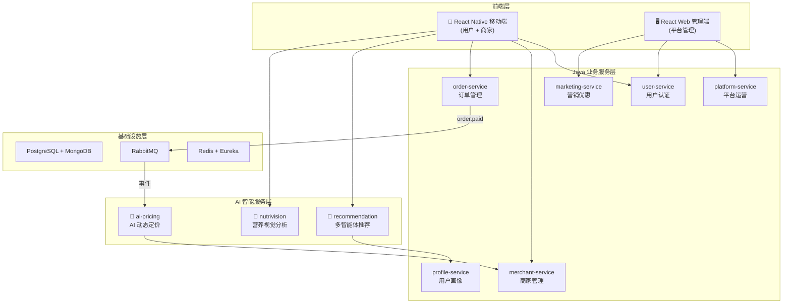
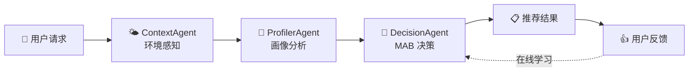
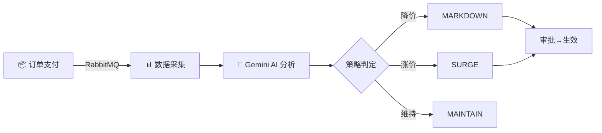

<!-- _class: title -->

# 🍽️ FoodMate-AI

### 基于多智能体协作的智能外卖平台

**答辩人：XXX &emsp; 指导老师：XXX**
2026年2月

---

<!-- _class: content -->

# 📌 项目背景与目标

## 传统外卖平台三大痛点

|       痛点       | 现状                           | 我们的方案                      |
| :--------------: | ------------------------------ | ------------------------------- |
| 🎯 **推荐不精准** | 忽略天气、时段、节气等场景因素 | 多智能体协作 + 多维场景感知推荐 |
|  💰 **定价僵化**  | 菜品价格静态，无法动态优化     | Gemini AI 动态定价 + 自动化提案 |
|  🥗 **健康缺失**  | 缺乏营养指导，过敏原风险高     | 多模态视觉营养分析              |

## 项目定位

> **以 AI 为核心驱动力**的全链路外卖平台，融合 **多智能体协作推荐、AI 动态定价、多模态营养分析** 三大 AI 能力，服务用户、商家、平台三方。

---

<!-- _class: content -->

# 🏗️ 系统架构设计

**架构理念**：微服务 + AI 中台 + 事件驱动 &emsp; | &emsp; **9 个微服务**（6 Java + 3 Python）

---

<!-- _class: content -->

# 🤖 核心创新：多智能体协作推荐

|      智能体       | 职责                                    | 技术实现                            |
| :---------------: | --------------------------------------- | ----------------------------------- |
| **ContextAgent**  | 天气(25%)+节气(20%)+时段(20%)+交通(15%) | 和风天气 API、高德地图 API          |
| **ProfilerAgent** | 用户偏好提取、意图识别、用户分群        | MongoDB 画像 + 权重计算             |
| **DecisionAgent** | 推荐排序 + 在线学习                     | UCB1 / Thompson Sampling / ε-Greedy |

**技术亮点**：采用 **LangGraph 状态机** 编排多智能体协作流程，支持 **MCP 协议** 标准化通信，**MAB 算法**实现推荐结果的实时自我优化。

---

<!-- _class: content -->

# 💡 AI 动态定价 & 营养视觉分析

## AI 动态定价系统

> Gemini 扮演 **"收益管理总监"**，分析 7 天销量与营收趋势，自动生成定价提案

## NutriVision 营养分析

📷 **拍照** → 🤖 **Gemini Vision 多模态识别** → 🥗 菜品名称 + 热量估算 + 过敏原 + 健康建议

---

<!-- _class: content -->

# 📊 技术栈总览

|     层次      | 技术选型                                                                                   |
| :-----------: | ------------------------------------------------------------------------------------------ |
| **Java 服务** | Java 21 · Spring Boot 3.2 · Spring Cloud (Eureka/Config/OpenFeign) · Spring Security + JWT |
|  **AI 服务**  | Python · FastAPI · LangGraph · LangChain · Google Gemini API                               |
|  **AI 算法**  | 多臂老虎机 (UCB1/Thompson) · 多智能体编排 · MCP 协议                                       |
|  **移动端**   | React Native 0.83 · React 19 · TypeScript · llama.rn (端侧 LLM)                            |
|  **Web 端**   | React + Vite                                                                               |
| **数据存储**  | PostgreSQL 15 · MongoDB 6.0 · Redis                                                        |
| **消息队列**  | RabbitMQ 3.12 (事件驱动架构)                                                               |
| **可观测性**  | Prometheus + Grafana · Zipkin 链路追踪                                                     |
|   **部署**    | Docker Compose 一键编排 (20+ 容器)                                                         |

---

<!-- _class: content -->

# 📈 项目进展

## 已完成功能模块

| 模块           |  进度  | 核心能力                             |
| -------------- | :----: | ------------------------------------ |
| 用户系统       | ✅ 100% | 注册/登录/JWT 认证/信用等级          |
| 商家系统       | ✅ 100% | 入驻/菜单管理/动态定价配置           |
| 订单系统       | ✅ 100% | 下单/支付/退款/状态追踪/事件发布     |
| 营销系统       | ✅ 100% | 4 类优惠券/最优组合算法/智能发券引擎 |
| 平台运营       | ✅ 100% | 增值服务/分成计算/结算管理           |
| 🤖 多智能体推荐 | ✅ 100% | LangGraph + MAB 在线学习             |
| 🤖 AI 动态定价  | ✅ 100% | Gemini AI 分析 + 自动审批            |
| 🤖 营养视觉分析 | ✅ 100% | Gemini Vision 多模态识别             |
| 📱 移动端 (RN)  | ✅ 95%  | 20+ 页面 (用户端 + 商家端)           |
| 🖥️ Web 管理端   | ✅ 90%  | 15+ 页面 (平台管理)                  |

---

<!-- _class: content -->

# 🎯 技术亮点与总结

## 六大技术亮点

|   #   | 亮点              | 说明                                             |
| :---: | ----------------- | ------------------------------------------------ |
|   1   | **多智能体协作**  | LangGraph 编排 3 个 Agent 协同推荐，业界前沿方案 |
|   2   | **MAB 在线学习**  | UCB1/Thompson Sampling 实现推荐自我优化          |
|   3   | **AI 动态定价**   | Gemini 大模型 + 事件驱动，菜品价格智能调控       |
|   4   | **多模态视觉 AI** | Gemini Vision 菜单图片营养分析 + 过敏原检测      |
|   5   | **端侧 AI**       | llama.rn 端侧 LLM + Vosk 离线语音识别            |
|   6   | **全链路可观测**  | Prometheus + Grafana + Zipkin 三位一体监控       |

## 项目规模

> **9 个微服务 · 35+ 页面 · 20+ 数据库表 · 3 大 AI 能力 · Docker 一键部署**

---

<!-- _class: title -->

# 谢谢！

### 欢迎提问 🙋

