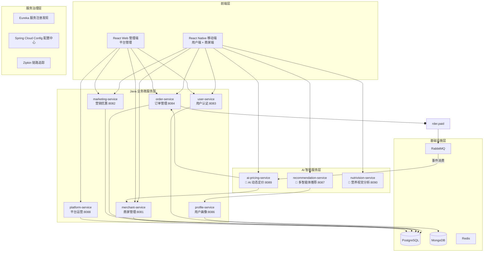
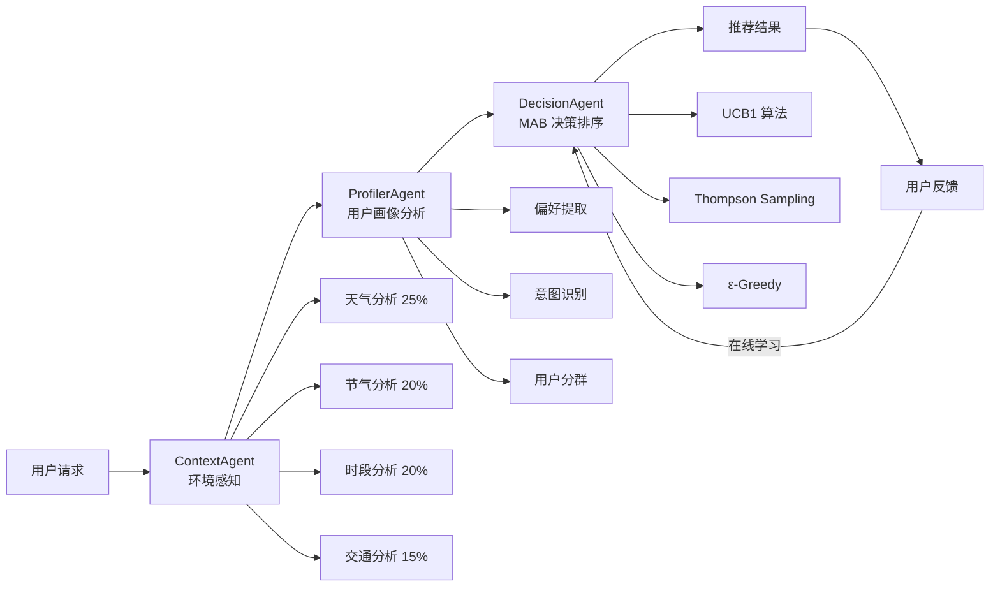
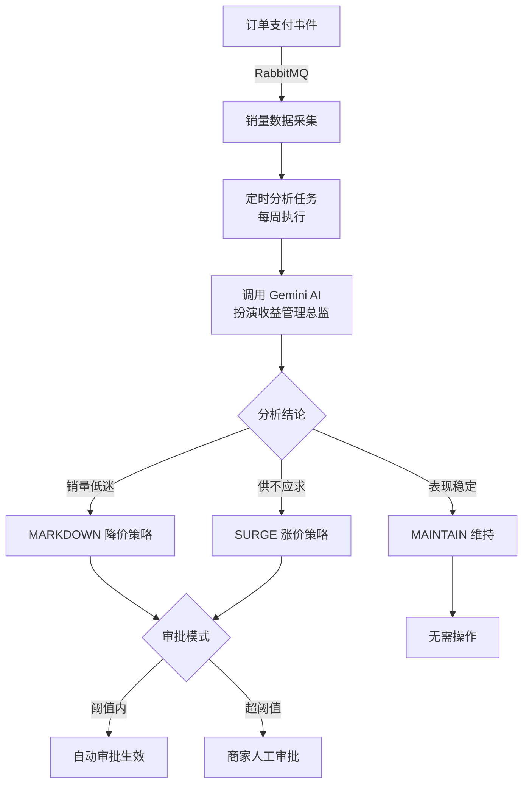
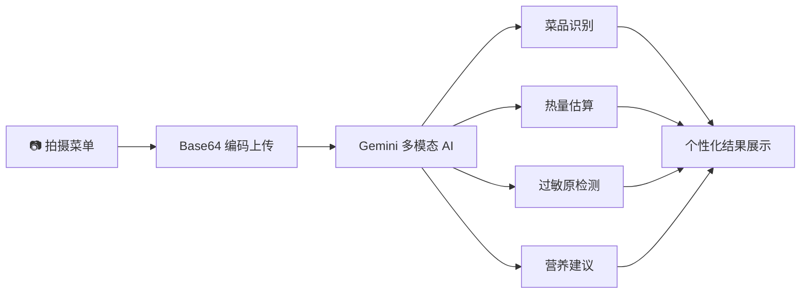
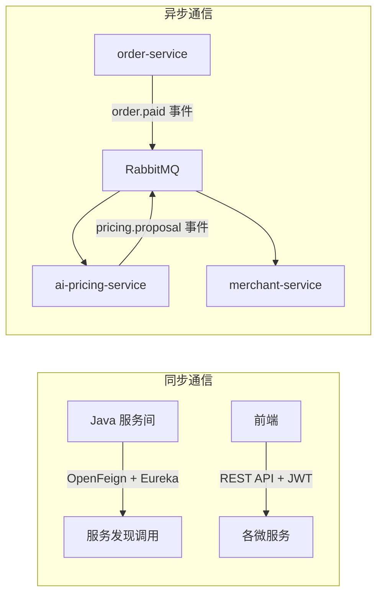
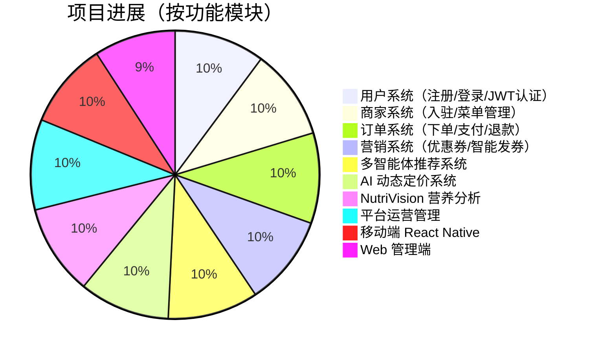
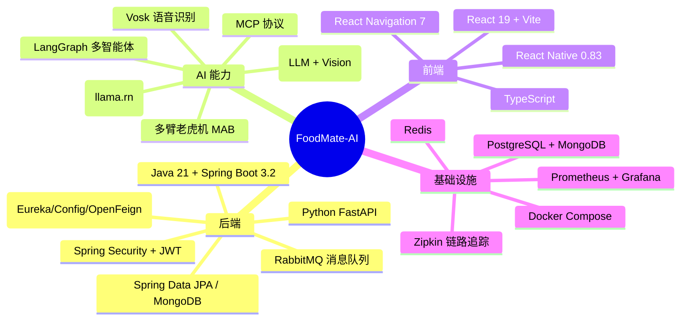

# FoodMate-AI 项目汇报内容（4-5分钟展示）

---

## 一、项目概述（30秒）

### 项目名称
FoodMate-AI —— 基于多智能体协作的智能外卖平台

### 项目背景
传统外卖平台面临三大痛点：
1. **推荐千篇一律**：缺乏对天气、时段、节气等场景因素的感知，推荐不精准
2. **定价策略僵化**：菜品价格静态不变，无法根据销量和市场动态优化收益
3. **健康管理缺失**：用户点餐缺乏营养指导，过敏原风险难以识别

### 项目定位
FoodMate-AI 是一个以 **AI 智能化**为核心驱动力的全链路外卖平台，采用微服务架构，融合多智能体协作推荐、AI 动态定价、多模态营养分析等前沿 AI 技术，为用户、商家、平台三方提供智能化的外卖服务体验。

---

## 二、设计思路（1分钟）

### 2.1 整体架构设计理念

采用 **"微服务 + AI 中台 + 事件驱动"** 的三层架构设计：

- **微服务层**：将业务拆分为 9 个独立微服务（6 个 Java + 3 个 Python），各服务职责单一、独立部署
- **AI 中台层**：3 个 Python AI 服务（推荐、定价、视觉分析）构成平台智能中枢
- **事件驱动层**：通过 RabbitMQ 实现服务间异步解耦，支撑实时数据流转

### 2.2 技术选型原则

| 层次          | 技术选型                       | 选型理由                          |
| ------------- | ------------------------------ | --------------------------------- |
| Java 业务服务 | Spring Boot 3.2 + Spring Cloud | 成熟稳定的微服务框架              |
| AI 服务       | Python FastAPI                 | AI 生态丰富，异步高性能           |
| 智能推荐      | LangGraph + 多臂老虎机         | 多智能体编排 + 在线学习能力       |
| AI 大模型     | Google Gemini API              | 多模态理解 + 成本可控             |
| 移动端        | React Native                   | 一套代码双平台运行                |
| 消息队列      | RabbitMQ                       | 事件驱动，服务解耦                |
| 数据存储      | PostgreSQL + MongoDB           | 结构化业务数据 + 非结构化画像数据 |
| 服务治理      | Eureka + Spring Cloud Config   | 服务注册发现 + 集中配置管理       |
| 可观测性      | Prometheus + Grafana + Zipkin  | 监控告警 + 链路追踪               |

### 2.3 系统架构图（Mermaid）

---

## 三、实施方案（1.5分钟）

### 3.1 核心功能模块

#### 模块一：多智能体协作推荐系统

这是本项目的核心创新点。采用 **LangGraph 状态机**编排 3 个 AI 智能体协作完成推荐：

**智能体协作流程图：**

- **ContextAgent**：接入和风天气 API 和高德地图 API，感知当前天气状况、通勤交通和节气时令
- **ProfilerAgent**：从 MongoDB 画像服务中提取用户偏好，进行意图识别和用户分群
- **DecisionAgent**：使用多臂老虎机（MAB）算法进行推荐排序，支持在线学习实时优化

#### 模块二：AI 动态定价系统

采用 **"数据采集 → AI 分析 → 提案审批"** 三阶段流水线：

**AI 定价流程图：**

#### 模块三：NutriVision 多模态营养分析

#### 模块四：智能营销系统

- **最优优惠组合算法**：基于背包问题变种，穷举可叠加/互斥优惠券组合，为用户计算最大优惠方案
- **智能发券引擎**：规则引擎自动触发发券（新用户注册、信用升级、订单里程碑、VIP 月度福利）

#### 模块五：平台运营管理

- 增值服务管理：技术服务费(3%)、配送服务(8%)、流量推广、数据报表
- 分成自动计算、结算单自动生成（周结/月结）、超时自动确认

### 3.2 服务间通信设计

### 3.3 数据架构

| 数据库            | 存储内容                                              | 服务               |
| ----------------- | ----------------------------------------------------- | ------------------ |
| PostgreSQL (主库) | 用户、商家、菜单、订单、优惠券、结算单等 20+ 张业务表 | 6 个 Java 服务     |
| PostgreSQL (AI库) | 销售历史、定价提案                                    | ai-pricing-service |
| MongoDB           | 用户行为画像、偏好数据                                | profile-service    |
| Redis             | 缓存热点数据                                          | 全局               |

---

## 四、进展情况（1分钟）

### 4.1 已完成功能

#### 后端服务（9 个微服务全部完成）

| 服务                   | 状态     | 关键能力                               |
| ---------------------- | -------- | -------------------------------------- |
| user-service           | ✅ 已完成 | JWT 认证、信用等级管理                 |
| merchant-service       | ✅ 已完成 | 商家入驻、菜单 CRUD、动态定价配置      |
| order-service          | ✅ 已完成 | 订单全流程、支付/退款、事件发布        |
| marketing-service      | ✅ 已完成 | 优惠券模板、最优组合算法、智能发券引擎 |
| platform-service       | ✅ 已完成 | 增值服务、分成计算、结算管理           |
| profile-service        | ✅ 已完成 | MongoDB 用户画像存储与查询             |
| recommendation-service | ✅ 已完成 | LangGraph 多智能体、MAB 在线学习       |
| ai-pricing-service     | ✅ 已完成 | Gemini AI 定价分析、自动/人工审批      |
| nutrivision-service    | ✅ 已完成 | Gemini 多模态视觉分析                  |

#### 前端应用

| 平台                               | 状态       | 页面数   |
| ---------------------------------- | ---------- | -------- |
| React Native 移动端（用户 + 商家） | ✅ 基本完成 | 20+ 页面 |
| React Web 管理端（平台管理）       | ✅ 基本完成 | 15+ 页面 |

#### 基础设施

| 组件                      | 状态     |
| ------------------------- | -------- |
| Docker Compose 一键部署   | ✅ 已完成 |
| Prometheus + Grafana 监控 | ✅ 已完成 |
| Zipkin 链路追踪           | ✅ 已完成 |
| CI/CD 自动化              | 🔄 计划中 |

### 4.2 技术亮点总结

1. **多智能体协作**：业界前沿的 LangGraph 多智能体编排，3 个 Agent 协同推荐
2. **MAB 在线学习**：UCB1/Thompson Sampling 等算法实现推荐结果的实时自我优化
3. **AI 动态定价**：Gemini 大模型 + 事件驱动架构，实现菜品价格智能调控
4. **多模态 AI**：Gemini Vision 实现菜单图片的营养分析与过敏原检测
5. **端侧 AI**：集成 llama.rn 实现端侧 LLM 推理 + Vosk 离线语音识别
6. **全链路可观测**：Prometheus + Grafana + Zipkin 三位一体监控体系

---

## 五、项目技术栈总览

