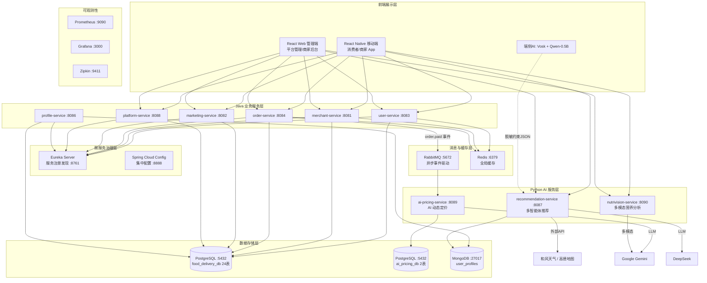
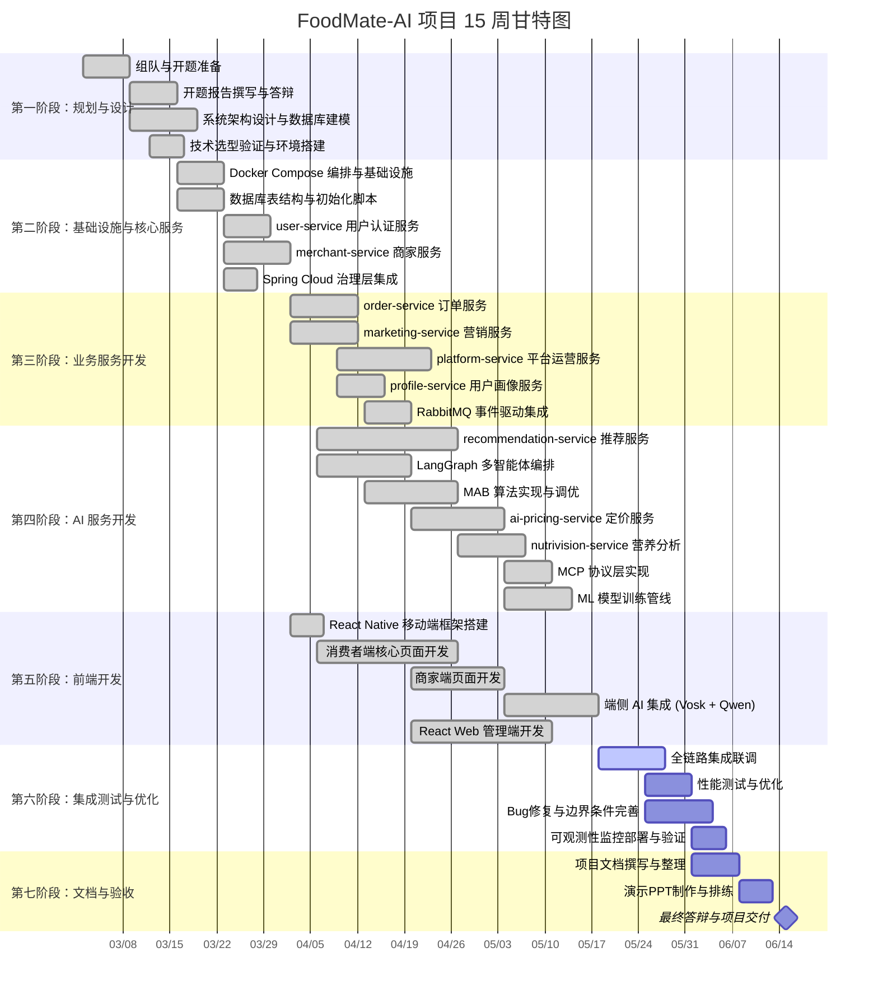

# FoodMate-AI —— 基于多智能体协作的智能外卖平台

## 开题报告前准备工作

---

## 一、项目背景

随着我国外卖产业规模的持续扩大，2025 年中国在线外卖市场交易规模已突破 1.2 万亿元，日均订单峰值超过 6000 万单（数据来源：艾瑞咨询《2024-2025 中国本地生活服务行业研究报告》）。然而在这一高速增长的产业背后，当前主流外卖平台在智能化服务方面仍然存在三个显著且亟待解决的结构性短板。

第一个短板是推荐系统对场景因素的感知严重缺失。以美团、饿了么为代表的主流平台所采用的推荐算法——无论是基于用户-商品交互矩阵的协同过滤（Collaborative Filtering），还是基于商品属性向量的内容推荐（Content-Based Filtering）——都高度依赖用户的历史行为数据来构建偏好模型。这类算法的致命缺陷在于忽略了天气、交通、时段、节气、用户即时身体状态等一系列直接影响用户点餐决策的动态环境因素。举例而言，一个寒冷的雨天和一个晴朗的夏日，用户对餐食品类、配送时效、价格敏感度的需求显然截然不同，但传统推荐系统给出的推荐列表往往没有任何差异化。更进一步，用户刚完成长距离跑步后对高蛋白、易消化食物的即时需求，在当前所有主流平台中都完全没有被感知和满足。这一问题的根源并不在于算法本身的优劣，而在于推荐系统的输入信息维度过于单一——仅有"人"和"物"两个维度，缺少了至关重要的"场"（Context）维度。近年来学术界对上下文感知推荐系统（Context-Aware Recommender System, CARS）的研究日益深入，Adomavicius 和 Tuzhilin（2022）在其综述论文中指出，融合时间、位置、社交关系等上下文信息可将推荐准确率提升 15%-30%，但这些研究成果在工业级外卖平台中的落地仍非常有限。

第二个短板是菜品定价策略过于僵化。绝大多数餐饮商家仍然采用人工设定的固定价格模式，即使面临供需变化、销量趋势波动、季节性因素影响等明显的市场信号，也无法及时做出价格调整。这种僵化的定价模式导致了双重损失：一方面，畅销菜品在需求旺盛时保持原价，错失了通过合理涨价获取额外利润的机会；另一方面，滞销菜品在销量持续走低时也不会主动降价促销，最终导致食材浪费和沉没成本。动态定价（Dynamic Pricing）在航空、酒店、网约车等行业已有成熟应用——Uber 的 surge pricing 算法可以在高峰期实时提价 2-5 倍——但在餐饮外卖领域，由于菜品种类繁多、商家运营能力参差不齐，传统的动态定价方案很难直接套用。中小型餐饮商家既缺乏专业的数据分析能力，也没有足够的技术团队来构建定价模型，因此迫切需要一种"AI 辅助决策 + 商家最终拍板"的智能定价方案。

第三个短板是用户在整个点餐过程中几乎完全缺乏健康指导。对于有特殊饮食需求的用户群体——包括但不限于糖尿病患者、食物过敏人群、健身减脂人群、素食主义者——面对一份外卖菜单时无法快速了解各菜品的热量、主要食材成分和潜在过敏原信息。世界卫生组织统计数据显示，全球食物过敏患病率已达 6%-8%（儿童更高），每年因食物过敏导致的严重反应（过敏性休克）事件超过 20 万起。在国内，随着全民健康意识的提升和"三高"等慢性病的年轻化趋势，越来越多的消费者开始关注日常饮食的营养摄入。然而现有外卖平台的菜品信息展示仍停留在"图片 + 文字描述 + 价格"的初级阶段，营养信息的缺失使得这些平台在服务有特殊饮食需求用户时处于完全"盲区"状态。

基于以上三个层面的问题分析，本项目提出 FoodMate-AI 智能外卖平台，旨在以人工智能技术为核心驱动力，从"智能推荐""智能定价"和"智能健康"三个维度全面提升外卖服务的智能化与个性化水平，构建一个面向消费者、商家和平台运营方三端的闭环智能生态。

---

## 二、项目范围与项目需求简介

FoodMate-AI 的项目范围覆盖了一个完整的外卖业务生态系统，涵盖消费者端、商家端和平台管理端三种角色的全部核心使用场景。从业务角度看，系统的范围起点是用户注册和商家入驻，终点是平台与商家之间的佣金结算与财务打款，中间贯穿了从"用户浏览推荐 → 语音/拍照辅助点餐 → 加购下单 → 优惠券智能组合 → 支付 → 商家接单 → 配送追踪 → 完成/退款 → AI 动态调价 → 平台佣金计算 → 结算确认"的完整业务闭环。

在需求层面，本项目围绕以下几个核心需求展开。对消费者而言，需要一个能够"阅读环境、理解个人偏好、保护隐私"的智能推荐系统，能够在不同的天气条件、交通状况和用餐时段下给出因时因地制宜的餐厅和菜品推荐，同时在交互方面支持语音搜索（离线）和菜单图片拍照分析两种自然交互模式，降低用户的认知和操作成本。此外，消费者还需要在下单环节获得自动化的最优优惠券组合推荐，确保在多种券叠加与互斥规则下获得最大优惠力度。

对商家而言，最核心的需求是一套"懂经营"的智能辅助工具集。其中包括：基于实际销售数据的 AI 动态定价系统，能自动识别滞销品和畅销品并给出调价建议；一套灵活的菜单管理和店铺信息管理后台；一套增值服务市场（流量推广、配送服务、运营工具等平台服务的自助订阅管理）；以及一套清晰透明的佣金计算与结算对账系统，支持商家在线确认或提出异议。

对平台管理方而言，需要一个功能完备的运营管理后台，涵盖全局数据看板（实时订单量、GMV、活跃用户数等核心指标的可视化展示）、营销活动管理（优惠券模板创建、智能发券规则配置）、商家管理（入驻审批、商家状态管理）、订单管理（全局订单查询与状态追踪）、用户管理与信用管理（用户列表、信用等级查看与调整）、以及系统监控（各微服务健康状态、性能指标和分布式调用链路追踪）。

在非功能需求方面，系统需要具备良好的可扩展性（微服务架构可独立扩缩容）、高可用性（外部 API 不可用时的自动降级机制、消息队列确保事件不丢失）和数据隐私保护能力（端侧 AI 模型确保用户语音和健康数据不离开手机端）。

---

## 三、项目功能模块介绍

从全局视角看，FoodMate-AI 平台由六大功能模块构成，各模块既高度自治又通过事件驱动和同步调用形成有机协作。

**多智能体智能推荐模块**是本项目最核心的创新模块。它将传统的"单一算法打分排序"推荐范式重构为"多智能体协作决策"范式，由三个专职智能体分工协作完成一次完整的推荐过程。环境感知智能体（ContextAgent）通过并行调用和风天气 API 和高德地图 API（使用 Python asyncio.gather 实现异步并发），实时获取天气状况（温度、湿度、降水、风力）、交通拥堵程度和当前时段类型（早餐、午餐、下午茶、晚餐、夜宵），并综合计算环境影响评分；用户画像智能体（ProfilerAgent）从 MongoDB 画像数据库中提取用户的口味偏好、菜系倾向、饮食限制和历史行为数据，结合环境信息动态调整推荐权重；决策智能体（DecisionAgent）实现了四种多臂老虎机（MAB）策略——UCB1、Thompson Sampling、ε-Greedy 和 Contextual Bandit——其中默认使用的 Contextual Bandit 策略将每个候选餐厅的推荐分数分解为基础分、变量分数和上下文奖励三层计算，并支持在线学习（用户点击给予 0.3 奖励、下单给予 1.0 奖励、评分给予 0.5 奖励），使推荐质量随使用时间持续自我优化。三个智能体的协作编排采用 LangGraph StateGraph 状态机实现，支持串行管线模式和并行编排模式两种协作路径。此外，系统还设计了端云协同隐私保护架构——移动端部署 Vosk 离线语音识别模型和 Qwen-2.5-0.5B-Instruct 端侧量化大语言模型（通过 llama.rn 框架运行），在手机本地完成语音→文本→结构化约束的全流程处理后，仅将脱敏的 JSON 约束上传到云端，实现"敏感数据不出端、推荐能力不打折"。手机步数传感器还能检测用户的运动状态（30 分钟内 2000 步以上触发"刚运动完"状态），将其作为上下文信号传递给 Contextual Bandit 算法，推荐高蛋白、易消化的餐食。

**AI 动态定价模块**遵循"数据驱动 + AI 决策 + 人机协同"的设计理念。系统通过 RabbitMQ 实时监听订单支付事件自动采集销售数据（无需商家手动录入），定期（默认每周）或手动触发定价分析。分析时将菜品的近期销量趋势和历史价格数据提交给 Google Gemini 大语言模型，Gemini 以"餐厅收益管理总监"角色进行分析，识别出滞销品（MARKDOWN 策略——降价促销）、畅销品（SURGE 策略——适度涨价）和稳定品（MAINTAIN 策略——维持现价），并以"定价提案"形式保存。商家可选择自动审批模式（设定价格变动阈值，阈值内自动执行）或人工审批模式（逐条确认或拒绝），实现 AI 辅助决策与商家经营自主权的平衡。

**NutriVision 多模态营养分析模块**为用户提供"拍照识菜、智能营养解读"的创新交互体验。用户在手机端拍摄菜单或菜品图片后，系统将图片（Base64 编码）连同用户的健康标签（如"花生过敏""低糖""素食"等）一并提交给 Gemini 2.0 Flash 多模态视觉模型，由 AI 扮演"专业数字营养师"角色识别每道菜品并输出名称、估算热量（kcal）、食材列表和过敏原警告，同时推荐 Top 3 最适合的菜品并生成一段综合性健康建议。前端将分析结果以卡片化 UI 展示，过敏原信息以醒目的红色警告标签呈现，帮助有特殊饮食需求的用户做出安全、健康的点餐决策。

**智能营销模块**包含优惠券全生命周期管理和智能发券引擎两个子系统。在优惠券管理方面，系统支持四种优惠券类型（折扣券、满减券、无门槛券、免运费券），核心算法是一个基于 0/1 背包问题变种的最优优惠组合算法——将可用券分为"可叠加"和"互斥"两组，通过位掩码枚举可叠加券子集并与互斥券搭配，找出总优惠金额最大的组合方案。智能发券引擎则通过规则引擎定义自动发券条件（新用户注册、信用升级、订单里程碑、VIP 月度福利、生日等触发类型），每条规则可配置触发频率和发放上限，实现精准的用户激励。

**平台运营与结算模块**围绕"增值服务订阅 + 订单分成 + 自动结算"三大核心流程构建。平台提供六种增值服务（技术服务费、配送服务、优先配送、首页推荐、搜索置顶、数据报表），商家可自助订阅或退订。每笔订单完成后，系统自动按商家已订阅的按单计费服务逐一计算佣金并生成记录。结算方面支持按周和按月两种周期自动生成结算单，结算单有完整的状态流转机制（待确认 → 已确认/有异议 → 已打款/已取消），并设有 3 天超时自动确认机制。

**用户系统与信用等级模块**实现了完整的注册登录认证（基于 JWT）、用户画像管理（基于 MongoDB 的灵活 Schema 文档存储）和信用等级机制（5 个等级，根据近期取消订单频率和完成订单数自动升降级），信用等级变动与营销模块的智能发券联动。

---

## 四、初步的逻辑架构与物理架构

### 逻辑架构

FoodMate-AI 的逻辑架构遵循"微服务 + AI 中台 + 事件驱动"的三层设计理念，从上到下可分为四个逻辑层次。

最上层是**前端展示层**，包括使用 React Native 开发的跨平台移动应用（面向消费者和商家两种角色）和使用 React + Vite 构建的 Web 管理后台（面向平台管理员和商家）。移动端集成了两个端侧 AI 模型——Vosk 离线语音识别和 Qwen-2.5-0.5B 端侧大语言模型，负责在手机本地完成隐私敏感数据的预处理。

中间层是**业务服务层**，由九个独立的微服务组成：六个 Java Spring Boot 微服务分别承担用户认证（user-service）、商家管理（merchant-service）、订单处理（order-service）、营销优惠（marketing-service）、平台运营（platform-service）和用户画像（profile-service）等核心业务逻辑；三个 Python FastAPI 微服务分别承担智能推荐（recommendation-service）、AI 动态定价（ai-pricing-service）和多模态营养分析（nutrivision-service）的 AI 能力。Java 服务之间通过 Spring Cloud OpenFeign 进行同步 HTTP 调用，Java 与 Python 服务之间通过 RabbitMQ 消息队列进行异步事件驱动通信（如订单支付事件驱动 AI 定价数据采集）。

下层是**基础设施层**，包括 Spring Cloud Eureka 服务注册发现、Spring Cloud Config 集中配置管理、以及 Prometheus + Grafana + Zipkin 全链路可观测性方案。

底层是**数据存储层**，采用多数据库混合架构：PostgreSQL 15 作为主数据库承载全部结构化业务数据（主库 food_delivery_db 包含 24 张表），一个独立的 ai_pricing_db PostgreSQL 数据库实现 AI 分析数据与业务数据的物理隔离；MongoDB 6.0 存储用户画像等灵活 Schema 文档数据；Redis 7 作为全局缓存层提供热点数据的毫秒级响应。

### 物理架构

在物理部署层面，整个系统通过一个包含 519 行配置的 Docker Compose 编排文件实现一键部署。物理上可分为以下几组容器：

- **基础设施容器组**：PostgreSQL 15（端口 5432）、MongoDB 6.0（端口 27017）、RabbitMQ 3.12（AMQP 5672 + 管理界面 15672）、Redis（端口 6379）、Eureka Server（端口 8761），以及可选的 Mongo Express 管理界面（端口 8085）和 Spring Cloud Config Server（端口 8888）。
- **Java 微服务容器组**：merchant-service（8081）、marketing-service（8082）、user-service（8083）、order-service（8084）、profile-service（8086）、platform-service（8088），每个容器配置了 Spring Boot Actuator 健康检查端点。
- **Python AI 服务容器组**：recommendation-service（8087）、ai-pricing-service（8089）、nutrivision-service（8090），以及一个按需启动的 ml-trainer 模型训练容器（使用 Docker Compose profiles 管理）。
- **可观测性容器组**（通过 monitoring profile 按需启动）：Prometheus（9090）、Grafana（3000）、Zipkin（9411）。

所有数据库初始化通过 15 个 SQL 脚本自动执行（挂载到 PostgreSQL 容器的 docker-entrypoint-initdb.d 目录），各服务的环境变量（数据库连接、消息队列地址、JWT 密钥等）统一通过 Docker Compose 的 environment 配置注入。数据持久化通过 Docker volumes（postgres_data、mongo_data、rabbitmq_data、redis_data、ml_models、ml_data 等 8 个命名卷）实现。

---

## 五、候选开发技术栈与初步技术框架

### 后端技术栈

本项目后端采用 Java + Python 异构双语言技术栈。Java 服务方面选用 **Java 21**（LTS 版本）作为运行时，**Spring Boot 3.2** 作为应用框架，引入 **Spring Cloud 2023.0**（代号 Leyton）作为微服务治理框架体系。具体组件包括：**Spring Cloud Netflix Eureka** 实现服务注册与发现，所有微服务启动时自动向 Eureka Server 注册实例信息并定期发送心跳，服务间调用通过注册中心进行实例查找和负载均衡；**Spring Cloud Config** 实现集中配置管理，配置文件统一存放在 config-repo 目录并以 native 模式加载，所有微服务从 Config Server 拉取公共配置（数据库连接池参数、JWT 密钥、日志格式、Actuator 端点暴露规则等）；**Spring Cloud OpenFeign** 简化服务间的声明式 HTTP 调用，开发者只需定义接口和注解即可完成跨服务 REST 调用。容错方面引入 **Resilience4j** 提供断路器（CircuitBreaker）、限流器（RateLimiter）、重试（Retry）和隔板（Bulkhead）等弹性模式。安全认证统一采用 **JWT** 方案（使用 JJWT 0.11.5 库），全局配置 24 小时过期时间和统一密钥。数据持久层使用 **Spring Data JPA** 配合 PostgreSQL 15，用户画像服务使用 **Spring Data MongoDB** 配合 MongoDB 6.0，热点数据缓存使用 **Spring Data Redis** + **Spring Cache** 抽象层配合 Redis 7。监控方面通过 **Spring Boot Actuator** + **Micrometer** 暴露 Prometheus 格式的指标端点。

Python AI 服务统一使用 **FastAPI** 框架，其原生异步支持（基于 Python asyncio/ASGI）非常适合调用外部 AI API 时的 I/O 密集型场景。推荐服务的核心依赖包括：**LangGraph**（多智能体状态图编排框架，用于定义三个智能体的协作工作流和条件路由）、**LangChain**（LLM 调用链管理）、**OpenAI SDK**（兼容 Gemini/DeepSeek 的 API 调用）、**FastMCP**（Model Context Protocol 服务器实现，支持 stdio 和 HTTP/SSE 传输模式）、**Pandas** 和 **NumPy**（数据处理）、**LightGBM** 和 **PyTorch**（机器学习模型）、**scikit-learn**（特征工程与模型评估）、**aiohttp**（异步 HTTP 客户端，用于并发调用天气和地图 API）。AI 定价服务使用 **SQLAlchemy**（异步 ORM，配合 asyncpg 驱动实现全异步数据库操作）、**aio-pika**（异步 RabbitMQ 客户端）和 **APScheduler**（定时任务调度，管理每周一次的自动定价分析周期）。营养分析服务依赖 **httpx**（异步 HTTP 客户端）用于调用 Gemini Vision 多模态 API。

### 前端技术栈

移动端采用 **React Native 0.83** 配合 **React 19.2** 和 **TypeScript 5.8**，页面导航使用 **React Navigation 7**（Native Stack），HTTP 通信使用 **Axios**。端侧 AI 方面集成了 **llama.rn 0.10.0**（端侧 LLM 推理框架，运行 Qwen-2.5-0.5B-Instruct 的 Q4 量化 GGUF 模型）和 **react-native-vosk 2.1.7**（离线语音识别，使用 vosk-model-small-cn 中文小模型）。功能扩展库包括 **react-native-image-picker**（NutriVision 拍照功能）、**react-native-geolocation-service**（GPS 定位，用于 POI 周边搜索）和 **react-native-fs**（本地文件操作，用于管理端侧模型文件）。Web 管理端使用 **React 18** + **Vite** 构建，采用组件化设计。

### 消息队列通信与异步事件驱动

**RabbitMQ 3.12** 作为全局消息中间件，负责微服务间的异步事件通信。系统定义了两组 Exchange：`order.events`（订单事件，routing key 为 `order.paid`，由 order-service 发布、ai-pricing-service 消费）和 `pricing.events`（定价事件，routing key 为 `merchant.pricing.updates`，由 ai-pricing-service 发布、merchant-service 消费）。这种事件驱动架构确保了 AI 数据采集和定价分析不会阻塞订单主流程。

### 外部 API 集成

推荐服务集成了两个外部 API：**和风天气 QWeather API**（支持 JWT 和 API Key 双认证模式，获取实时天气和预报数据）和**高德地图 API V5**（支持文本搜索、周边搜索和多边形搜索三种 POI 检索模式）。AI 定价和营养分析服务均调用 **Google Gemini** 大语言模型（gemini-2.5-flash）进行 AI 分析，推荐理由生成调用 **DeepSeek** 大语言模型（deepseek-chat）。所有外部 API 调用均实现了降级容错机制——API 不可用时系统自动降级为基于规则的本地处理逻辑。

### 数据库与数据架构

采用多数据库混合架构：**PostgreSQL 15** 作为主关系型数据库（主库 food_delivery_db 含 24 张表，独立库 ai_pricing_db 含 2 张表）、**MongoDB 6.0** 存储灵活 Schema 的用户画像文档数据、**Redis 7** 作为全局分布式缓存层。数据库表结构总计 27 个数据实体，通过 15 个自动化 SQL 初始化脚本管理。

### DevOps 与可观测性

全系统通过 **Docker** + **Docker Compose** 实现容器化编排与一键部署。可观测性采用 **Prometheus**（指标采集）+ **Grafana**（可视化仪表盘）+ **Zipkin**（分布式链路追踪）三位一体方案，通过 Docker Compose profiles 机制按需启停监控栈，不影响日常开发时的系统资源占用。

---

## 六、项目所用编程语言

本项目涉及以下编程语言及其在各模块中的具体应用：

- **Java 21**（LTS）：六个核心业务微服务的开发语言（user-service、merchant-service、order-service、marketing-service、platform-service、profile-service），以及公共模块 food-platform-common 的开发。选用 Java 的原因是 Spring Cloud 生态在企业级微服务治理领域（服务注册发现、集中配置、声明式调用、断路器、分布式追踪等）拥有最成熟且经过大规模生产验证的解决方案。
- **Python 3.11+**：三个 AI 智能服务的开发语言（recommendation-service、ai-pricing-service、nutrivision-service），以及 ML 模型训练脚本。选用 Python 的原因是其在 AI/ML 领域拥有无可替代的生态优势——LangGraph、LangChain、OpenAI SDK、PyTorch、LightGBM、scikit-learn 等前沿框架和库均以 Python 为第一语言。
- **TypeScript 5.8 / JavaScript（ES6+）**：React Native 移动端前端和 React Web 管理端的开发语言。移动端以 TypeScript 为主，Web 端以 JSX 为主。
- **SQL**：PostgreSQL 数据库的表结构定义、索引创建、种子数据插入和数据迁移脚本（共 15 个 SQL 文件）。
- **YAML / Dockerfile / Shell**：Spring Cloud 配置文件（application.yml）、Docker 镜像构建脚本（各服务的 Dockerfile）、Docker Compose 编排文件、以及少量的 Shell 辅助脚本。

这种 Java + Python 双语言后端架构的设计哲学是"让每个服务使用最适合其职责的技术栈"——Java 负责事务密集型的业务逻辑处理，Python 负责计算密集型和 I/O 密集型的 AI 推理任务，两者通过 HTTP REST 和 RabbitMQ 消息队列实现跨语言通信。

---

## 七、项目管理与系统测试方面的设想

### 项目管理

本项目采用**敏捷开发 + 看板管理**的项目管理方法。具体措施如下：

版本控制方面，使用 **Git + GitHub** 进行代码管理，采用 **Feature Branch** 工作流——每位开发者在各自的功能分支上开发，完成后提交 Pull Request 合并到 main 主分支，代码合并前需经过对方审查（Code Review）。每次开发前拉取最新 main 分支代码并合并，每次功能完成且本地测试通过后立即推送并创建 PR，保证代码库始终处于可回归的稳定状态。

任务管理方面，使用 GitHub Issues + GitHub Projects 看板进行任务拆分、分配和进度跟踪。每个功能模块拆分为若干 Issue，每个 Issue 有明确的标题、描述、负责人和目标完成日期。看板设置 Backlog（待规划）、To Do（本周计划）、In Progress（进行中）、Review（待审查）、Done（已完成）五个泳道。每周末进行一次迭代回顾（Sprint Review），复盘本周完成情况、遇到的问题和下周计划。

文档管理方面，项目文档统一使用 Markdown 格式存放在仓库的 docs 目录下，包括数据库设计文档、项目详细报告、PPT 展示内容等。技术文档与代码保持同步更新，确保文档的时效性。

### 系统测试

系统测试采用**分层测试策略**，从单元测试到端到端测试逐层覆盖。

**单元测试层**：Java 服务使用 JUnit 5 + Mockito 编写单元测试，重点覆盖核心业务逻辑（如优惠券组合算法的各种边界条件、佣金计算的不同费率类型、订单状态机的合法/非法转换、信用等级的升降级规则等）。Python 服务使用 pytest 编写单元测试，重点覆盖 MAB 算法的数学正确性、环境分析的降级逻辑等。前端使用 Jest 进行组件单元测试。

**集成测试层**：使用 Spring Boot Test 的 @SpringBootTest 注解启动完整的 Spring Context 进行集成测试，验证 JPA Repository 与 PostgreSQL 的交互正确性、RabbitMQ 消息发布与消费的端到端连通性、跨服务 OpenFeign 调用的参数传递与异常处理。对于依赖外部 AI API 的 Python 服务，使用 mock 对象替代真实 API 调用以保证测试的确定性和可重复性。

**接口测试层**：使用 HTTP 请求文件（api-tests.http）对所有 REST API 端点进行手工接口测试和回归测试，覆盖正常路径和异常路径（如未授权访问、参数校验失败、资源不存在等）。

**端到端测试层**：在 Docker Compose 环境中启动全部服务，模拟完整的业务流程——从用户注册、商家入驻、发布菜单、到首次推荐一个完整流程，验证各微服务之间的通信、数据一致性和业务闭环。

**性能测试层（规划中）**：计划使用 k6 或 JMeter 对推荐服务的核心 API 进行负载测试，评估在并发请求下的响应时间分布和系统吞吐量瓶颈。

---

## 八、AI 部分的设想

本项目的 AI 部分由三个相互独立又协同互补的智能子模块构成，每个模块都具备明确的技术路线和可落地的实现方案。

### 8.1 多智能体协作智能推荐系统

这是本项目最核心的 AI 创新模块，其设计理念是将推荐过程从传统的"单一算法黑箱"升级为"多智能体显式协作"范式，让推荐系统像一个由环境分析师、用户研究员和决策专家组成的"虚拟推荐委员会"一样工作。

**技术架构**方面，采用 LangGraph 的 StateGraph 状态机作为智能体编排引擎。LangGraph 是 LangChain 团队于 2024 年推出的多智能体应用框架，它允许开发者将 AI 工作流建模为有向图（Directed Graph），每个节点是一个智能体或处理步骤，边上可以定义条件路由逻辑。本项目定义了"环境分析 → 画像分析 → 决策排序"的三节点串行管线，同时实现了条件分支——当检测到用户请求携带紧急标记时，跳过画像分析直接进入决策排序以降低延迟。此外还实现了一个 ParallelOrchestrator，支持环境感知、POI 检索和画像分析三路并行执行后合并结果。

**算法设计**方面，决策智能体实现了四种多臂老虎机（Multi-Armed Bandit）策略。MAB 问题是强化学习中经典的"探索-利用"权衡问题：系统需要在推荐已知表现好的餐厅（利用）和尝试推荐新餐厅以发现潜在优质选项（探索）之间取得平衡。UCB1 算法通过给每个候选项增加一个与其被选次数成反比的不确定性奖励来鼓励探索；Thompson Sampling 利用贝叶斯后验分布（Beta 分布）进行随机采样，天生具有自适应的探索-利用平衡；ε-Greedy 以固定概率（ε=0.1）随机探索。默认使用的 Contextual Bandit 设计最为精细，它将推荐分数分解为四层：固定基础分（0.50）→ 餐厅属性的加权变量分（距离 25% / 评分 30% / 价格匹配 20% / 菜系匹配 20% / 配送时间 10%）→ 上下文奖励（天气 ±0.20 / 温度 ±0.18 / 交通 ±0.12 / 运动后 ±0.22 / 用户意图 +0.40）→ 历史 MAB 奖励（×0.05 系数）。所有策略均支持在线学习，用户的实时行为反馈（点击 0.3、下单 1.0、评分 0.5）会更新对应餐厅的 MAB 参数。此外，推荐服务还集成了 ML 模型层，包括 LightGBM 梯度提升树和 DeepFM 深度因子分解机，通过加权融合（LightGBM 0.6 + DeepFM 0.4）与 MAB 输出进行最终排序，并支持通过独立的 ml-trainer 容器进行模型离线训练和增量更新。

**隐私保护**方面，系统在移动端部署了端侧 AI 推理能力。Vosk 离线语音识别（vosk-model-small-cn，约 50MB，纯 CPU 推理）完成语音到文字的转换，全程不经过网络。Qwen-2.5-0.5B-Instruct 端侧大语言模型（Q4_K_M 量化，GGUF 格式，约 400MB，通过 llama.rn 在手机本地 CPU/NPU 推理）将自然语言文本提纯为结构化的推荐约束 JSON（包含 forbidden_ingredients、required_temperature、preferred_tags、max_price 等字段）。仅此脱敏后的结构化约束被发送到云端，原始语音和自然语言文本留在手机本地，实现了真正的端云协同隐私保护推荐。

**MCP 协议支持**方面，推荐服务实现了完整的 Model Context Protocol（MCP）层——8 个标准化工具和 3 个 Agent 能力描述资源，支持 stdio 和 HTTP/SSE 两种传输模式，使得推荐系统的各项能力可以作为标准化的"AI 工具"被任何支持 MCP 协议的客户端（如 Claude Desktop、Cursor 等）直接调用和编排。

**可落地验证方案**：系统已实现 recommendation feedback API，记录用户对推荐结果的点击/下单/评分行为，可通过 A/B 测试对比不同 MAB 策略（UCB1 vs Thompson Sampling vs Contextual Bandit）的点击率和转化率差异，量化评估多智能体协作相比传统推荐的提升幅度。

### 8.2 AI 动态定价系统

动态定价模块旨在为中小型餐饮商家提供"零门槛"的 AI 辅助定价能力，核心理念是用大语言模型替代传统的需求预测和价格弹性建模——传统方法需要大量历史数据和专业的经济学/统计学知识，而 LLM-based 方案只需将近期销量趋势以自然语言描述的方式提交给 AI，即可获得直觉合理且有理由支撑的定价建议。

**数据采集管线**方面，系统通过 RabbitMQ 订阅 order-service 发布的 `order.paid` 事件，使用 aio-pika 异步客户端消费消息，将订单明细（菜品 ID、数量、单价、商家 ID、交易时间）逐条写入 ai_pricing_db 的 sales_history 表。全程自动化、无需商家任何手动操作，实现了从订单完成到销售数据落库的 T+0 实时采集。

**AI 分析引擎**方面，定价分析由 APScheduler 定时触发（默认每 7 天一个周期，也支持 API 手动触发）。分析流程包括：通过 HTTP 拉取商家菜单数据和近 7 天销售统计 → 构造结构化 prompt（要求 Gemini 以"餐厅收益管理总监"角色分析每道菜品的销量趋势和营收表现） → 提交 Gemini 2.5 Flash 进行分析 → 解析 AI 返回的 JSON（包含 suggested_price、strategy_type、reasoning）→ 以 PricingProposal 对象持久化到数据库。AI 能够识别三种典型场景并给出对应策略：滞销品（周销量 <5）→ MARKDOWN 降价促销；畅销品（周销量 >50）→ SURGE 适度涨价；稳定品 → MAINTAIN 维持现价。

**人机协同决策**方面，AI 的建议并不会自动修改真实菜品价格，而是以"提案"形式呈现给商家。商家可选择两种审批模式：人工审批模式下，商家在 App 或 Web 端逐条查看 AI 提案的分析理由、当前价格和建议价格，决定批准或拒绝；自动审批模式下，商家设定一个价格变动阈值（如 5%），AI 建议的价格变动在阈值内时自动执行，超出阈值时仍需人工确认。自动批准的提案通过 RabbitMQ 的 pricing.events exchange 通知 merchant-service 更新真实菜品价格。

**可落地验证方案**：数据库中已预置四种典型销量趋势的模拟数据（红烧牛肉面销量下滑、酸菜肉丝面稳定、秘制烤五花暴涨、至尊披萨低迷），开发测试阶段无需积累真实订单即可验证完整的 AI 定价流水线。上线后可通过对比开启/关闭动态定价功能的商家在同一时期的营收变化来评估效果。

### 8.3 NutriVision 多模态营养分析系统

NutriVision 模块利用多模态视觉-语言大模型为用户提供"拍照即知营养"的智能健康服务，是本项目在 AI 应用方面最面向普通用户的直觉化功能。

**技术实现**方面，前端通过 react-native-image-picker 调用手机摄像头拍摄菜单或菜品照片，将图片编码为 Base64 格式后连同用户的健康标签列表一起发送到 nutrivision-service。服务端使用 httpx 异步客户端调用 Gemini 2.0 Flash 多模态 API（该模型支持同时处理图像和文本输入），在 prompt 中要求 AI 以"专业数字营养师"角色输出以下结构化信息：每道被识别菜品的名称、估算热量（kcal）、主要食材列表、潜在过敏原（特别标注含花生、海鲜、乳制品、麸质等常见过敏原的菜品），以及根据用户个人健康标签推荐的 Top 3 最适合菜品和一段综合性饮食建议。

**鲁棒性设计**方面，由于大语言模型的输出格式存在不可完全控制的波动性（同一个 prompt 不同次调用可能返回 `items`、`dishes`、`menu_items` 等不同字段名），系统实现了防御性的 `_standardize_response()` 方法，能够兼容多种字段命名变体，并将逗号分隔的食材字符串自动转换为列表格式，确保前端接收到的数据结构始终一致。

**可落地验证方案**：用户拍摄实际餐厅菜单照片后，可将 AI 分析结果与中国食物成分表（杨月欣等主编，北京大学医学出版社出版）中的标准数据进行交叉验证，评估 AI 热量估算的准确度；过敏原识别的准确率可通过构建标注数据集进行评估。

---

## 九、团队分工

本项目由两名成员组成开发团队，分工如下：

| 成员       | 职责范围                                                                                                                                                                                                                                                                                                                                                                                                                                |
| :--------- | :-------------------------------------------------------------------------------------------------------------------------------------------------------------------------------------------------------------------------------------------------------------------------------------------------------------------------------------------------------------------------------------------------------------------------------------- |
| **成员 A** | 负责后端 Java 微服务开发（user-service、merchant-service、order-service、marketing-service、platform-service、profile-service、food-platform-common 公共模块共 7 个模块）、数据库设计与 SQL 脚本编写、Docker Compose 编排与 DevOps、RabbitMQ 消息事件设计、Spring Cloud 微服务治理（Eureka、Config、OpenFeign 配置）、可观测性方案集成（Prometheus + Grafana + Zipkin）、Web 管理端开发、系统集成测试与联调                             |
| **成员 B** | 负责 Python AI 服务开发（recommendation-service 多智能体推荐系统、ai-pricing-service AI 动态定价、nutrivision-service 多模态营养分析共 3 个模块）、LangGraph 多智能体编排与 MAB 算法实现、ML 模型训练管线（LightGBM + DeepFM）、外部 API 集成（和风天气、高德地图、Gemini、DeepSeek）、MCP 协议层实现、React Native 移动端全部页面开发（消费者端 + 商家端共 23+ 页面）、端侧 AI 集成（Vosk 离线语音 + Qwen-0.5B 端侧 LLM + 步数传感器） |

两名成员通过 GitHub Pull Request 进行代码互审，通过 RabbitMQ 事件协议和 REST API 契约在服务边界处对接，实现前后端和 Java/Python 的并行开发。

---

## 十、项目日程详细安排

以下甘特图展示了 15 周的详细项目日程。假设第 1 周为 2026 年 3 月 2 日开始。

---

## 十一、参考文献与资料

### 参考书籍

1. Craig Walls, *Spring in Action*, 6th Edition, Manning Publications, 2022. 本书系统性地介绍了 Spring Boot 和 Spring Cloud 的核心概念、自动配置原理和微服务架构实践。
2. Sam Newman, *Building Microservices: Designing Fine-Grained Systems*, 2nd Edition, O'Reilly Media, 2021. 微服务架构设计的经典参考书，涵盖服务拆分策略、服务间通信模式、数据一致性方案和部署策略。
3. Aurélien Géron, *Hands-On Machine Learning with Scikit-Learn, Keras, and TensorFlow*, 3rd Edition, O'Reilly Media, 2022. 机器学习实践指南，覆盖了本项目中 LightGBM、深度学习模型训练和特征工程相关的知识。
4. Harrison Chase & LangChain Team, *LangChain Documentation & Cookbook*, 2024. LangChain 和 LangGraph 的官方文档及示例集，本项目多智能体编排的核心参考。链接：https://python.langchain.com/docs/ 和 https://langchain-ai.github.io/langgraph/
5. Richard S. Sutton & Andrew G. Barto, *Reinforcement Learning: An Introduction*, 2nd Edition, MIT Press, 2018. 强化学习经典教材，Multi-Armed Bandit 问题的理论基础来源。
6. Charu C. Aggarwal, *Recommender Systems: The Textbook*, 2nd Edition, Springer, 2022. 推荐系统全面教材，涵盖协同过滤、内容推荐和上下文感知推荐等方法。
7. 杨月欣 等主编，*中国食物成分表（标准版第6版）*，北京大学医学出版社, 2019. NutriVision 营养分析模块的热量校验参考基准。
8. Noel Kalicharan, *Advanced Topics in Java*, 3rd Edition, Apress, 2023. Java 21 新特性和高级编程实践。
9. Bill Lubanovic, *Introducing Python: Modern Computing in Simple Packages*, 3rd Edition, O'Reilly Media, 2023. Python 现代编程实践指南。
10. Sebastián Ramírez (tiangolo), *FastAPI Documentation*, 2024. FastAPI 框架官方文档。链接：https://fastapi.tiangolo.com/

### 参考论文

1. Adomavicius, G., & Tuzhilin, A. (2022). Context-Aware Recommender Systems: From Foundations to Recent Developments. *AI Magazine*, 43(3), 364-378. 上下文感知推荐系统的综述论文，本项目推荐系统设计的理论基础。链接：https://doi.org/10.1002/aaai.12057
2. Lattimore, T., & Szepesvári, C. (2020). *Bandit Algorithms*. Cambridge University Press. MAB 算法的权威参考著作（开放获取版本）。链接：https://tor-lattimore.com/downloads/book/book.pdf
3. Guo, H., Tang, R., Ye, Y., Li, Z., & He, X. (2017). DeepFM: A Factorization-Machine based Neural Network for CTR Prediction. *Proceedings of the 26th International Joint Conference on Artificial Intelligence (IJCAI)*, 1725-1731. DeepFM 模型的原始论文，本项目 ML 排序模型的参考。链接：https://arxiv.org/abs/1703.04247
4. Ke, G., Meng, Q., Finley, T., et al. (2017). LightGBM: A Highly Efficient Gradient Boosting Decision Tree. *Advances in Neural Information Processing Systems (NeurIPS)*, 30. LightGBM 算法的原始论文。链接：https://papers.nips.cc/paper/6907-lightgbm-a-highly-efficient-gradient-boosting-decision-tree
5. Wu, Y., et al. (2024). Qwen2.5 Technical Report. arXiv preprint arXiv:2412.15115. 端侧大模型 Qwen-2.5 系列的技术报告。链接：https://arxiv.org/abs/2412.15115
6. Team Gemini, Google (2024). Gemini 1.5: Unlocking Multimodal Understanding Across Millions of Tokens of Context. arXiv preprint arXiv:2403.05530. Gemini 多模态模型的技术报告，NutriVision 模块的模型基础。链接：https://arxiv.org/abs/2403.05530
7. Den Boer, A. V. (2015). Dynamic Pricing and Learning: Historical Origins, Current Research, and New Directions. *Surveys in Operations Research and Management Science*, 20(1), 1-18. 动态定价的综述论文。链接：https://doi.org/10.1016/j.sorms.2015.03.001
8. Li, L., Chu, W., Langford, J., & Schapire, R. E. (2010). A Contextual-Bandit Approach to Personalized News Article Recommendation. *Proceedings of the 19th International Conference on World Wide Web (WWW)*, 661-670. Contextual Bandit 应用于推荐系统的经典论文。链接：https://arxiv.org/abs/1003.0146
9. Richardson, L., & Ruby, S. (2024). RESTful Web APIs: Services for a Changing World, 2nd Edition. 微服务 API 设计参考。
10. Newman, S. (2023). Monolith to Microservices: Evolutionary Patterns to Transform Your Monolith, 2nd Edition, O'Reilly Media. 单体到微服务演进策略的实践指南。

### 参考视频教程

1. 尚硅谷 Spring Cloud 2024 全套教程：https://www.bilibili.com/video/BV1gW4y1D7WL （Spring Cloud 微服务治理全家桶）
2. 黑马程序员 Docker 实战教程：https://www.bilibili.com/video/BV1HP4118797 （Docker 与 Docker Compose 容器编排）
3. LangGraph 官方教程 — Multi-Agent Systems：https://www.youtube.com/watch?v=9BPCV5TYPmg （LangGraph 多智能体编排）
4. FastAPI 官方视频教程：https://www.youtube.com/watch?v=0sOvCWFmrtA （FastAPI 异步 Web 服务开发）
5. React Native 新架构实战：https://www.bilibili.com/video/BV1Uj421f7cZ （React Native 0.7x+ 新架构开发）

---

## 十二、课程知识关联

### 先修课程

| 课程名称                 | 与本项目的关联                                                                                       | 任课老师（示例） |
| :----------------------- | :--------------------------------------------------------------------------------------------------- | :--------------- |
| 数据结构与算法           | 背包问题（优惠券组合优化）、状态机模型（订单状态流转、结算状态流转）、图搜索（LangGraph 有向图编排） | 待填写           |
| 数据库系统               | PostgreSQL 关系模型设计、MongoDB 文档数据库、SQL 索引优化、事务处理                                  | 待填写           |
| 计算机网络               | HTTP/REST API 设计、TCP/IP 通信、RabbitMQ AMQP 协议                                                  | 待填写           |
| 操作系统                 | Docker 容器化原理（Linux namespace + cgroup）、进程间通信（消息队列）、并发编程                      | 待填写           |
| 面向对象程序设计（Java） | Spring Boot 面向对象设计、设计模式（策略模式用于 MAB 策略切换、观察者模式用于事件驱动）              | 待填写           |
| Python 程序设计          | FastAPI 后端开发、asyncio 异步编程、数据处理（Pandas/NumPy）                                         | 待填写           |
| Web 开发技术             | React/React Native 前端开发、HTML/CSS/JavaScript、RESTful API 交互                                   | 待填写           |
| 概率论与数理统计         | MAB 算法的概率理论基础（Beta 分布、置信界、贝叶斯推断）、Thompson Sampling 的后验概率采样            | 待填写           |

### 平行课程

| 课程名称         | 与本项目的关联                                                                                                                                                                                                                                                                                                                                                                                                                      | 任课老师（示例） |
| :--------------- | :---------------------------------------------------------------------------------------------------------------------------------------------------------------------------------------------------------------------------------------------------------------------------------------------------------------------------------------------------------------------------------------------------------------------------------- | :--------------- |
| 人工智能导论     | 智能体概念（Agent）、多智能体系统（MAS）、强化学习基础（MAB 问题）、大语言模型原理                                                                                                                                                                                                                                                                                                                                                  | 待填写           |
| 机器学习         | LightGBM 梯度提升、DeepFM 深度因子分解机、特征工程、模型评估指标（AUC、NDCG）                                                                                                                                                                                                                                                                                                                                                       | 待填写           |
| 软件工程         | 敏捷开发方法、需求分析、微服务架构设计、版本控制（Git Flow）、CI/CD 概念                                                                                                                                                                                                                                                                                                                                                            | 待填写           |
| 软件测试         | 本项目采用分层测试策略（JUnit 5 单元测试、Spring Boot Test 集成测试、HTTP 接口测试、Docker Compose 端到端测试），课程中学习的测试用例设计方法（等价类划分、边界值分析）直接应用于优惠券组合算法的边界条件验证和订单状态机的合法/非法转换测试；黑盒测试与白盒测试理论指导了 API 接口的正向/异向路径覆盖策略；Mock 技术在隔离外部 AI API 依赖的测试中发挥了关键作用                                                                   | 待填写           |
| 软件工程管理经济 | 本项目的团队协作与项目管理实践直接受益于该课程：两人团队采用敏捷迭代（Sprint）进行任务拆分与进度管控，GitHub Projects 看板的 5 个泳道设计对应了课程中项目计划与监控的方法论；15 周的甘特图排期运用了课程中工期估算与关键路径分析的知识；成本-收益分析思维体现在技术选型决策中（如选用开源框架降低开发成本、Docker 一键部署降低运维成本）；风险管理理论指导了系统的降级容错设计（外部 API 不可用时的 fallback 机制即为风险缓解策略） | 待填写           |

### 需自学补充的知识

- **LangGraph / LangChain 多智能体框架**：学院课程中不涉及 LangGraph 的 StateGraph 多智能体编排和条件路由机制，需通过官方文档和示例代码自学。
- **Spring Cloud 微服务治理全家桶**：学院 Java 课程覆盖了 Spring Boot 基础，但 Eureka、Config、OpenFeign、Resilience4j 等微服务治理组件需要额外学习。
- **RabbitMQ 消息队列与事件驱动架构**：学院课程中不涉及消息中间件的使用，AMQP 协议、Exchange/Queue/Binding 模型、消息确认与持久化机制需自学。
- **Docker 与 Docker Compose 容器化编排**：操作系统课程讲解了虚拟化原理但不涉及 Docker 实操，Dockerfile 编写、多服务编排、healthcheck 配置等需自学。
- **React Native 跨平台移动开发**：学院 Web 课程覆盖了 React Web 开发基础，但 React Native 的原生模块桥接、iOS/Android 平台差异、端侧 AI 模型加载等需要额外学习。
- **多模态 AI 模型调用（Gemini Vision API）**：学院 AI 课程侧重传统 ML 方法，大语言模型的 prompt engineering 和多模态图文理解能力需自学。
- **端侧 AI 推理（llama.rn + Vosk）**：将量化大语言模型部署到手机本地运行涉及模型量化、GGUF 格式转换和移动端推理框架适配等专门知识。
- **Prometheus + Grafana 监控体系**：可观测性方面的 Metrics 采集、PromQL 查询语法和 Grafana Dashboard 配置需自学。

---

## 十三、本项目的挑战

**多智能体协作的工程化落地**是本项目面临的首要挑战。学术论文中的多智能体推荐系统通常在离线数据集上评估，而本项目需要在一个实际运行的微服务系统中实现三个智能体的实时协作——包括 LangGraph StateGraph 的状态管理、智能体间的数据传递格式设计、串行/并行两种编排模式的统一抽象、以及当某个智能体（如环境感知）因外部 API 超时而失败时的优雅降级策略。从 Python 代码量来看，仅决策智能体就有 1392 行、编排器有 570 行，复杂度远超常规的 CRUD 应用。

**异构微服务间的通信可靠性**是第二个重大挑战。系统同时包含 Java 和 Python 两种技术栈的微服务，通过 HTTP 同步调用和 RabbitMQ 异步事件两种方式交互。如何确保 RabbitMQ 消息的可靠投递与消费（消息确认、死信队列、消费幂等性）、如何处理跨语言服务之间的数据格式兼容（Java 的强类型序列化 vs Python 的动态类型 JSON）、如何在 Eureka 服务发现体系中集成 Python 服务（Python 服务不直接注册到 Eureka，而是通过固定端口映射被 Java 服务访问），这些问题都需要在工程实践中逐一解决。

**端侧 AI 模型在移动端的性能与兼容性**是第三个挑战。Qwen-2.5-0.5B 虽然经过 Q4 量化压缩到约 400MB，但在中低端 Android 设备上的推理速度和内存占用仍然是一个变数。llama.rn 框架在不同 Android 芯片（Snapdragon、MediaTek、Exynos）上的兼容性尚未经过大规模验证。Vosk 语音识别的中文准确率在噪声环境下可能显著下降。端侧模型的加载时间（冷启动时可能需要 5-10 秒）也需要通过预加载和 loading 动画等 UX 手段来缓解。

**大语言模型输出的稳定性与可控性**是第四个挑战。AI 定价模块和 NutriVision 模块都依赖 Gemini 大语言模型，而 LLM 的输出具有天然的不确定性——同一个 prompt 多次调用可能返回不同格式的 JSON、不同粒度的分析结论、甚至偶尔出现幻觉（hallucination）。系统需要在 prompt 工程、输出格式校验（JSON Schema 验证）和防御性解析（容忍多种字段命名变体）三个层面构建鲁棒的"AI 输出稳定性保障网"。

**两人团队的工作量管理**是第五个挑战。本项目横跨后端 9 个微服务、前端移动端 23+ 页面和 Web 管理端 36+ 页面、3 个 AI 模型集成（LangGraph 多智能体、Gemini LLM、端侧 Qwen + Vosk）、15 个数据库脚本、超过 500 行的 Docker Compose 配置，总代码量预计超过 5 万行。对于一个两人团队而言，需要极其精细的任务拆分和并行开发策略，同时在 Java/Python 服务边界和前后端接口处保持严格的契约一致性。任何一方的开发延迟或接口变更都可能造成联调阶段的连锁阻塞。

