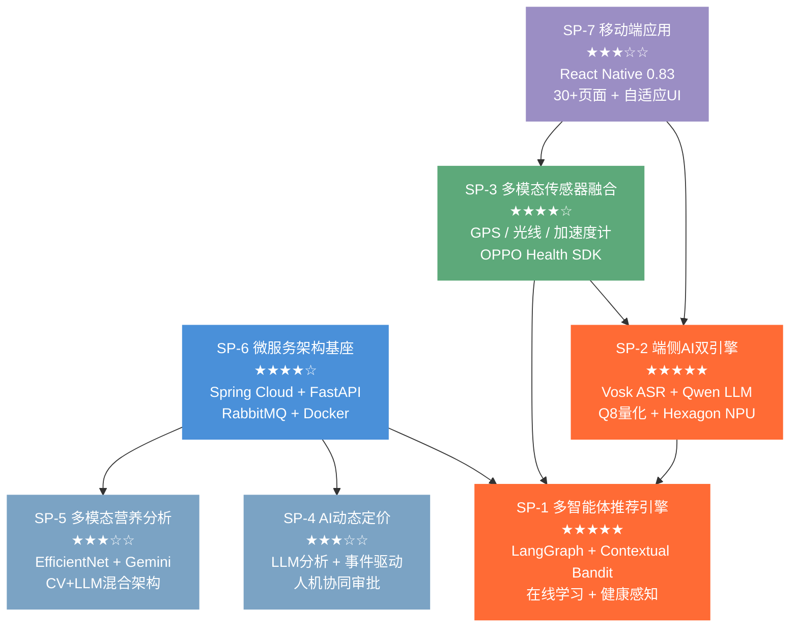

# 1 问题聚焦

## 1.1 问题描述

随着移动互联网和 O2O（Online to Offline）商业模式的深度普及，在线外卖已成为数亿用户的高频生活服务场景。然而，当前主流外卖平台虽然在交易撮合和物流配送方面已趋成熟，但在**智能化服务体验**层面仍存在三个显著且相互关联的核心痛点，严重制约了用户体验的进一步提升和产业的智能化升级。

**痛点一：推荐系统的场景感知严重缺失。** 传统外卖推荐系统主要依赖协同过滤或基于内容的推荐算法，仅利用用户的历史点击和购买行为数据来预测偏好。然而，用户的点餐决策是一个高度情境化的行为——一个寒冷的雨天和一个晴朗的夏日，用户对餐食的需求截然不同；刚运动完的用户和久坐办公的用户，对营养搭配的诉求也完全不同；交通拥堵时用户更倾向于选择近距离的餐厅。这些直接影响决策的实时环境因素（天气、交通、时段、身体状态）和多模态感知信号（语音、健康数据、环境光照）被现有系统几乎完全忽略，导致推荐结果千篇一律、无法"因时因地因人"地动态响应。

**痛点二：菜品定价策略僵化，缺乏数据驱动的动态调整能力。** 绝大多数餐饮商家仍然采用"一价定终身"的固定定价模式，无法根据供需波动、销量趋势、竞争态势等市场信号做出灵活的价格调整。这直接导致两个经营困境：畅销品的定价偏低，错失了利润最大化的空间；滞销品的定价偏高，无法通过价格杠杆刺激销量、减少食材浪费。商家迫切需要一套"AI 出主意、人来拍板"的智能定价辅助系统，但现有平台未能提供这一能力。

**痛点三：用户在点餐场景中缺乏实时、个性化的健康指导。** 面对一份纸质或电子菜单，用户无法快速了解各菜品的热量、食材成分和潜在过敏原信息。对于有食物过敏（如花生、海鲜过敏）、慢性病饮食控制（如糖尿病控糖、高血压限盐）或健身营养管理需求的用户群体，现有平台几乎不提供任何辅助判断工具，用户只能凭经验和猜测做出选择，存在健康风险。

**隐私与安全的隐性痛点。** 要解决上述三个痛点，系统不可避免地需要采集用户的语音输入、健康数据（心率、血氧、步数、睡眠等）和位置信息。传统的云端集中处理架构意味着这些高度敏感的个人数据必须全部上传至服务器，带来了严重的隐私泄露风险和用户信任危机。如何在**不牺牲 AI 推荐能力的前提下保护用户隐私**，是一个被现有平台普遍忽视但在法规和用户意识层面日益迫切的问题。

综上所述，本项目聚焦的核心问题可概括为：**如何构建一个面向移动端的智能生活服务平台，通过多智能体协作、端云协同的 AI 架构，在保护用户隐私的前提下，实现场景感知的个性化推荐、数据驱动的商家智能定价和实时多模态健康饮食指导，全面提升外卖场景下的用户体验和商家经营效率？**

---

## 1.2 问题抽象

将上述具体业务问题转化为可工程化求解的技术问题，形成以下技术问题体系：

### 1.2.1 上下文感知的多智能体协作推荐问题

**业务本质**：用户的点餐决策受多维实时上下文（天气、交通、时段、身体状态、情绪意图）的共同影响，推荐系统需要同时感知、融合和利用这些异构信号源。

**技术抽象**：这是一个**上下文感知的多目标排序决策问题**。将每个候选餐厅视为一个"臂"（Arm），将推荐过程建模为多臂老虎机（Multi-Armed Bandit, MAB）问题的上下文扩展形式——Contextual Bandit。系统需要在有限的用户交互中，在"利用已知最优选择"（Exploitation）和"探索潜在更优选择"（Exploration）之间做出平衡，同时将环境上下文（天气、交通、健康、光照等 50+ 维信号）融入每个臂的奖励估计中。进一步地，将推荐决策过程分解为多个智能体的协作问题，利用状态图编排框架（LangGraph StateGraph）实现智能体间的有条件串行/并行流水线，属于**多智能体系统编排与协调**技术范畴。

### 1.2.2 端侧隐私保护下的自然语言意图提取问题

**业务本质**：用户通过语音表达模糊的点餐意图（如"想吃辣的，不要花生，三十块以内"），系统需要在**不上传原始语音的前提下**，提取结构化的饮食约束。

**技术抽象**：这是一个**端侧资源受限条件下的语音理解与结构化信息抽取问题**。涉及两个级联的子问题：（1）在手机端侧以 < 50MB 模型体积实现中文离线语音识别（ASR）；（2）在端侧以 < 100MB 模型体积实现自然语言到结构化 JSON 的意图提取（NLU），且需支持多轮对话上下文。核心约束是**推理必须完全在设备本地完成**，涉及模型量化（Q8 GGUF）、内存映射（mmap）、NPU 硬件加速（Hexagon DSP）等端侧部署优化技术。

### 1.2.3 LLM 驱动的动态定价策略生成问题

**业务本质**：根据菜品的历史销售数据自动生成定价调整建议，并与商家形成"AI 建议 → 人工审批"的协作闭环。

**技术抽象**：这是一个**基于大语言模型的时间序列趋势分析与决策生成问题**。将历史销售数据（7 天粒度的销量和营收）通过自然语言 Prompt 传入 LLM，由 LLM 扮演"收益管理总监"角色，根据滞销/畅销/稳定三类模式输出结构化的定价建议（JSON 格式）。核心技术挑战是 Prompt Engineering 的可靠性——确保 LLM 输出格式严格一致、数值合理、推理逻辑可解释。此外还涉及事件驱动架构下的异步数据采集和阈值自动审批机制。

### 1.2.4 多模态视觉营养分析问题

**业务本质**：用户拍摄菜单或菜品照片，系统实时识别菜品并输出热量、食材、过敏原等健康信息。

**技术抽象**：这是一个**多模态视觉问答（VQA）与结构化信息抽取问题**。输入为一张菜单/菜品图片和用户的健康标签集合，输出为结构化的营养分析报告。系统采用**端侧 CV + 云端多模态 LLM 混合架构**——先用轻量级 EfficientNet-B0 进行快速分类，置信度高时仅需文本查询 LLM（降低延迟和成本），置信度低时回退到全图像多模态推理。核心技术挑战是跨模型的响应格式标准化和多源格式兼容。

### 1.2.5 多模态传感器融合与健康上下文建模问题

**业务本质**：将手机/手表的多种传感器数据（心率、血氧、步数、睡眠、压力、环境光）转化为可指导推荐决策的上下文信号。

**技术抽象**：这是一个**多源异构传感器数据融合与实时状态推断问题**。需要在 React Native 框架中通过自定义 Hooks 和原生模块桥接，统一封装 GPS 定位、光线传感器、加速度计、OPPO Health SDK 等 6 类数据源，实现传感器噪声滤波（移动平均）、状态推断（如 30 分钟步数滑窗判定运动后状态）和跨平台数据聚合，并将融合后的健康上下文输入到推荐引擎的 Contextual Bandit 评分模型中。

---

## 1.3 问题定位

### 1.3.1 业务领域定位

本项目所聚焦的问题属于**智能生活服务**领域，具体对应大赛赛题中"智能生活服务工具"核心场景。在该场景描述中，赛题明确提出：

> "餐饮场景中，拍摄菜单可识别菜品成分（如是否含过敏原），推荐适配'少油少盐''控糖'等需求的选项并测算热量。"

本项目的 NutriVision 多模态营养分析和健康感知推荐功能，正是对上述场景的**完整技术实现和深度扩展**——不仅实现了拍照识别菜品和测算热量的基础能力，还进一步融合了智能穿戴设备的实时健康数据，将"识别过敏原"扩展为基于心率、血氧、压力、睡眠等综合健康状态的全方位饮食指导。

同时，本项目的端云协同语音交互和 OPPO 手表/手环数据联动，高度契合赛题总纲中"通过手机/手表等多种智能终端和 AI 技术的联动服务，深度赋能用户的生活服务、健康管理等领域"的核心目标，以及"随身 AI 健康管家"场景中"关联智能手环等设备，实时整合心率、睡眠时长等数据"的技术要求。

### 1.3.2 技术领域定位

本项目涉及的技术领域横跨**人工智能、移动应用开发和分布式系统**三大技术板块，具体映射关系如下：

| 技术领域 | 本项目对应技术 | 赛题技术关键词映射 |
| :--- | :--- | :--- |
| 多智能体系统 | LangGraph 状态图编排、多 Agent 协作、条件路由 | AIGC、机器学习 |
| 强化学习/在线学习 | Contextual Bandit、UCB1、Thompson Sampling、ε-Greedy | 机器学习、深度学习 |
| 自然语言处理 | 端侧 LLM 意图提取、DeepSeek 推荐文案生成、LLM 定价分析 | 自然语言处理 |
| 计算机视觉 | EfficientNet-B0 食物分类、Gemini 多模态菜单分析 | 视觉大模型 |
| 端侧 AI 部署 | GGUF 量化、llama.rn、Vosk 离线 ASR、Hexagon NPU 加速 | 端云协同 |
| 多模态感知 | 语音 + 图像 + GPS + 光线 + 加速度计 + 健康 SDK | 实时多模态感知 |
| 隐私计算 | 端侧推理、数据脱敏、结构化约束传输 | 端云协同 |
| 微服务架构 | Spring Cloud + FastAPI、RabbitMQ 事件驱动、Docker 编排 | 移动应用开发 |
| 移动端开发 | React Native 0.83、Hermes 引擎、React Navigation 7 | 移动端交互设计 |
| 数据工程 | PostgreSQL + MongoDB + Redis 多库混合架构 | 数据分析 |

---

## 1.4 问题评估

### 1.4.1 技术性评估

本项目问题具有**高技术复杂度**，体现在以下四个维度：

**（1）AI 技术的广度与深度并重。** 项目不是简单地调用一个 AI API，而是在推荐、定价、营养分析三个子域分别构建了完整的 AI 解决方案——推荐系统实现了从数据采集到多智能体编排、从 MAB 算法到在线学习的完整闭环（仅决策智能体就有 1935 行 Python 代码、覆盖 50+ 健康上下文信号）；定价系统实现了"事件驱动数据采集 → LLM 分析 → 自动/人工审批"的三阶段自动化流水线；营养分析系统实现了"端侧 CV 快速分类 + 云端多模态 LLM 深度分析"的混合架构。这种技术广度在同类项目中极为罕见。

**（2）端侧 AI 部署的工程难度极高。** 在手机端侧同时部署离线语音识别引擎（Vosk ~40MB）和量化大语言模型（Qwen Q8 GGUF ~50MB），并实现两者的级联处理管线（语音→文字→结构化 JSON），涉及模型量化、内存映射、NPU 加速库适配（5 个 Hexagon 版本）、多轮对话上下文管理等多项端侧 AI 工程难题。据我们调研，在同类大学生竞赛项目中，能在移动端实现离线 LLM 推理的案例极少。

**（3）系统架构的工程复杂度高。** 九个微服务（6 Java + 3 Python）、三个数据库（PostgreSQL + MongoDB + Redis）、消息队列（RabbitMQ）、三个可观测性服务（Prometheus + Grafana + Zipkin），通过 484 行的 Docker Compose 编排一键部署。Java 和 Python 双语言异构微服务的治理本身就是企业级的架构挑战。

**（4）多模态传感器融合的跨层集成。** 从硬件传感器（光线、加速度计）到原生 SDK（OPPO Health）到 React Native Hooks 到推荐引擎的上下文奖励，数据流跨越了硬件层、原生层、桥接层、JS 层和云端服务层共五个技术层次，任何一层的集成失误都会导致整条链路断裂。

### 1.4.2 普适性评估

本项目解决的问题具有**高普适性**，体现在三个层面：

**（1）场景普适性。** 外卖/餐饮推荐是数亿用户的高频刚需场景。根据公开数据，中国在线外卖用户规模已超过 5 亿，市场交易规模超万亿元。推荐精准度每提升 1%，就可能带来数十亿元的 GMV 增长。本项目的多智能体推荐架构和健康感知能力，对于美团、饿了么等主流平台具有直接的技术借鉴价值。

**（2）技术普适性。** 本项目构建的多智能体协作推荐框架、端云协同隐私保护架构、LLM 驱动的定价分析流水线，均不局限于外卖场景。多智能体推荐可推广至电商、旅游、医疗等任何需要上下文感知的推荐场景；端云协同的隐私保护架构可推广至任何涉及敏感数据处理的移动应用；LLM 定价分析可推广至零售、酒店等需要动态定价的行业。

**（3）人群普适性。** 本项目的健康感知推荐特别关注了特殊饮食需求群体——食物过敏患者（通过 NutriVision 过敏原识别和端侧禁忌食材过滤）、慢性病患者（通过心率/血氧/压力健康数据驱动的饮食建议）、健身人群（通过运动后状态检测推荐高蛋白餐食）。这些群体在现有平台中长期被忽视，本项目为其提供了有针对性的智能服务。

### 1.4.3 热度评估

本项目涉及的技术方向均处于当前产业和学术的**高热度前沿**：

| 热点方向 | 产业动态 | 本项目对应 |
| :--- | :--- | :--- |
| 大模型应用落地 | 2024-2025 年产业界的首要命题，各大厂争相推出行业大模型应用 | 三个 LLM 应用场景（推荐文案、动态定价、营养分析） |
| 端侧大模型部署 | Apple Intelligence、高通 AI Engine、联发科 APU 推动端侧推理 | Qwen Q8 GGUF + llama.rn + Hexagon NPU 加速 |
| 多智能体协作 | LangChain/LangGraph/AutoGen 等多智能体框架 2024 年爆发式增长 | LangGraph StateGraph 三智能体编排 |
| AI + 健康管理 | 智能穿戴设备（Apple Watch、OPPO Watch）健康生态快速扩张 | OPPO Health SDK 深度集成、健康感知推荐 |
| 隐私计算/端云协同 | GDPR/个保法驱动隐私保护技术刚需化 | 端侧 ASR + LLM 推理、数据脱敏传输 |
| MCP 协议 | Anthropic 2024 年底发布 Model Context Protocol，成为 AI 互操作标准 | FastMCP 实现 8 个标准化工具 + 3 个 Agent 资源 |

---

## 1.5 问题分解

根据问题的规模和技术特征，将总问题分解为 **7 个子问题**，并分析各子问题的技术难度和相互依赖关系。

### 1.5.1 子问题清单

| 编号 | 子问题 | 技术难度 | 核心挑战 |
| :---: | :--- | :---: | :--- |
| **SP-1** | 多智能体协作推荐引擎的设计与实现 | ★★★★★ | 三智能体编排、Contextual Bandit 算法设计、50+ 上下文信号融合、在线学习 |
| **SP-2** | 端侧 AI 双引擎部署与隐私保护推荐管线 | ★★★★★ | 离线 ASR + 端侧 LLM 级联、Q8 量化、NPU 加速、数据脱敏 |
| **SP-3** | 多模态传感器融合与健康上下文建模 | ★★★★☆ | 6 类传感器统一封装、OPPO Health SDK 原生桥接、运动后状态推断、传感器噪声滤波 |
| **SP-4** | LLM 驱动的 AI 动态定价流水线 | ★★★☆☆ | Prompt 可靠性、事件驱动数据采集、自动审批阈值机制、提案状态管理 |
| **SP-5** | 多模态视觉营养分析系统 | ★★★☆☆ | CV + LLM 混合架构、多模态 Prompt 设计、响应格式标准化、并发控制 |
| **SP-6** | 微服务架构与分布式系统基座 | ★★★★☆ | 9 服务编排、Java/Python 异构治理、RabbitMQ 事件驱动、多数据库混合架构 |
| **SP-7** | 移动端应用与交互体验 | ★★★☆☆ | React Native 0.83 跨平台开发、30+ 页面导航、环境光自适应 UI、北欧主题设计 |

### 1.5.2 子问题依赖关系



### 1.5.3 依赖关系说明

| 依赖路径 | 依赖性质 | 说明 |
| :--- | :--- | :--- |
| SP-6 → SP-1 | **强依赖** | 推荐引擎需要微服务基座提供的服务注册发现、消息队列、数据库等基础设施 |
| SP-6 → SP-4 | **强依赖** | 定价系统依赖 RabbitMQ 事件驱动架构和 PostgreSQL 独立数据库 |
| SP-6 → SP-5 | **强依赖** | 营养分析服务部署在微服务集群中，依赖 Docker 编排和统一配置 |
| SP-3 → SP-1 | **数据依赖** | 推荐引擎的 Contextual Bandit 需要传感器融合后的健康上下文作为输入 |
| SP-3 → SP-2 | **数据依赖** | 端侧 AI 管线需要健康数据（运动后状态）作为脱敏约束的补充字段 |
| SP-2 → SP-1 | **接口依赖** | 端侧推理输出的结构化 JSON 约束通过 EdgeSynergy 接口传入推荐引擎进行硬过滤 |
| SP-7 → SP-2 | **宿主依赖** | 端侧 AI 模型运行在 React Native 应用中，依赖移动端框架的原生模块加载能力 |
| SP-7 → SP-3 | **宿主依赖** | 传感器数据采集依赖移动端的 React Native Hooks 和原生桥接层 |
| SP-4（独立） | **弱依赖** | 定价系统与推荐系统之间无直接数据依赖，通过 RabbitMQ 松耦合 |
| SP-5（独立） | **弱依赖** | 营养分析系统独立运行，通过 REST API 被前端直接调用 |

### 1.5.4 关键路径分析

从依赖图可以识别出系统的**关键开发路径**为：

```
SP-6（微服务基座）→ SP-7（移动端框架）→ SP-3（传感器融合）→ SP-2（端侧AI）→ SP-1（推荐引擎）
```

这条关键路径上的五个子问题必须按序完成，总难度达到 ★×21，是整个项目技术实现的主干。其中 SP-1 和 SP-2 作为终端汇聚点，同时依赖多个上游子问题的输出，是系统集成测试的重点风险区域。

SP-4（动态定价）和 SP-5（营养分析）与关键路径**解耦**，可与关键路径并行开发，有效缩短总工期。这种解耦得益于微服务架构和事件驱动设计——定价系统通过 RabbitMQ 异步接收订单事件，营养分析系统通过独立 REST API 对外服务，两者均不阻塞推荐系统的核心流程。
