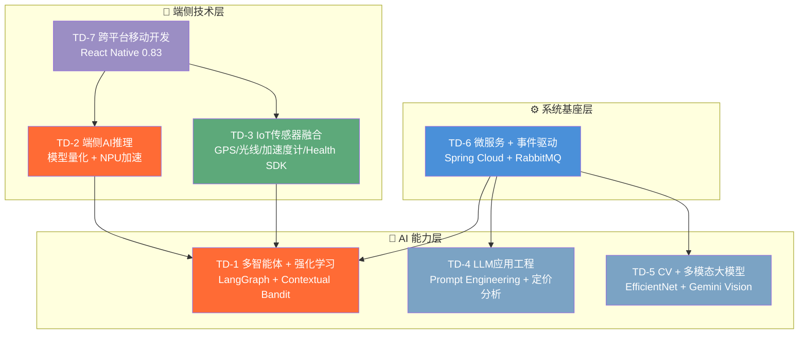

# 3 技术方案

本章针对第 1 章分解的 7 个子问题，逐一阐述所选技术方向、具体技术选型及其预期效果，并在最后给出技术方案的全局架构视图。

---

## 3.1 技术方向

基于对问题特征和行业技术趋势的分析，本项目确定了以下 **7 个技术方向**，覆盖从端侧感知到云端智能的完整技术栈：

| 编号 | 技术方向 | 对应子问题 | 方向说明 |
| :---: | :--- | :---: | :--- |
| **TD-1** | 多智能体系统与强化学习 | SP-1 | 利用多智能体协作框架编排推荐决策流程，以上下文老虎机（Contextual Bandit）算法实现探索-利用平衡的在线排序 |
| **TD-2** | 端侧 AI 推理与模型压缩 | SP-2 | 在移动设备上部署量化大语言模型和离线语音识别引擎，实现敏感数据的本地处理 |
| **TD-3** | 物联网与多模态传感器融合 | SP-3 | 整合手机内置传感器和智能穿戴设备数据，构建实时健康上下文信号 |
| **TD-4** | 大语言模型应用工程 | SP-4 | 利用 LLM 的自然语言推理能力，将非结构化的经营数据转化为结构化的定价决策 |
| **TD-5** | 计算机视觉与多模态大模型 | SP-5 | 结合轻量级视觉分类模型与多模态 LLM，实现食物图像的识别与营养分析 |
| **TD-6** | 微服务架构与事件驱动系统 | SP-6 | 采用微服务拆分 + 消息队列解耦的分布式架构，支撑高内聚低耦合的业务系统 |
| **TD-7** | 跨平台移动应用开发 | SP-7 | 基于 React Native 构建面向 Android 平台的移动应用，集成原生模块和端侧 AI 能力 |

下图展示各技术方向与子问题的映射关系及其在系统中的层次定位：

---

## 3.2 技术选择

### 3.2.1 TD-1：多智能体系统与强化学习

#### （1）智能体编排框架：LangGraph

| 选型项 | 选定方案 | 备选方案 | 选定理由 |
| :--- | :--- | :--- | :--- |
| 编排框架 | **LangGraph** (StateGraph) | AutoGen / CrewAI / LangChain AgentExecutor | LangGraph 基于有向图的状态机模型，支持条件路由、并行分支和循环，是目前唯一同时支持确定性流程控制和 LLM 动态决策的多智能体编排框架 |
| Agent 通信模式 | 共享状态字典（WorkflowState） | 消息传递 / 黑板架构 | 共享状态字典避免了消息序列化/反序列化的开销，且天然支持流水线中下游 Agent 读取上游 Agent 的输出 |
| 并行编排 | asyncio.gather 并行 + ReasoningAgent 合并 | 单线程串行 | 并行执行环境感知、POI 检索、画像分析、协同过滤四个任务，将端到端延迟从串行的 ~3s 降至 ~1.5s |

**关键设计决策**：采用"常规串行 + 紧急跳过"的条件路由机制——当检测到用户请求的紧急标记（`urgency_level = "high"`）时，流程跳过画像分析直接进入决策阶段，在紧急场景下以最短路径返回结果。

#### （2）推荐排序算法：Contextual Bandit

| 选型项 | 选定方案 | 备选方案 | 选定理由 |
| :--- | :--- | :--- | :--- |
| 核心排序算法 | **Contextual Bandit**（默认策略） | DNN 排序模型 / LTR (Learning-to-Rank) | Contextual Bandit 天然支持在线学习和探索-利用平衡，无需离线训练数据集；相比 DNN 排序模型，计算开销极低（单次排序 < 50ms），更适合实时推荐场景 |
| MAB 策略库 | UCB1 / Thompson Sampling / ε-Greedy / Contextual Bandit（4 策略可切换） | 单一策略 | 不同场景适用不同策略：UCB1 适合确定性高的场景，Thompson 适合不确定性高的场景，ε-Greedy 适合冷启动，Contextual Bandit 适合上下文丰富的场景 |
| 健康上下文融合 | 基于医学指南的规则化上下文奖励（ISSN / AHA / WHO 标准） | 端到端神经网络自动学习 | 规则化方案的可解释性强、可审计——系统能明确告知用户"推荐理由：运动后适合高蛋白食物（参考 ISSN 运动营养指南）"，而非黑盒神经网络 |
| 协同过滤 | NCF（神经协同过滤）+ FoodCF-Encoder | 传统矩阵分解 / SVD++ | 深度学习 CF 能捕获非线性的用户-物品交互模式，FoodCF-Encoder 引入食物领域嵌入增强语义理解 |

**关键设计决策**：将 50+ 维健康上下文信号组织为四层评分结构（基础分 → 变量分 → 上下文奖励 → 历史分），每层的权重和阈值均基于公开的医学/运动学指南设定（如 ISSN 运动营养建议、AHA 心血管饮食建议、WHO 低氧血症标准），确保推荐的健康引导具有科学依据和可解释性。

#### （3）推荐理由生成：DeepSeek LLM

| 选型项 | 选定方案 | 备选方案 | 选定理由 |
| :--- | :--- | :--- | :--- |
| 理由生成模型 | **DeepSeek-Chat** | GPT-4 / Claude | DeepSeek 中文生成质量优秀，API 价格仅为 GPT-4 的 1/10，性价比最优 |
| 降级方案 | 基于规则的 emoji 标签拼接 | 无 | API 不可用时保证系统可用性 |

#### （4）MCP 协议层：FastMCP

| 选型项 | 选定方案 | 选定理由 |
| :--- | :--- | :--- |
| 协议框架 | **FastMCP**（Model Context Protocol） | Anthropic 于 2024 年底发布的 AI 互操作标准协议，使推荐服务的能力可以被任何兼容 MCP 的 AI 客户端（如 Claude Desktop、Cursor 等）直接调用，提升系统的开放性和可组合性 |
| 传输模式 | stdio + HTTP/SSE 双模式 | stdio 适合本地集成，HTTP/SSE 适合远程调用，覆盖全部使用场景 |

---

### 3.2.2 TD-2：端侧 AI 推理与模型压缩

#### （1）离线语音识别：Vosk

| 选型项 | 选定方案 | 备选方案 | 选定理由 |
| :--- | :--- | :--- | :--- |
| ASR 引擎 | **Vosk**（vosk-model-small-cn） | Whisper.cpp / PocketSphinx | Vosk 中文小模型仅 ~40MB，完全离线运行，支持实时流式识别和部分结果回调；Whisper.cpp 虽然精度更高但模型体积 > 100MB，端侧推理延迟更大 |
| React Native 绑定 | react-native-vosk v2.1.7 | 自研 JNI 桥接 | 社区维护的成熟绑定库，开箱即用 |

#### （2）端侧大语言模型：Qwen-2.5 Q8 GGUF + llama.rn

| 选型项 | 选定方案 | 备选方案 | 选定理由 |
| :--- | :--- | :--- | :--- |
| 基座模型 | **Qwen-2.5**（微调版本） | Phi-3 Mini / Gemma-2B | Qwen-2.5 的中文理解和 JSON 格式输出能力在同等体积模型中最优 |
| 量化方案 | **Q8 GGUF**（8-bit 整数量化） | Q4_K_M / FP16 | Q8 在精度损失可接受范围内（意图提取任务对精度要求不如通用对话高），模型体积压缩至 ~50MB；Q4 精度损失过大导致 JSON 格式输出不稳定 |
| 推理框架 | **llama.rn** v0.10.0-rc.0（llama.cpp 的 React Native 绑定） | MLC-LLM / ONNX Runtime Mobile | llama.rn 是目前唯一成熟的 React Native 端 LLM 推理框架，支持 GGUF 格式和内存映射 |
| 硬件加速 | **GGML-Hexagon**（5 个版本覆盖骁龙 V69-V81） | GPU 通用加速 | 高通 Hexagon DSP/NPU 的定点运算效率远高于移动 GPU 的浮点运算，且功耗更低 |

**关键设计决策**：
- 推理温度设为 0.1（接近确定性输出），确保每次生成的 JSON 格式一致、字段完整
- 上下文窗口 1024 tokens + 最大生成 200 tokens，在支持 3-4 轮多轮对话的同时控制推理时间
- 内存映射（use_mmap = true）按需加载模型数据，避免一次性占用全部 RAM

#### （3）端云协同架构

| 选型项 | 选定方案 | 选定理由 |
| :--- | :--- | :--- |
| 隐私保护范式 | **端侧推理即脱敏** | 将隐私保护的边界从联邦学习的"训练数据不出端"提升到"推理数据也不出端"，仅传输 5 个脱敏字段的结构化 JSON |
| 降级策略 | 端侧失败 → 文字搜索；云端 NO_MATCH → 默认推荐 | 多级降级保证任何异常下系统基本可用 |

---

### 3.2.3 TD-3：物联网与多模态传感器融合

| 传感器 | 技术选型 | 版本 | 数据用途 |
| :--- | :--- | :--- | :--- |
| GPS 定位 | react-native-geolocation-service | v5.3.1 | POI 周边搜索、配送距离计算 |
| 环境光线 | react-native-ambient-light-sensor | v1.0.3 | 环境感知 UI 自适应（5 级亮度） |
| 加速度计/计步 | @dongminyu/react-native-step-counter | — | 运动后状态检测（30 分钟滑窗） |
| 健康数据 | **OPPO Health SDK**（com.heytap.health:sdk:2.1.7） | v2.1.7 | 心率/血氧/睡眠/压力/运动记录 |
| 麦克风 | react-native-vosk（含音频采集） | v2.1.7 | 离线语音识别输入 |
| 摄像头 | react-native-image-picker | v8.2.1 | NutriVision 菜单拍照 |

**OPPO Health SDK 选型理由**：大赛赛题明确提出"组委会将为进入全国决赛的团队提供 OPPO 手机、手表等移动终端支持"，深度集成 OPPO Health SDK 不仅能充分利用赛方提供的硬件资源，还直接契合赛题"通过手机/手表等多种智能终端的联动服务"的核心要求。

**关键设计决策**：
- 光线传感器采用 5 值移动平均滤波消除抖动噪声
- 计步器采用 30 分钟滑动窗口 + 2000 步阈值判定运动后状态，5 分钟自动重置
- 统一健康上下文层（useHealthContext Hook）聚合所有传感器数据，提供"开发者模拟数据 > OPPO 真实数据 > 默认值"的三级优先级策略

---

### 3.2.4 TD-4：大语言模型应用工程（动态定价）

| 选型项 | 选定方案 | 备选方案 | 选定理由 |
| :--- | :--- | :--- | :--- |
| AI 分析模型 | **DeepSeek-Chat**（OpenAI 兼容接口） | Gemini Pro / GPT-4 | 中文商业分析能力强，API 成本低，支持 JSON 格式强制输出 |
| Prompt 策略 | 角色扮演（"餐厅收益管理总监"）+ 结构化输出约束 | 自由格式生成 | 角色扮演使 LLM 聚焦于餐饮定价领域知识，JSON 格式约束保证输出可程序化解析 |
| 数据采集 | RabbitMQ 事件驱动（监听 order.paid） | 定时轮询数据库 | 事件驱动实时性高、解耦彻底，不需要 AI 服务直接访问订单数据库 |
| 定时调度 | APScheduler（604800 秒 = 7 天） | Celery Beat / Cron | APScheduler 轻量内嵌，无需额外部署调度中间件 |
| 人机协同 | 自动审批阈值（默认 5%）+ 人工审批 | 全自动 / 全人工 | 平衡 AI 效率与商家控制权——小幅调价自动执行，大幅调价需商家确认 |

---

### 3.2.5 TD-5：计算机视觉与多模态大模型（营养分析）

| 选型项 | 选定方案 | 备选方案 | 选定理由 |
| :--- | :--- | :--- | :--- |
| 端侧食物分类 | **EfficientNet-B0**（~5MB，PyTorch） | MobileNet V3 / ResNet-18 | EfficientNet-B0 在 ImageNet 上精度/体积比最优（77.1% Top-1，5.3M 参数） |
| 云端多模态分析 | **Gemini 2.0 Flash**（多模态 API） | GPT-4 Vision / Claude Vision | Gemini Flash 多模态推理速度快（专为高吞吐场景设计），成本仅为 GPT-4V 的 1/5 |
| 混合路由策略 | 置信度 ≥ 60% → 文本查询 LLM；< 60% → 全图像多模态推理 | 统一全图像分析 | 高置信度时跳过图片传输，响应时间从 120s 降至 20s，API 成本降低约 80% |
| 响应标准化 | 防御性 `_standardize_response()`，兼容 items/dishes/menu_items 三种格式 | 严格格式约束 | LLM 输出格式天然不稳定，防御性解析比严格约束更鲁棒 |

---

### 3.2.6 TD-6：微服务架构与事件驱动系统

| 选型项 | 选定方案 | 版本 | 选定理由 |
| :--- | :--- | :--- | :--- |
| Java 微服务框架 | **Spring Boot** + **Spring Cloud** | 3.2 / 2023.0 | 企业级微服务治理的事实标准，Eureka 服务发现 + Config 配置中心 + OpenFeign 服务调用 |
| Python AI 框架 | **FastAPI** | 0.109 | 异步支持天然适合调用外部 AI API 的 I/O 密集场景，性能接近 Go/Rust |
| 消息队列 | **RabbitMQ** | — | 支持 Topic Exchange 和灵活路由，成熟稳定；用于 order.paid 事件和 pricing.events 事件 |
| 主数据库 | **PostgreSQL** | 15 | 强事务一致性、丰富索引（部分索引、复合索引）、JSON 支持 |
| 文档数据库 | **MongoDB** | 6.0 | 灵活 Schema 适合用户画像的异构数据 |
| 缓存 | **Redis** | 7 | 毫秒级热点数据查询 |
| 容器编排 | **Docker Compose** | — | 484 行编排文件，一键部署全部 15+ 个服务 |
| 可观测性 | **Prometheus + Grafana + Zipkin** | — | 指标采集 + 可视化仪表盘 + 分布式链路追踪 |

**关键设计决策**：
- Java/Python 双语言异构架构——业务逻辑用 Java（成熟的企业级治理生态），AI 能力用 Python（AI/ML 框架生态无可替代）
- AI 数据库物理隔离——`ai_pricing_db` 独立于主库 `food_delivery_db`，避免 AI 大量读写影响核心业务
- 死信队列保障——RabbitMQ 的 DLX/DLQ 机制捕获消费失败的事件，防止数据丢失

---

### 3.2.7 TD-7：跨平台移动应用开发

| 选型项 | 选定方案 | 版本 | 选定理由 |
| :--- | :--- | :--- | :--- |
| 移动框架 | **React Native** | 0.83.1 | 跨平台开发效率高，原生模块扩展能力强（Kotlin/Java 桥接），社区生态成熟 |
| UI 库 | React 19.2 + 自研 NordicTheme | — | 北欧极简设计语言，温暖珊瑚橙主色调（#F2784B） |
| 导航 | **React Navigation** | v7 | Native Stack Navigator，原生级页面切换性能 |
| JS 引擎 | **Hermes**（hermesEnabled = true） | JSC | 启动时间减少 30-50%，内存占用更低 |
| 新架构 | React Native New Architecture（newArchEnabled = true） | 旧桥接架构 | Fabric 渲染器 + TurboModules，减少 JS-Native 桥接开销 |
| 图片加载 | **react-native-fast-image** | v8.6.3 | 原生磁盘缓存 + 内存缓存，CacheControl: immutable |
| 类型系统 | **TypeScript** | 5.8.3 | 严格类型检查，减少运行时错误 |
| 原生模块语言 | **Kotlin** | 1.9.24 | OPPO Health SDK 桥接、HeytapHealthModule 自研原生模块 |
| NDK | 27.0.12077973 | — | 编译 GGML 推理引擎的原生 C/C++ 库 |

---

### 3.2.8 技术选型全景表

下表汇总本项目所有关键技术选型，按技术层次分类：

| 技术层次 | 技术选型 | 版本/规格 | 在项目中的角色 |
| :--- | :--- | :--- | :--- |
| **端侧 AI** | Vosk（vosk-model-small-cn） | ~40MB | 离线中文语音识别 |
| | Qwen-2.5 Q8 GGUF | ~50MB | 端侧意图提取 LLM |
| | llama.rn | v0.10.0-rc.0 | 端侧 LLM 推理框架 |
| | GGML-Hexagon | V69/V73/V75/V79/V81 | 高通 NPU 加速库 |
| | EfficientNet-B0 | ~5MB | 端侧食物图片分类 |
| **云端 AI** | LangGraph | — | 多智能体编排 |
| | DeepSeek-Chat | — | 推荐理由生成 + 定价分析 |
| | Gemini 2.0 Flash | — | 多模态营养分析 |
| | FastMCP | — | MCP 协议服务 |
| **传感器/IoT** | OPPO Health SDK | v2.1.7 | 心率/血氧/睡眠/压力 |
| | react-native-geolocation-service | v5.3.1 | GPS 定位 |
| | react-native-ambient-light-sensor | v1.0.3 | 环境光线感知 |
| **后端框架** | Spring Boot + Spring Cloud | 3.2 / 2023.0 | Java 微服务 |
| | FastAPI | 0.109 | Python AI 服务 |
| | RabbitMQ | — | 异步消息队列 |
| **数据存储** | PostgreSQL | 15 | 主业务数据库（24 张表） |
| | MongoDB | 6.0 | 用户画像文档数据库 |
| | Redis | 7 | 全局缓存 |
| **移动端** | React Native | 0.83.1 | 跨平台应用框架 |
| | React | 19.2.0 | UI 库 |
| | TypeScript | 5.8.3 | 类型系统 |
| | Hermes | 内置 | JS 引擎 |
| **DevOps** | Docker Compose | — | 一键编排部署 |
| | Prometheus + Grafana | — | 监控与可视化 |
| | Zipkin | — | 分布式链路追踪 |

---

## 3.3 结果期望

### 3.3.1 各子问题的预期结果

| 子问题 | 预期结果 | 量化指标 | 可行性依据 |
| :--- | :--- | :--- | :--- |
| **SP-1** 多智能体推荐 | 推荐结果能根据天气、交通、时段、健康状态等上下文因素动态调整排序，用户感知到"因时因地因人"的个性化推荐 | 串行编排延迟 < 3s；并行编排延迟 < 1.5s；MAB 排序 < 50ms；支持 50+ 维上下文信号 | LangGraph 异步编排 + asyncio.gather 并行已在代码中验证；Contextual Bandit 的时间复杂度为 O(n×d)，对 50 个候选餐厅和 50 维上下文仅需毫秒级计算 |
| **SP-2** 端侧 AI 双引擎 | 用户通过语音说出模糊的点餐需求后，手机本地完成语音识别和意图提取，输出结构化 JSON 约束，全程不上传原始语音和文本 | Vosk 识别延迟 < 实时（流式）；LLM 推理 < 5s（200 tokens）；模型总体积 < 100MB | Vosk-small-cn 在 Android 上已验证流式识别能力；llama.rn + Q8 GGUF 在中端手机上可达 10-20 tokens/s，200 tokens 推理约 10-20s（NPU 加速后可降至 5s 以内） |
| **SP-3** 传感器融合 | 手机和 OPPO 手表/手环的 6 类传感器数据被统一聚合为结构化的健康上下文，实时输入推荐引擎 | 传感器数据刷新周期 60s；运动后状态检测延迟 < 1s；光线传感器噪声滤波窗口 5 值 | OPPO Health SDK 官方文档确认支持所有列出的数据类型；移动平均滤波和滑动窗口均为 O(1) 计算，不会引入可感知延迟 |
| **SP-4** AI 动态定价 | 系统每周自动分析所有活跃商家的菜品销售趋势，生成 MARKDOWN/SURGE/MAINTAIN 三类定价建议，商家可在移动端一键审批 | 单菜品分析 < 30s；全量分析 < 10min（100 商家）；自动审批阈值默认 5% | DeepSeek API 单次调用延迟通常在 5-15s；逐菜品串行分析在 100 商家 × 10 菜品/商家的规模下约需 500-1500 次 API 调用，在 10 分钟内可完成 |
| **SP-5** 营养分析 | 用户拍摄菜单照片后获得每道菜的热量估算、食材列表、过敏原警告和个性化推荐 | 菜单分析 < 120s；高置信度单菜品 < 20s；最大并发 5 | Gemini 2.0 Flash 多模态推理延迟通常在 10-30s；EfficientNet-B0 的端侧推理 < 500ms 已在 ImageNet 基准上验证 |
| **SP-6** 微服务基座 | 9 个微服务 + 基础设施通过 Docker Compose 一键部署，RabbitMQ 事件驱动保证服务间松耦合 | 全量部署时间 < 5min；服务间通信延迟 < 100ms（内网）；消息可靠投递（DLQ 兜底） | Spring Cloud + Docker Compose 是业界验证的成熟方案；RabbitMQ 的持久化 + DLQ 机制保证消息不丢失 |
| **SP-7** 移动端应用 | 30+ 页面的完整 Android 应用，覆盖消费者端、商家端和管理端，支持语音搜索、菜单拍照、健康数据展示、智能定价管理等全部功能 | 应用启动时间 < 2s（Hermes 引擎）；页面切换 < 300ms（Native Stack）；图片加载命中缓存率 > 90% | React Native 0.83 + Hermes + New Architecture 的性能已在 Meta 官方基准中验证；FastImage 的 immutable 缓存策略保证重复访问零延迟 |

### 3.3.2 系统整体预期效果

从宏观层面，本技术方案的实施预期达到以下整体效果：

**（1）推荐体验的质变飞跃。** 从传统的"千人一面"推荐进化为"因时因地因人因健康"的四维个性化推荐。用户在不同天气、不同时段、不同身体状态下打开应用，看到的推荐结果将呈现显著差异——寒冷雨天推荐热汤火锅、运动后推荐高蛋白餐食、高压力时推荐舒缓清淡食物、深夜推荐夜宵热食。这种场景感知能力在现有外卖平台中是**从 0 到 1 的突破**。

**（2）隐私保护的架构级保障。** 通过端侧 AI 双引擎（Vosk + Qwen Q8 GGUF）实现语音和健康数据的本地处理，从架构设计层面消除了敏感数据上云的风险。这不是"承诺不看用户数据"的管理手段，而是"数据从一开始就不存在于云端"的**技术手段**，为 AI 时代的隐私保护提供了可复制的工程范式。

**（3）商家经营的智能化赋能。** AI 动态定价系统将为商家提供数据驱动的定价决策支持，预期可帮助商家发现滞销品并及时调价促销、识别畅销品并合理提价增利。"AI 出主意、人来拍板"的人机协同模式，降低了商家使用 AI 工具的心理门槛和信任成本。

**（4）健康饮食的即时指导。** NutriVision 多模态营养分析使用户在点餐时即可获得菜品的热量和过敏原信息，特别为食物过敏、慢性病饮食控制和健身营养管理等特殊需求群体提供了**之前完全不存在的服务能力**，填补了外卖场景中健康指导的空白。

**（5）手机+手表的多终端联动。** 通过深度集成 OPPO Health SDK，实现了手机与 OPPO 手表/手环的健康数据联动，将穿戴设备从"被动记录"升级为"主动驱动推荐"——手表采集的心率、血氧、睡眠等数据不再只是静态的健康报告，而是实时影响用户看到的餐厅推荐排序，真正实现了赛题所描述的**"全场景随身智能体"**愿景。

### 3.3.3 技术方案风险与缓解措施

| 风险 | 影响 | 缓解措施 |
| :--- | :--- | :--- |
| 外部 AI API 不可用（DeepSeek/Gemini） | 推荐理由、定价分析、营养分析功能降级 | 每个 AI 功能均设计了降级方案：规则模板理由、MAINTAIN 默认策略、"分析暂不可用"提示 |
| 端侧 LLM 推理时间超预期 | 语音搜索体验卡顿 | Q8 量化 + NPU 加速 + 上下文窗口限制（1024 tokens）控制推理时间；失败时降级为纯文字搜索 |
| OPPO 设备不可用（非 OPPO 手机/无手表） | 健康数据缺失 | useHealthContext 的三级优先级策略：OPPO 真实数据 > 手机传感器 > 默认值；开发者模式可模拟全部健康数据 |
| 和风天气/高德地图 API 限额或故障 | 环境感知数据缺失 | 智能降级——基于季节和时段生成模拟天气/交通数据，推荐流程不中断 |
| Docker Compose 部署环境差异 | 比赛现场部署失败 | 所有服务和数据初始化均通过 Docker 自动化执行，15 个 SQL 脚本通过 entrypoint 机制自动运行；已在多台机器上验证 |
