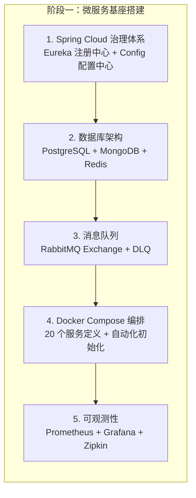
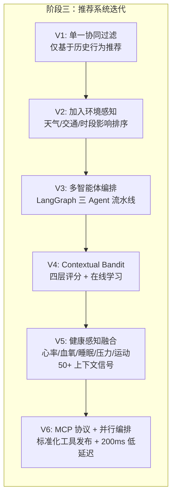
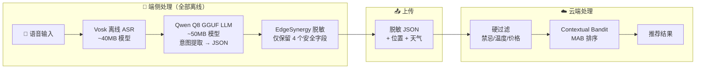

# 4 技术实践

## 4.1 使用的开发框架及依赖的库

本项目采用 **Java + Python + TypeScript** 三语言异构技术栈，覆盖移动端、云端业务服务和 AI 智能服务三大层次。以下按技术层次逐一列出所有开发框架和依赖库。

### 4.1.1 移动端（React Native + Android 原生）

**核心框架**：

| 框架/库 | 版本 | 用途 |
| :--- | :--- | :--- |
| React Native | 0.83.1 | 跨平台移动应用框架 |
| React | 19.2.0 | UI 组件库 |
| TypeScript | 5.8.3 | 静态类型系统 |
| Hermes | 内置 | 高性能 JavaScript 引擎（AOT 编译） |
| Kotlin | 1.9.24 | Android 原生模块开发语言 |
| Android Gradle Plugin | 8.2.1 | Android 构建工具 |
| NDK | 27.0.12077973 | C/C++ 原生库编译 |

**端侧 AI 依赖**：

| 库 | 版本 | 用途 |
| :--- | :--- | :--- |
| llama.rn | 0.10.0-rc.0 | 端侧 LLM 推理引擎（llama.cpp React Native 绑定） |
| react-native-vosk | 2.1.7 | Vosk 离线语音识别引擎 |
| react-native-fs | 2.20.0 | 文件系统读写（模型文件管理） |
| GGML-Hexagon 加速库 | V69/V73/V75/V79/V81 | 高通 NPU 硬件加速（5 个骁龙芯片版本） |

**传感器与硬件依赖**：

| 库 | 版本 | 用途 |
| :--- | :--- | :--- |
| OPPO Health SDK | 2.1.7 | OPPO 智能手表/手环健康数据读取（Gradle 依赖） |
| react-native-geolocation-service | 5.3.1 | GPS 精确定位 |
| react-native-ambient-light-sensor | 1.0.3 | 环境光线传感器 |
| react-native-image-picker | 8.2.1 | 相机/相册图片选取 |
| @react-native-voice/voice | 3.2.4 | 系统语音接口 |

**UI 与交互依赖**：

| 库 | 版本 | 用途 |
| :--- | :--- | :--- |
| @react-navigation/native | 7.1.28 | 页面导航框架 |
| @react-navigation/native-stack | 7.11.0 | 原生栈导航器 |
| react-native-fast-image | 8.6.3 | 高性能图片加载与原生缓存 |
| react-native-vector-icons | 10.3.0 | 矢量图标库（Feather Icons） |
| @react-native-community/blur | 4.4.1 | 毛玻璃模糊效果 |
| react-native-linear-gradient | 2.8.3 | 线性渐变背景 |
| react-native-safe-area-context | 5.6.2 | 设备安全区域适配 |
| react-native-screens | 4.20.0 | 原生屏幕容器 |
| @react-native-async-storage/async-storage | 2.2.0 | 本地持久化存储 |
| @react-native-community/netinfo | 12.0.1 | 网络状态检测 |
| axios | 1.13.4 | HTTP 客户端 |

**开发工具链**：

| 工具 | 版本 | 用途 |
| :--- | :--- | :--- |
| @babel/core | 7.25.2 | JavaScript 编译器 |
| Metro Bundler | 内置 | JavaScript 打包器 |
| ESLint | 8.19.0 | 代码风格检查 |
| Prettier | 2.8.8 | 代码格式化 |
| Jest | 29.6.3 | 单元测试框架 |
| Node.js | >= 20 | JavaScript 运行时 |

---

### 4.1.2 后端 Java 微服务（6 个服务）

**统一基础框架**：

| 框架 | 版本 | 用途 |
| :--- | :--- | :--- |
| Java | 21 (LTS) | 编程语言 |
| Spring Boot | 3.2.0 | 微服务应用框架 |
| Spring Cloud | 2023.0.0 | 微服务治理套件 |
| Spring Data JPA | 继承自 Boot | ORM 持久层 |
| Spring Data MongoDB | 继承自 Boot | MongoDB 文档操作 |
| Spring AMQP | 继承自 Boot | RabbitMQ 消息队列客户端 |
| Eureka Client | 继承自 Cloud | 服务注册与发现 |
| OpenFeign | 继承自 Cloud | 声明式 HTTP 客户端（服务间调用） |
| Spring Cloud Config Client | 继承自 Cloud | 集中配置管理 |

**安全与认证**：

| 库 | 版本 | 用途 |
| :--- | :--- | :--- |
| JJWT (jjwt-api / jjwt-impl / jjwt-jackson) | 0.11.5 | JWT 令牌生成与验证 |
| Spring Security | 继承自 Boot | 安全框架 |
| Bouncy Castle (bcpkix-jdk18on) | 1.77 | 加密工具库（平台服务） |

**数据库迁移与工具**：

| 库 | 版本 | 用途 |
| :--- | :--- | :--- |
| Flyway Core | 继承自 Boot | 数据库版本迁移 |
| Flyway PostgreSQL | 10.0.1 | PostgreSQL 迁移适配 |
| Lombok | 1.18.30 | 代码简化注解 |

**可观测性**：

| 库 | 版本 | 用途 |
| :--- | :--- | :--- |
| Micrometer Prometheus Registry | 继承自 Boot | Prometheus 指标暴露 |
| Spring Boot Actuator | 继承自 Boot | 健康检查与运维端点 |
| Resilience4j (ratelimiter / retry / bulkhead) | 继承自 Boot | 熔断限流与弹性容错 |

**API 文档**：

| 库 | 版本 | 用途 |
| :--- | :--- | :--- |
| SpringDoc OpenAPI | 2.3.0 | Swagger/OpenAPI 自动文档生成 |

**Maven 构建**：

| 插件 | 版本 | 用途 |
| :--- | :--- | :--- |
| maven-compiler-plugin | 3.11.0 | Java 编译插件 |

---

### 4.1.3 后端 Python AI 服务（3 个服务）

#### （1）推荐服务（recommendation-service）

**Web 框架与基础**：

| 库 | 版本 | 用途 |
| :--- | :--- | :--- |
| FastAPI | >= 0.109.0 | 异步 Web 框架 |
| uvicorn | >= 0.24.0 | ASGI 服务器 |
| pydantic | >= 2.5.2 | 数据校验与序列化 |
| pydantic-settings | >= 2.1.0 | 配置管理 |

**多智能体编排**：

| 库 | 版本 | 用途 |
| :--- | :--- | :--- |
| langgraph | >= 0.0.40 | 多智能体状态图编排引擎 |
| langchain | >= 0.1.0 | LLM 调用链框架 |
| langchain-openai | >= 0.0.5 | OpenAI 兼容接口（DeepSeek 调用） |
| langchain-community | >= 0.0.10 | 社区扩展工具 |
| openai | >= 1.10.0 | OpenAI SDK（兼容 DeepSeek/Gemini API） |

**MCP 协议**：

| 库 | 版本 | 用途 |
| :--- | :--- | :--- |
| mcp | >= 1.0.0 | Model Context Protocol 基础库 |
| fastmcp | >= 0.2.0 | FastMCP 服务器框架 |

**机器学习**：

| 库 | 版本 | 用途 |
| :--- | :--- | :--- |
| lightgbm | >= 4.0.0 | 梯度提升排序模型 |
| scikit-learn | >= 1.3.0 | 机器学习工具库 |
| transformers | >= 4.38.0 | HuggingFace 预训练模型 |
| sentencepiece | >= 0.1.99 | 分词器 |
| peft | >= 0.7.0 | 参数高效微调（LoRA） |
| pandas | >= 2.1.0 | 数据处理 |
| numpy | >= 1.24.0 | 数值计算 |

**外部 API 与认证**：

| 库 | 版本 | 用途 |
| :--- | :--- | :--- |
| aiohttp | >= 3.9.1 | 异步 HTTP 客户端（天气/地图 API） |
| httpx | >= 0.27.0 | 异步 HTTP 客户端（备选） |
| PyJWT | >= 2.8.0 | 和风天气 JWT 认证 |
| cryptography | >= 41.0.0 | 密码学工具（JWT 签名） |

**测试**：

| 库 | 版本 | 用途 |
| :--- | :--- | :--- |
| pytest | >= 7.4.0 | 测试框架 |
| pytest-asyncio | >= 0.21.0 | 异步测试支持 |

#### （2）AI 定价服务（ai-pricing-service）

| 库 | 版本 | 用途 |
| :--- | :--- | :--- |
| FastAPI | 0.109.0 | 异步 Web 框架 |
| uvicorn | 0.27.0 | ASGI 服务器 |
| SQLAlchemy | 2.0.25 | 异步 ORM（配合 asyncpg） |
| asyncpg | 0.29.0 | PostgreSQL 异步驱动 |
| aio-pika | 9.4.0 | RabbitMQ 异步客户端 |
| httpx | 0.26.0 | 异步 HTTP 客户端 |
| apscheduler | 3.10.4 | 定时任务调度（7 天定价周期） |
| pandas | 2.2.0 | 数据分析 |
| pydantic | 2.6.0 | 数据校验 |

#### （3）NutriVision 营养分析服务（nutrivision-service）

| 库 | 版本 | 用途 |
| :--- | :--- | :--- |
| FastAPI | 0.104.1 | 异步 Web 框架 |
| uvicorn | 0.24.0 | ASGI 服务器 |
| httpx | 0.25.1 | 异步 HTTP 客户端（Gemini API 调用） |
| timm | >= 0.9.0 | PyTorch Image Models（EfficientNet-B0） |
| Pillow | >= 10.0.0 | 图片预处理 |
| pydantic | 2.5.2 | 数据校验 |

---

### 4.1.4 基础设施与中间件

| 组件 | 镜像/版本 | 用途 |
| :--- | :--- | :--- |
| PostgreSQL | 15 | 主业务数据库（24 张表）+ AI 定价独立库（2 张表） |
| MongoDB | 6.0 | 用户画像文档数据库 |
| Redis | Alpine | 全局缓存层 |
| RabbitMQ | 3.12-management-alpine | 异步消息队列（含管理控制台） |
| Eureka Server | ygqygq2/eureka-server:latest | 服务注册与发现 |
| Spring Cloud Config Server | hyness/spring-cloud-config-server:3.1.3 | 集中配置管理 |
| Prometheus | prom/prometheus:latest | 指标采集 |
| Grafana | grafana/grafana:latest | 可视化监控仪表盘 |
| Zipkin | openzipkin/zipkin:latest | 分布式链路追踪 |
| Docker Compose | — | 容器编排（20 个服务定义） |

---

### 4.1.5 依赖统计概览

| 统计维度 | 数值 |
| :--- | :--- |
| 编程语言 | 3 种（Java 21 / Python 3.11+ / TypeScript 5.8） |
| 移动端依赖总数 | 22 个生产依赖 + 14 个开发依赖 |
| Java 服务数量 | 6 个（含 1 个公共模块） |
| Python 服务数量 | 3 个 |
| Python 依赖总数 | 推荐服务 28 个 + 定价服务 11 个 + 营养服务 8 个 |
| Docker 服务定义 | 20 个（5 基础设施 + 6 Java + 4 Python + 2 微服务治理 + 3 可观测性） |
| 数据库初始化脚本 | 13 个 SQL 文件 |

---

## 4.2 技术实践过程

本节按照系统的**构建顺序**，从基础设施搭建到核心 AI 能力实现，再到移动端集成，完整记录技术实践的全过程。

### 4.2.1 阶段一：微服务基座搭建与数据架构实现

**目标**：构建支撑全部业务逻辑和 AI 能力的分布式系统基座。

**实践过程**：

首先确立了 "Java 业务服务 + Python AI 服务" 的异构微服务架构——Java 生态在企业级微服务治理方面有成熟的 Spring Cloud 全家桶，Python 生态在 AI/ML 框架方面具有不可替代的优势（LangGraph、LangChain、OpenAI SDK 等前沿框架均以 Python 为主）。这一决策使每个服务都能使用最适合其职责的技术栈。

在数据架构方面，采用了**多数据库混合架构**：PostgreSQL 承载结构化业务数据（24 张表），MongoDB 存储灵活 Schema 的用户画像数据，Redis 作为全局缓存层。关键设计是将 AI 定价服务的数据库（`ai_pricing_db`）与主业务库（`food_delivery_db`）进行**物理隔离**，避免 AI 分析任务的大量读写影响核心业务性能。

服务间通信采用**同步 HTTP + 异步消息队列**混合模式：关键业务流程（如佣金计算）通过 OpenFeign 同步调用保证实时性，AI 数据采集通过 RabbitMQ 异步解耦避免阻塞主流程。具体实现了 `order.events`（订单事件）和 `pricing.events`（定价事件）两个 Topic Exchange，并配套死信队列（DLX/DLQ）保障消息不丢失。

全部 20 个服务通过 Docker Compose 编排一键部署，13 个 SQL 初始化脚本通过 PostgreSQL 的 `docker-entrypoint-initdb.d` 机制在容器首次启动时自动按序号执行，实现了零人工干预的自动化部署。

**关键技术难点与解决方案**：

| 难点 | 解决方案 |
| :--- | :--- |
| Java/Python 异构服务的统一注册发现 | Python 服务通过 HTTP 健康检查端点被 Eureka 轮询注册，而非嵌入 Eureka Client |
| 数据库初始化脚本的执行顺序 | 文件名以数字前缀编号（01_schema.sql → 15_smart_issuance_tables.sql），PostgreSQL 容器按字典序自动执行 |
| 跨服务事务一致性 | 采用最终一致性模型——RabbitMQ 持久化消息 + DLQ 兜底 + 人工重放机制 |

---

### 4.2.2 阶段二：核心业务服务开发

**目标**：实现用户认证、商家管理、订单生命周期、营销优惠和平台结算五大核心业务模块。

**实践过程**：

**用户服务**实现了注册、登录、JWT 认证（24 小时过期 + 统一密钥）和信用等级管理。信用等级系统采用"7 天滑窗取消次数"判定降级、"7 天零取消 + 30 天 3 单"判定升级的规则，信用变动事件与营销系统的智能发券引擎联动。

**商家服务**支持本地创建和外部导入（高德地图 API）两种商家入驻途径，菜单管理包含 AI 动态定价相关字段（`base_price`、`current_dynamic_price`、`is_dynamic`）。通过 RabbitMQ 监听 `merchant.pricing.updates` 队列，根据 routing key 中是否包含 "auto" 来判定执行自动价格更新或创建待审批通知。

**订单服务**覆盖了 PENDING → PAID → CONFIRMED → PREPARING → READY → DELIVERED → COMPLETED 的完整状态机，以及 CANCEL_PENDING → CANCELLED 的取消审批分支。支付确认时同步触发平台佣金计算，并异步发布 `order.paid` 事件驱动 AI 数据采集。

**营销服务**实现了基于 0/1 背包问题变种的优惠券组合优化算法——通过位掩码枚举可叠加券的所有 2^n 子集，再与互斥券交叉组合，取总优惠最大的方案。智能发券引擎支持 5 种触发类型（新用户/信用升级/订单里程碑/VIP/生日）和 4 种频率控制（一次性/日度/周度/月度）。

**平台服务**实现了增值服务订阅管理、逐单佣金计算（支持 PERCENTAGE / FIXED_PER_ORDER / FIXED_MONTHLY 三种计费方式）和自动结算（周结/月结，含超时自动确认和异议处理）。

---

### 4.2.3 阶段三：多智能体推荐系统实现

**目标**：构建三智能体协作的上下文感知推荐引擎，这是本项目最核心的技术创新。

**实践过程**：

推荐服务是代码量最大的单个微服务（17,455 行 Python 代码，37 个文件）。三个核心智能体的实现经历了从简单到复杂的迭代过程：

**ContextAgent（566 行）** 通过 `asyncio.gather` 并行调用和风天气 API（支持 JWT 和 API Key 双认证模式）和高德地图 API（V5 版本，支持文本/周边/多边形三种搜索），获取天气、交通和时段信息。实现了智能降级——API 不可用时基于当前季节和时段生成模拟数据。环境影响评分按 天气 40% + 交通 40% + 高峰时段 20% 的权重综合计算。

**ProfilerAgent（538 行）** 从 MongoDB 画像库提取用户偏好后，执行意图检测（菜系/口味/紧急度/饮食限制四维分析）和用户分群（budget/standard/premium 三档，按均价 30/80 元分界）。最关键的设计是**动态权重计算**——根据用户分群和环境上下文实时调整推荐因子的权重（如预算型用户价格权重 0.35，恶劣天气时距离权重进一步提升）。

**DecisionAgent（1,935 行）** 是最复杂的核心组件。实现了四种 MAB 策略：UCB1（探索因子 c=2.0）、Thompson Sampling（Beta 分布 10 次采样取均值）、ε-Greedy（探索率 0.1）和 Contextual Bandit（默认策略）。Contextual Bandit 的评分模型经过多次迭代，最终形成了四层结构（基础分 + 变量分 + 上下文奖励 + 历史分），其中上下文奖励层融合了 50+ 维健康信号——基于 ISSN 运动营养指南设计运动后推荐逻辑（+0.35/-0.30）、基于 AHA 心血管饮食建议设计高心率推荐（+0.25/-0.20）、基于 WHO 低氧血症标准设计低血氧推荐（+0.30/-0.25）。

三智能体通过 LangGraph 的 StateGraph 编排。常规流程为串行管线（Context → Profile → Collaborative → Decision），但设计了条件路由——紧急请求跳过画像分析直入决策。同时实现了并行编排器（ParallelOrchestrator），支持四任务并行执行（~200ms 总延迟），由 ReasoningAgent 合并结果。

---

### 4.2.4 阶段四：AI 动态定价流水线实现

**目标**：构建从数据采集到 AI 分析到商家审批的完整自动化定价流水线。

**实践过程**：

定价服务的实践分为三个步骤：

**第一步：事件驱动数据采集。** 通过 aio-pika 异步 RabbitMQ 客户端连接消息队列，声明 `order.events` exchange 并绑定 `order.paid` routing key。每收到一条支付事件，将事件中的菜品销售明细（菜品 ID、数量、单价、商家 ID）逐条写入 `sales_history` 表。RabbitMQ 连接配置了 5 次重试（每次间隔 5 秒）保证可靠性。

**第二步：LLM 定价分析。** APScheduler 以 604800 秒（7 天）为间隔定时触发分析周期。对每个活跃商家，通过 `asyncio.gather` 并行拉取菜单数据和 7 天销售统计，然后构造 Prompt（角色："餐厅收益管理总监"；输入：菜品名称、当前价格、7 天销量和营收；约束：输出纯 JSON 格式），提交给 DeepSeek-Chat API（temperature=0.7，强制 JSON 输出格式）。AI 返回 `suggested_price`、`strategy_type`（MARKDOWN/SURGE/MAINTAIN）和 `reasoning`（30 字以内中文理由）。

**第三步：人机协同审批。** 每条分析结果保存为 PricingProposal 记录，状态根据商家配置和价格变动幅度判定：价格未变（< 0.01 元）直接 AUTO_APPROVED；商家开启自动审批且变动在阈值内（默认 5%）则 AUTO_APPROVED；否则 PENDING。自动通过的提案通过 `pricing.events` exchange 发布到 `price.proposal.auto` routing key，商家服务消费后直接更新菜品价格；待审批提案发布到 `price.proposal.pending`，商家服务创建通知供商家在移动端审批。

---

### 4.2.5 阶段五：NutriVision 多模态营养分析实现

**目标**：实现拍照识别菜单/菜品并输出结构化营养信息的 AI 能力。

**实践过程**：

NutriVision 采用了**端侧 CV + 云端多模态 LLM 混合架构**：

**端侧快速分类**：使用 PyTorch 的 timm 库加载 EfficientNet-B0 预训练模型（~5MB），输入预处理为 224×224 RGB 图像（Resize → CenterCrop → Normalize），通过 softmax 输出类别概率。置信度阈值设为 60%——高于此值说明端侧模型有把握，仅发送菜品名称（文本）到云端 LLM 查询营养信息（快速路径，20 秒）；低于此值回退到发送完整图片（Base64 编码）到 Gemini 2.0 Flash 多模态 API 进行深度分析（精确路径，120 秒）。

**云端多模态分析**：构造多模态 Prompt，要求 Gemini 扮演"专业数字营养师"角色，识别图片中的每道菜品并输出名称、估算热量、食材列表和过敏原警告，同时根据用户健康标签推荐 Top-3 菜品。为应对 LLM 输出格式不一致的问题，实现了防御性 `_standardize_response()` 方法，兼容 `items` / `dishes` / `menu_items` 三种字段命名，自动将中文逗号分隔的食材字符串转换为列表格式。

**并发控制**：通过 asyncio.Semaphore 限制最大 5 个并发请求，排队超时 30 秒，防止 API 过载。

---

### 4.2.6 阶段六：端侧 AI 双引擎部署与端云协同

**目标**：在手机端侧部署离线语音识别和 LLM 推理引擎，实现"敏感数据不出端"的隐私保护推荐。

**实践过程**：

这是工程难度最高的阶段，涉及 React Native 的原生模块集成和端侧 AI 模型的加载优化。

**Vosk 离线语音识别**：将 vosk-model-small-cn（~40MB）打包到 Android 的 assets 目录，应用启动时加载到内存。实现了三通道事件拦截（NativeEventEmitter + DeviceEventEmitter + Vosk 官方回调）确保跨 Android 版本的事件捕获可靠性。智能静音检测采用双阈值策略——2 秒短停顿重置定时器，5 秒持续静默自动结束录音。

**端侧 LLM 推理**：Qwen-2.5 微调模型经过 Q8 量化后以 GGUF 格式存储（~50MB），通过 llama.rn 框架加载。关键优化包括：内存映射（use_mmap=true）按需加载模型数据避免一次性占满 RAM；上下文窗口限制 1024 tokens + 最大生成 200 tokens 控制推理时间；推理温度 0.1 确保 JSON 输出格式稳定。Gradle 构建中通过 `aaptOptions { noCompress 'gguf' }` 避免 APK 打包时压缩模型文件。内置 5 个版本的 GGML-Hexagon NPU 加速库，运行时自动检测骁龙芯片并加载对应版本。

**端云协同管线**：端侧处理完成后，EdgeSynergyService 执行数据脱敏——仅提取 `forbidden_ingredients`、`required_temperature`、`preferred_tags`、`max_price` 四个安全字段，与位置和天气信息一起发送到云端 `/agents/edge-synergy-recommend` 接口。云端 DecisionAgent 先对候选餐厅执行硬过滤（禁忌食材、温度偏好、价格上限），再执行 Contextual Bandit 排序。若过滤后无匹配结果，返回 `NO_MATCH` 标记，前端自动降级为普通推荐。

---

### 4.2.7 阶段七：多模态传感器集成与健康上下文建模

**目标**：将手机和 OPPO 手表/手环的 6 类传感器数据统一聚合为推荐引擎可消费的健康上下文。

**实践过程**：

**自研 OPPO Health 原生模块**：由于 OPPO Health SDK 是原生 Android SDK（Java/Kotlin API），无法在 React Native 的 JavaScript 层直接调用，我们自研了一套 Kotlin 原生桥接模块——`HeytapHealthModule.kt`（React Native 入口）、`HeytapHealthManager.kt`（SDK 管理器）、`HealthDataTypes.kt`（数据类型）和 `HeytapHealthPackage.kt`（包注册）。该模块通过 `@ReactMethod` 注解暴露 `initialize()`、`requestAuthorization()`、`queryDailyActivity()`、`queryHeartRate()` 等方法给 JavaScript 层，支持 10 类健康数据（心率、血氧、睡眠、压力、步数、运动、ECG、听力、放松训练等）的读取。

**传感器 Hooks 封装**：在 React Native 层实现了 7 个自定义 Hooks，每个 Hook 封装一类传感器的数据采集和预处理：
- `useOppoHealth`：OPPO Health SDK 授权管理和数据读取（60 秒刷新间隔）
- `usePedometer`：加速度计步数采集 + 30 分钟滑窗 + 2000 步运动后判定
- `useAmbientLight`：光线传感器 lux 值 → 5 级亮度分类（5 值移动平均滤波）
- `useHealthContext`：**统一聚合层**（549 行），整合所有数据源，提供三级优先级（开发者模拟 > OPPO 真实 > 默认值）
- `useAuth`：认证状态管理
- `useNetworkStatus`：网络连接监控
- `useCoupons`：优惠券管理

**健康数据融入推荐**：useHealthContext 输出的 40+ 个健康指标通过推荐请求的 `health_context` 字段传递给云端推荐服务。DecisionAgent 的 Contextual Bandit 算法根据心率分区（AHA Zone 1-5）、压力等级（放松/正常/中等/偏高）、睡眠时长/质量、血氧水平（WHO 标准）、日步数（WHO/ACSM 活动量指南）和运动后状态，对每个候选餐厅给予差异化的上下文奖励加成。

---

### 4.2.8 阶段八：移动端应用开发与交互体验打磨

**目标**：构建覆盖消费者端、商家端和管理端的完整 Android 应用。

**实践过程**：

移动端共实现 **30+ 个页面**，采用 React Navigation v7 的 Native Stack Navigator 组织导航结构。按用户角色分为三条路径：

**消费者端**：首页推荐（集成语音搜索、NutriVision 拍照、天气提示、健康状态显示）→ 餐厅详情 → 购物车 → 订单确认（优惠券最优组合）→ 支付 → 订单追踪。此外包含个人中心、地址管理、收藏夹、浏览历史、健康数据面板、口味偏好问卷等辅助页面。

**商家端**：商家仪表盘 → 智能定价管理（AI 提案审批）→ 菜单管理 → 订单管理 → 退款审核 → 结算管理 → 增值服务市场 → 店铺信息编辑。

**管理端**：管理面板（移动端精简版）。

**视觉设计**采用北欧极简主题（NordicTheme）——温暖珊瑚橙主色调（#F2784B）、柔和森林绿辅助色（#5DA97A）、天空蓝点缀色（#7BA3C4）、暖白背景（#FAFAF8），搭配毛玻璃卡片效果和 8pt 间距网格。

**环境光自适应 UI**：全局 AdaptiveOverlay 组件根据 useAmbientLight Hook 的光照等级实时调整半透明遮罩层，在暗光环境下自动启用护眼模式。

**性能优化**：Hermes 引擎（启动时间减少 30-50%）+ New Architecture（Fabric + TurboModules）+ FastImage immutable 缓存 + 请求去重/智能缓存/指数退避重试。

---

### 4.2.9 实践过程总览

```mermaid
gantt
    title FoodMate-AI 技术实践阶段总览
    dateFormat  X
    axisFormat %s
    
    section 基座层
    阶段一 微服务基座搭建           :done, a1, 0, 2
    
    section 业务层
    阶段二 核心业务服务开发          :done, a2, 1, 4
    
    section AI 层
    阶段三 多智能体推荐系统          :done, a3, 2, 6
    阶段四 AI 动态定价流水线         :done, a4, 3, 5
    阶段五 NutriVision 营养分析      :done, a5, 3, 5
    
    section 端侧层
    阶段六 端侧 AI 双引擎           :done, a6, 4, 7
    阶段七 传感器集成与健康建模       :done, a7, 5, 7
    
    section 应用层
    阶段八 移动端应用与交互体验       :done, a8, 2, 8
```

上图展示了 8 个实践阶段的时序关系：基座层最先启动，业务层和 AI 层可部分并行，端侧层依赖 AI 层的接口定义，移动端应用贯穿全程持续迭代。
