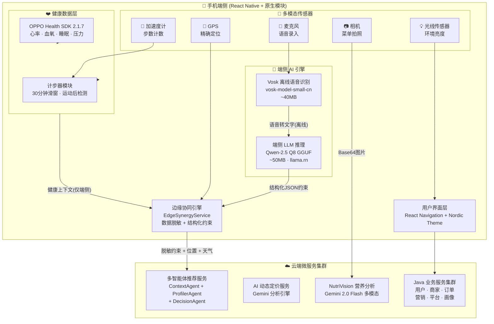
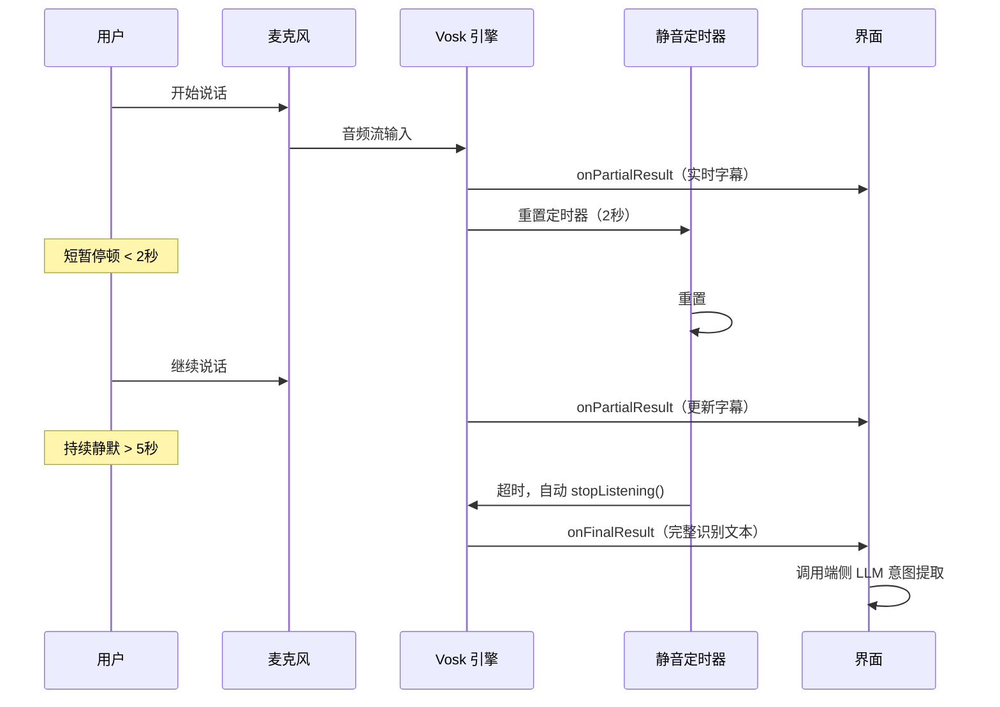
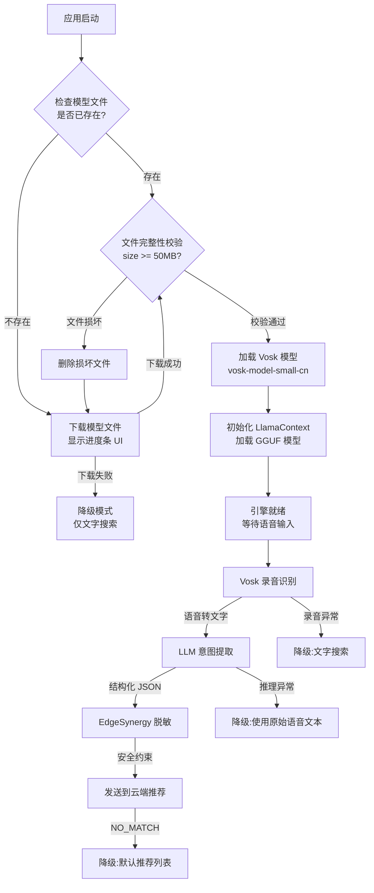
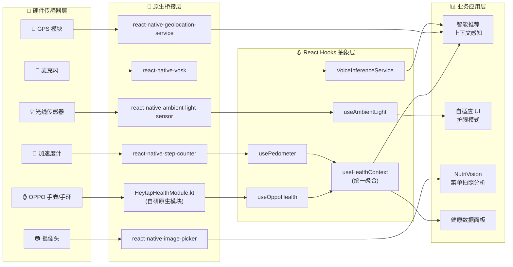
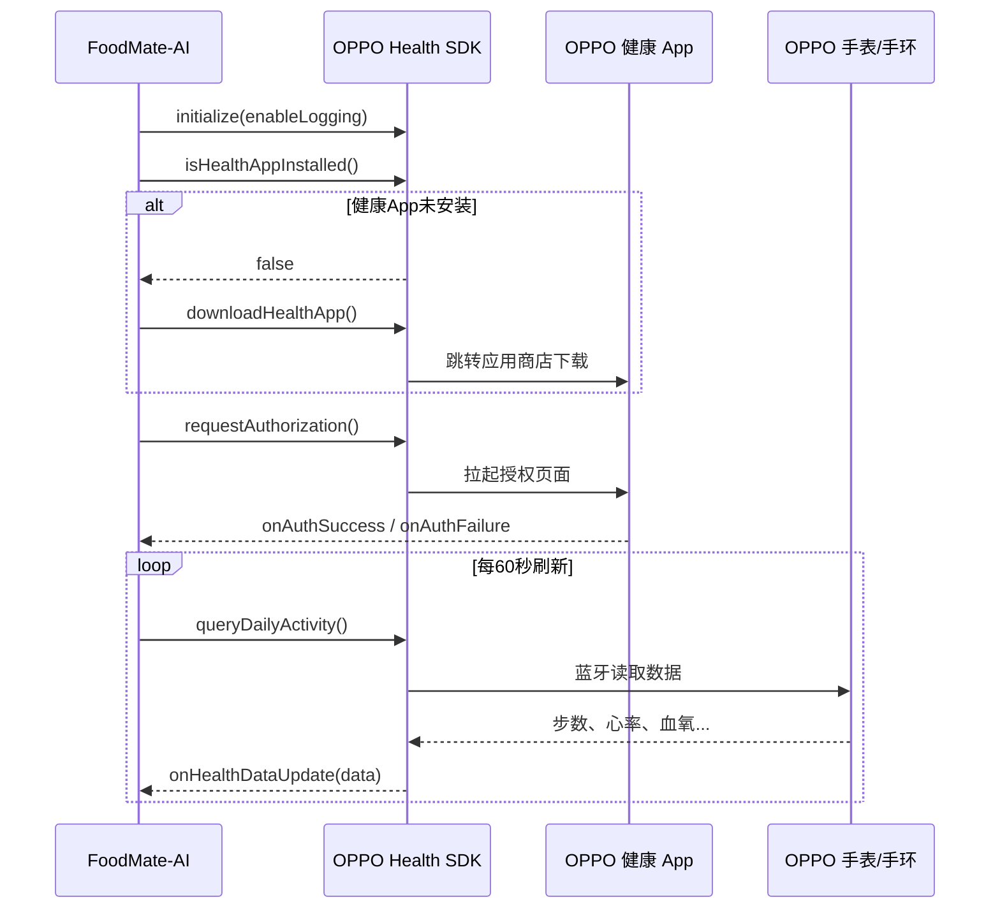
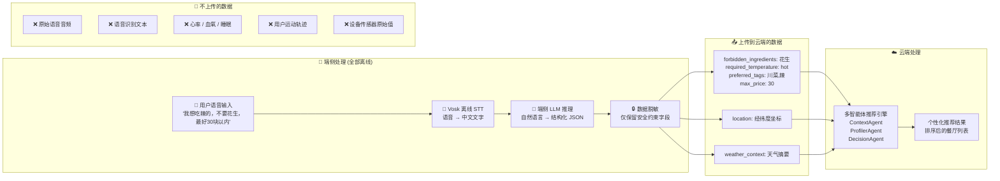
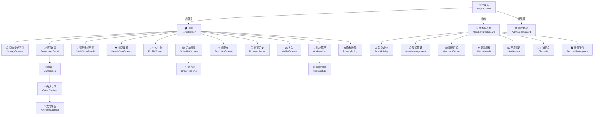
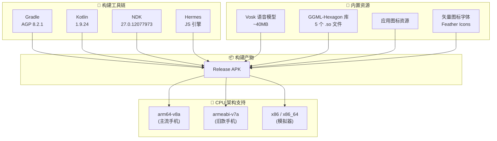
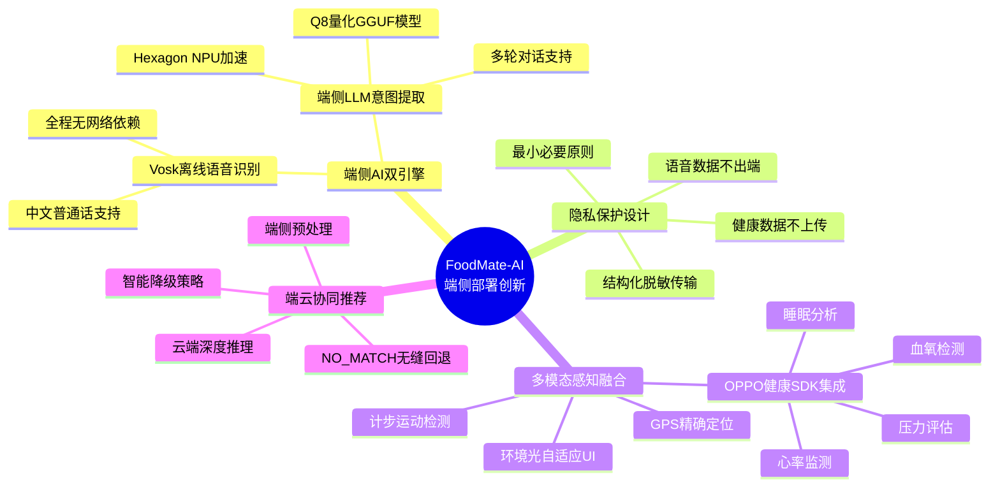

# 第七章 手机端侧部署设计

## 7.1 手机环境需求

### 7.1.1 Android 平台基础要求

FoodMate-AI 移动端基于 React Native 0.83.1 框架构建，面向 Android 平台进行原生编译部署。以下为应用运行所需的最低硬件与软件环境：

| 环境项 | 最低要求 | 推荐配置 | 说明 |
| :--- | :--- | :--- | :--- |
| Android 系统版本 | Android 7.0（API 24） | Android 12+（API 31+） | minSdkVersion = 24，targetSdkVersion = 34 |
| 编译目标 SDK | Android 14（API 34） | — | compileSdkVersion = 34 |
| CPU 架构 | armeabi-v7a / arm64-v8a | arm64-v8a（64位） | 同时支持 x86 / x86_64（模拟器） |
| 运行内存（RAM） | 4 GB | 6 GB 及以上 | 端侧 LLM 推理需加载 ~50MB 量化模型 |
| 存储空间 | 500 MB | 1 GB | 含 Vosk 语音模型（~40MB）+ GGUF LLM 模型（~50MB）+ 应用本体 |
| GPU / NPU | 不强制要求 | 支持 Hexagon DSP 的骁龙芯片 | GGML-Hexagon 加速库可利用高通 NPU 加速推理 |
| 网络 | Wi-Fi / 4G 移动网络 | 5G 网络 | 端侧 AI 推理可完全离线，云端推荐需联网 |
| 传感器 | GPS 定位模块 | 额外：光线传感器、加速度计 | 光线传感器用于环境感知 UI，加速度计用于计步 |
| 可选外设 | — | OPPO 智能手表/手环 | 通过 OPPO Health SDK 获取心率、血氧、睡眠等健康数据 |

### 7.1.2 Android 权限清单

应用在 `AndroidManifest.xml` 中声明了以下 9 项系统权限，覆盖定位、音频、相机、存储和运动识别五大类别：

| 权限 | 类别 | 用途 | 运行时申请 |
| :--- | :--- | :--- | :---: |
| `ACCESS_FINE_LOCATION` | 定位 | GPS 精确定位，用于 POI 周边餐厅搜索 | 是 |
| `ACCESS_COARSE_LOCATION` | 定位 | 网络粗略定位，作为 GPS 定位的快速回退 | 是 |
| `INTERNET` | 网络 | 访问云端微服务 API | 否 |
| `CAMERA` | 相机 | NutriVision 菜单拍照分析、用户头像拍摄 | 是 |
| `READ_EXTERNAL_STORAGE` | 存储 | 从相册选取图片进行营养分析 | 是 |
| `WRITE_EXTERNAL_STORAGE` | 存储 | 下载并缓存端侧 AI 模型文件 | 是 |
| `RECORD_AUDIO` | 音频 | Vosk 离线语音识别录音输入 | 是 |
| `ACTIVITY_RECOGNITION` | 运动 | Android 10+ 步数传感器和运动状态检测 | 是 |
| `com.google.android.gms.permission.ACTIVITY_RECOGNITION` | 运动 | Google Play Services 活动识别（兼容层） | 是 |

### 7.1.3 开发环境与构建工具链

| 工具 | 版本 | 用途 |
| :--- | :--- | :--- |
| Node.js | >= 20 | JavaScript 运行时 |
| React Native | 0.83.1 | 跨平台移动应用框架 |
| React | 19.2.0 | UI 库 |
| TypeScript | 5.8.3 | 静态类型检查 |
| Android Gradle Plugin (AGP) | 8.2.1 | Android 构建系统 |
| Kotlin | 1.9.24 | Android 原生模块开发语言 |
| NDK | 27.0.12077973 | C/C++ 原生库编译（GGML 推理引擎） |
| Hermes JS Engine | 内置 | 高性能 JavaScript 引擎，提升启动速度 |
| Metro Bundler | 内置 | JavaScript 打包器 |
| Gradle JVM 内存 | 2048 MB（-Xmx） | 构建时 JVM 堆内存 |

---

## 7.2 端侧整体架构设计

### 7.2.1 端云协同架构总览

FoodMate-AI 的移动端采用**"端侧智能 + 云端服务"双引擎协同架构**。端侧部署两个 AI 模型（Vosk 语音识别 + 端侧 LLM 意图提取），负责处理用户的语音输入和健康数据等敏感信息；云端部署九个微服务，提供推荐、定价、营养分析等计算密集型的 AI 能力。这种架构的核心目标是**"敏感数据不出端、推荐能力不打折"**。



### 7.2.2 端侧处理与云端处理的职责划分

| 处理位置 | 处理内容 | 技术方案 | 隐私等级 |
| :--- | :--- | :--- | :--- |
| **端侧处理** | 语音转文字（STT） | Vosk 离线语音识别引擎 | 高（语音数据不上传） |
| **端侧处理** | 自然语言意图提取 | Qwen-2.5 Q8 GGUF 端侧 LLM | 高（原始文本不上传） |
| **端侧处理** | 健康数据采集与分析 | OPPO Health SDK + 原生传感器 | 高（健康数据不上传） |
| **端侧处理** | 环境光感知与自适应 UI | 光线传感器 + 移动平均滤波 | 低（纯本地 UI 逻辑） |
| **端侧处理** | 运动状态检测 | 加速度计步数 + 30 分钟滑窗 | 中（仅传运动后标志位） |
| **云端处理** | 多智能体智能推荐 | LangGraph + Contextual Bandit | 低（仅接收脱敏约束） |
| **云端处理** | 菜单图片营养分析 | Gemini 2.0 Flash 多模态 | 中（图片需上传） |
| **云端处理** | AI 动态定价分析 | Gemini + RabbitMQ 事件驱动 | 低（商家数据） |
| **云端处理** | 核心业务逻辑 | Spring Boot 微服务集群 | 低（常规业务数据） |

---

## 7.3 端侧 AI 模型部署

### 7.3.1 Vosk 离线语音识别模型

Vosk 是一款基于 Kaldi 框架的离线语音识别引擎，能够在完全无网络的条件下将用户语音实时转换为文字，所有语音数据全程在手机本地处理，不经过任何网络传输。

**模型规格**：

| 参数 | 值 |
| :--- | :--- |
| 模型名称 | vosk-model-small-cn |
| 语言 | 中文普通话（Mandarin） |
| 模型体积 | ~40 MB（解压后） |
| 存储位置 | `android/app/src/main/assets/vosk-model-small-cn/` |
| React Native 库 | react-native-vosk v2.1.7 |
| 加载方式 | 应用首次启动时从 assets 加载到内存 |

**模型文件结构**：

```
vosk-model-small-cn/
├── am/
│   └── final.mdl              # 声学模型（Acoustic Model）
├── conf/
│   ├── mfcc.conf              # MFCC 特征提取配置
│   └── model.conf             # 模型配置参数
├── graph/
│   ├── Gr.fst                 # 主语法有限状态转换机（Grammar FST）
│   ├── HCLr.fst               # HCL 声学图
│   └── disambig_tid.int       # 消歧义转换 ID
├── ivector/
│   ├── final.dubm             # 对角化 UBM 模型
│   ├── final.ie               # i-vector 提取器
│   ├── final.mat              # LDA 变换矩阵
│   ├── global_cmvn.stats      # 全局倒谱均值方差归一化
│   ├── online_cmvn.conf       # 在线 CMVN 配置
│   └── splice.conf            # 帧拼接配置
└── uuid                       # 模型唯一标识
```

**静音检测机制**：

Vosk 集成了智能静音检测，通过可配置的定时器实现"说完即停"的用户体验：

- **短暂停顿**（2 秒）：语句间歇，重置静音定时器，继续录音
- **持续静默**（5 秒）：判定为用户说完，自动结束录音并触发最终识别结果
- **三通道事件拦截**：同时监听 NativeEventEmitter、DeviceEventEmitter 和 Vosk 官方回调，确保跨 Android 版本的事件捕获可靠性



### 7.3.2 端侧大语言模型（On-Device LLM）

端侧 LLM 是本项目的核心创新之一——在手机本地部署一个经过量化的大语言模型，将用户语音识别后的自然语言文本"提纯"为结构化的 JSON 约束，实现**敏感信息不出端**的隐私保护目标。

**模型规格**：

| 参数 | 值 |
| :--- | :--- |
| 模型基座 | Qwen-2.5 系列（微调版本） |
| 模型文件 | model_1500_q8.gguf |
| 量化精度 | Q8（8-bit 整数量化） |
| 模型格式 | GGUF（llama.cpp 统一格式） |
| 模型体积 | ~50 MB（量化后） |
| 推理框架 | llama.rn v0.10.0-rc.0（llama.cpp 的 React Native 绑定） |
| 存储位置 | `{DocumentDirectoryPath}/model_1500_q8.gguf` |
| 上下文窗口 | 1024 tokens（n_ctx） |
| 最大生成长度 | 200 tokens（n_predict） |
| 推理温度 | 0.1（接近确定性输出，确保 JSON 格式稳定） |
| 内存映射 | use_mmap = true（内存映射 I/O，按需加载） |
| 内存锁定 | use_mlock = false（不锁定全部模型到 RAM） |

**硬件加速支持**：

应用内置了高通 Hexagon DSP 加速库，可在搭载骁龙芯片的设备上利用 NPU 加速推理：

| 加速库文件 | 对应芯片 |
| :--- | :--- |
| `libggml-htp-v69.so` | Hexagon V69（骁龙 8 Gen 1 等） |
| `libggml-htp-v73.so` | Hexagon V73（骁龙 8 Gen 2 等） |
| `libggml-htp-v75.so` | Hexagon V75（骁龙 8s Gen 3 等） |
| `libggml-htp-v79.so` | Hexagon V79（骁龙 8 Elite 等） |
| `libggml-htp-v81.so` | Hexagon V81（新一代骁龙平台） |

这些加速库存放在 `android/app/src/main/assets/ggml-hexagon/` 目录，由 llama.rn 框架在运行时自动检测设备芯片并加载对应版本。Gradle 构建配置中通过 `aaptOptions { noCompress 'gguf' }` 确保模型文件在 APK 打包时不被压缩，避免运行时解压的额外内存和时间开销。

**System Prompt 设计**：

```
你是一个运行在手机端侧的外卖意图提取助手。请提取用户的点餐需求，
输出严格的JSON格式。如果用户没有明确提到价格或特定的健康约束，
对应字段必须为空数组 [] 或 null。
```

**输出结构**：

```json
{
    "query": "用户查询的关键内容",
    "forbidden_ingredients": ["花生", "海鲜"],
    "required_temperature": "hot",
    "preferred_tags": ["川菜", "高蛋白"],
    "max_price": 30
}
```

**多轮对话支持**：

端侧 LLM 支持多轮对话的上下文保持。每轮对话的历史记录保存在内存中（`dialogueHistory` 数组），构建 prompt 时采用 Qwen 的 `<|im_start|>` / `<|im_end|>` 对话格式标记，使模型能够理解之前的对话上下文并做出连贯的意图提取。1024 tokens 的上下文窗口可支持约 3-4 轮的多轮对话。

> **【待插入图片：图 7-1 端侧语音→LLM 意图提取输入输出对照图】**
>
> 本图需手工制作（draw.io / PPT），展示端侧 AI 双引擎的真实输入输出效果。具体要求如下：
>
> - **左侧**：用户语音气泡 + Vosk 转录结果，例如用户说"我想吃辣的，不要花生，最好三十块以内"，下方显示 Vosk 输出的纯文本："我想吃辣的不要花生最好三十块以内"
> - **中间**：一个标注"端侧 LLM 推理（Qwen Q8 GGUF · 离线）"的处理框，带齿轮/芯片图标，强调全程在手机本地完成
> - **右侧**：LLM 输出的结构化 JSON，用代码框样式展示 `{"query":"辣的", "forbidden_ingredients":["花生"], "required_temperature":"hot", "preferred_tags":["川菜","辣"], "max_price":30}`
> - **底部箭头**：标注"仅此 JSON 上传云端"，其余数据标注红色"不上传"
> - **整体风格**：白底，左→右流程方向，用绿色/红色分别标注"上传"/"不上传"的数据

### 7.3.3 模型加载与生命周期管理



**降级策略设计**：

| 故障场景 | 降级方案 | 用户感知 |
| :--- | :--- | :--- |
| 模型文件下载失败 | 切换为纯文字搜索模式 | 语音按钮不可用，提示手动输入 |
| Vosk 语音识别超时 | 返回空结果，提示用户重试 | 显示"未识别到语音"提示 |
| LLM 推理输出格式异常 | 使用原始语音文本作为查询关键词 | 推荐结果可能不够精准 |
| 端云协同返回 NO_MATCH | 自动降级为普通推荐列表 | 无缝切换到默认推荐 |
| 麦克风权限被拒 | 隐藏语音按钮，仅保留文字搜索 | 语音功能不可用 |

---

## 7.4 端侧多模态传感器集成

### 7.4.1 传感器集成架构

FoodMate-AI 的移动端集成了**六类多模态传感器**，通过 React Native 自定义 Hooks 将原生传感器数据统一封装，供上层业务逻辑调用。



### 7.4.2 GPS 定位服务

**库**：react-native-geolocation-service v5.3.1

定位服务采用**双模竞速策略**——同时发起网络定位和 GPS 定位请求，取先返回的结果使用。网络定位速度快但精度低（8 秒超时、10 分钟缓存），GPS 定位精度高但速度慢（12 秒超时、5 分钟缓存）。系统还提供紧急定位模式（60 秒超时、10 分钟缓存），在信号极差环境下保证用户不会被长时间阻塞。

**位置缓存**：5 分钟内的重复定位请求直接返回缓存结果，避免频繁调用 GPS 硬件消耗电量。支持 Haversine 公式计算两点间距离，用于判断推荐餐厅的配送范围。

### 7.4.3 环境光线传感器

**库**：react-native-ambient-light-sensor v1.0.3

**自定义 Hook**：`useAmbientLight`

读取设备光线传感器的 lux（勒克斯）值，经过**5 值移动平均滤波**消除传感器抖动噪声，然后将平滑后的 lux 值映射为 5 级光照等级：

| 光照等级 | lux 范围 | 典型场景 | UI 响应 |
| :--- | :--- | :--- | :--- |
| dark | 0 - 50 | 夜间、暗室 | 启用深色护眼遮罩层 |
| dim | 50 - 200 | 昏暗室内 | 降低界面对比度 |
| normal | 200 - 1,000 | 正常室内照明 | 标准界面显示 |
| bright | 1,000 - 10,000 | 户外阴天 | 正常界面显示 |
| sunlight | > 10,000 | 户外强烈日照 | 提升界面亮度和对比度 |

全局 `AdaptiveOverlay` 组件根据光照等级实时调整半透明遮罩层的不透明度，实现**环境感知的自适应护眼 UI**——用户在黑暗环境中打开应用时，界面会自动降低亮度以保护视力，无需手动切换暗色模式。

### 7.4.4 计步器与运动状态检测

**库**：@dongminyu/react-native-step-counter

**自定义 Hook**：`usePedometer`

系统通过加速度计实时采集步数数据，并维护一个 **30 分钟滑动窗口**的历史步数记录。当检测到用户在 30 分钟内累计步数超过 **2000 步**时，系统判定用户处于"运动后"（Post-Workout）状态。该状态将被传递给云端推荐服务的决策智能体，后者在 Contextual Bandit 算法中为此给予 **±0.22 的上下文奖励加成**，从而推荐更适合运动后食用的高蛋白、易消化餐食。

运动后状态设有 **5 分钟自动重置**机制，避免过期的运动状态持续影响推荐结果。

### 7.4.5 OPPO Health SDK 集成

> **【待插入图片：图 7-2 OPPO 手表/手环 + 手机多终端联动示意图】**
>
> 本图需手工制作（draw.io / PPT），直观展示"手机 + 智能穿戴设备"的多终端联动架构。具体要求如下：
>
> - **左侧**：OPPO 智能手表/手环的设备示意图（可使用 OPPO 官方产品图），旁边用标签列出其采集的传感器数据：心率传感器（bpm）、血氧传感器（SpO2%）、加速度计（步数/距离）、睡眠监测（深睡/浅睡/REM）、压力传感器（压力值/等级）
> - **中间**：一条蓝牙连接线（标注"Bluetooth LE"），连接手表与手机
> - **右侧**：手机设备示意图，内部分为两层：上层是 "OPPO Health SDK 2.1.7 → HeytapHealthModule.kt（自研 Kotlin 原生桥接层）"，下层是 "React Native useOppoHealth Hook → useHealthContext 聚合层 → 推荐引擎上下文"
> - **右下角**：用绿色锁图标标注"所有健康数据仅在端侧处理，不上传云端"
> - **整体风格**：浅色背景，左→右数据流方向，突出"多终端联动 + 隐私保护"两个关键词

**SDK**：com.heytap.health:sdk:2.1.7

**自研原生模块**：`HeytapHealthModule.kt`（Kotlin 原生桥接层）

本项目深度集成了 OPPO Health SDK，通过自研的 Kotlin 原生模块桥接 React Native 与 OPPO 健康 SDK，实现了对 OPPO 智能手表/手环的全方位健康数据读取。原生模块架构如下：

| 原生文件 | 职责 |
| :--- | :--- |
| `HeytapHealthModule.kt` | React Native 原生模块入口，暴露 JS 可调用方法 |
| `HeytapHealthManager.kt` | SDK 核心管理器，封装授权和数据读取逻辑 |
| `HealthDataTypes.kt` | 健康数据类型定义与枚举 |
| `HeytapHealthPackage.kt` | React Native 原生包注册 |

**支持的健康数据类型**：

| 数据类别 | 具体指标 | 单位 | 更新频率 |
| :--- | :--- | :--- | :--- |
| 心率 | 当前心率、静息心率、平均心率、最高/最低心率 | bpm | 实时 |
| 日常活动 | 今日步数、运动距离、消耗卡路里 | 步/km/kcal | 实时 |
| 压力指标 | 当前压力值、平均压力、压力等级（放松/正常/中等/偏高） | 数值 | 60 秒 |
| 睡眠数据 | 睡眠时长、深睡/浅睡/REM 时长、睡眠质量评分（0-100） | 分钟/分 | 每日 |
| 血氧 | 当前血氧、平均血氧、血氧状态（正常/偏低/低氧） | % | 实时 |
| 心电图 | ECG 原始数据 | mV | 按需 |
| 运动记录 | 运动类型、时长、卡路里、距离、强度 | — | 每次运动 |
| 听力健康 | 环境分贝、暴露时长、听力等级 | dB | 实时 |
| 放松训练 | 训练类型（呼吸/冥想/游戏）、时长 | 分钟 | 每次训练 |

**授权流程**：



### 7.4.6 统一健康上下文层

**自定义 Hook**：`useHealthContext`（549 行，全应用最大的 Hook 组件）

`useHealthContext` 是整个健康数据体系的**统一聚合层**，负责将来自计步器、OPPO Health SDK、环境光传感器等多个数据源的健康信息聚合为一个统一的 `HealthContextType` 对象，供全应用所有页面和服务使用。该 Hook 以 React Context Provider 模式挂载在应用根组件，实现全局数据共享。

**数据优先级策略**：

```
开发者模式模拟数据 > OPPO Health SDK 真实数据 > 默认值
```

**开发者模式**：系统内置了一套完整的模拟健康数据，开发人员可在无 OPPO 设备的环境下模拟心率（72 bpm）、血氧（98%）、睡眠评分（85 分）等数据，便于功能开发和调试。在比赛现场演示时，也可通过开发者模式面板实时调整模拟数据，展示不同健康状态下的推荐差异。

---

## 7.5 端云协同隐私保护推荐流水线

### 7.5.1 完整数据流设计

端云协同推荐的核心设计理念是：**用户的语音输入和健康数据属于高度敏感的隐私信息，不应直接上传到云端**。系统在端侧完成"语音 → 文字 → 结构化约束"的全流程处理，仅将脱敏后的结构化约束发送至云端。



### 7.5.2 脱敏规则

EdgeSynergyService 在将端侧处理结果发送到云端之前，执行严格的数据脱敏：

| 字段 | 是否上传 | 说明 |
| :--- | :---: | :--- |
| `forbidden_ingredients` | 是 | 用户禁忌食材列表（如花生、海鲜） |
| `required_temperature` | 是 | 温度偏好（hot/cold/any） |
| `preferred_tags` | 是 | 偏好标签（如川菜、高蛋白） |
| `max_price` | 是 | 价格上限 |
| `latitude` / `longitude` | 是 | 用于 POI 周边搜索 |
| `weather_summary` | 是 | 天气概要信息 |
| 原始语音音频 | 否 | 全程端侧处理，不存储不上传 |
| 语音识别文本 | 否 | 仅在端侧 LLM 输入中使用 |
| 心率 / 血氧 / 睡眠 | 否 | 仅在端侧判断健康上下文 |
| 步数 / 运动状态 | 仅标志位 | 仅上传 `is_post_workout: true/false` |
| 光线传感器 lux 值 | 否 | 仅用于端侧 UI 自适应 |

> **【待插入图片：图 7-3 端云隐私保护方案对比图】**
>
> 本图需手工制作（draw.io / PPT），通过左右对比的形式直观展示本项目隐私保护设计的创新价值。具体要求如下：
>
> - **左半边（传统方案）**：标题"传统外卖平台方案"，流程为：用户语音 → 上传原始音频到云端 → 云端 STT 语音识别 → 云端 NLU 意图理解 → 云端推荐。在"上传原始音频"和"云端 STT"处用红色警告标注"隐私风险：原始语音、健康数据、用户位置全部上传至云端服务器"。整体区域用浅红色/橙色背景。
> - **右半边（本项目方案）**：标题"FoodMate-AI 端云协同方案"，流程为：用户语音 → 端侧 Vosk 离线 STT → 端侧 LLM 意图提取 → 数据脱敏 → 仅上传结构化 JSON 约束 → 云端多智能体推荐。在"端侧处理"区域用绿色锁图标标注"隐私安全：语音、健康数据全程不出端"，在上传箭头处标注"仅传输 5 个脱敏字段"。整体区域用浅绿色背景。
> - **底部**：一行总结文字——"敏感数据不出端，推荐能力不打折"
> - **格式**：横向布局，左右等宽，对比鲜明，红绿配色突出安全差异

---

## 7.6 前端应用架构与 UI 设计

### 7.6.1 应用目录结构

```
frontend/src/
├── components/           # 可复用 UI 组件（20+）
│   ├── RestaurantCard.tsx       # 餐厅卡片
│   ├── CartBar.tsx              # 购物车快捷栏
│   ├── OptimizedImage.tsx       # FastImage 缓存组件
│   ├── AdaptiveOverlay.tsx      # 环境光自适应护眼遮罩
│   ├── VoiceEngineLoading.tsx   # 语音引擎下载进度
│   ├── NutriVisionLoading.tsx   # AI 营养分析加载动画
│   ├── WeatherAlertModal.tsx    # 天气感知弹窗
│   ├── DevModePanel.tsx         # 开发者调试面板
│   ├── ActiveRecommendationModal.tsx  # 主动推荐弹窗
│   └── ...
├── config/               # 配置文件
│   ├── serviceConfig.js         # 微服务 API 地址配置
│   └── imageDictionary.ts       # 图片资源映射
├── hooks/                # 自定义 React Hooks（7 个）
│   ├── useHealthContext.tsx      # 健康数据统一聚合
│   ├── useOppoHealth.ts         # OPPO Health SDK 封装
│   ├── usePedometer.tsx         # 计步器封装
│   ├── useAmbientLight.ts       # 光线传感器封装
│   ├── useAuth.tsx              # 认证状态管理
│   ├── useNetworkStatus.ts      # 网络状态监听
│   └── useCoupons.js            # 优惠券管理
├── native/               # 原生模块类型定义
│   └── HeytapHealthModule.ts    # OPPO Health SDK 类型桥接
├── screens/              # 页面组件（30+ 个屏幕）
│   ├── HomeScreen.tsx           # 主页（1357行，最大单文件）
│   ├── LoginScreen.tsx          # 登录注册
│   ├── RestaurantDetailScreen.tsx    # 餐厅详情与菜单
│   ├── CartScreen.tsx           # 购物车
│   ├── OrderConfirmScreen.tsx   # 订单确认
│   ├── NutriVisionResultScreen.tsx   # 营养分析结果
│   ├── HealthDataScreen.tsx     # 健康数据面板
│   ├── PrivacyPolicyScreen.tsx  # 隐私政策
│   ├── merchant/                # 商家端页面（8 个）
│   │   ├── MerchantDashboardScreen.tsx
│   │   ├── SmartPricingScreen.tsx
│   │   ├── MenuManagementScreen.tsx
│   │   └── ...
│   └── admin/                   # 管理端页面
├── services/             # 业务服务层（20+）
│   ├── VoiceInferenceService.ts      # 端侧语音+LLM 管线
│   ├── edgeSynergyService.ts         # 端云协同引擎
│   ├── recommendationService.js      # 智能推荐 API
│   ├── apiClient.js                  # HTTP 客户端（缓存/重试/去重）
│   ├── locationService.js            # 定位服务
│   ├── weatherService.ts             # 天气服务
│   ├── nutriVisionService.js         # 营养分析服务
│   └── ...
├── theme/                # 主题系统
│   └── NordicTheme.ts           # 北欧极简主题
├── types/                # TypeScript 类型定义
└── utils/                # 工具函数
    ├── cacheUtils.js            # 缓存/防抖/节流
    └── couponUtils.js           # 优惠券计算
```

### 7.6.2 页面导航架构

应用采用 **React Navigation v7** 的 **Native Stack Navigator** 实现页面导航，根据用户角色（消费者/商家/管理员）动态路由到不同的功能页面集合。



### 7.6.3 主题与视觉设计

应用采用**北欧极简设计（Nordic Theme）**，以温暖珊瑚橙为主色调，搭配毛玻璃卡片效果，营造简洁优雅的视觉体验：

| 设计元素 | 值 | 用途 |
| :--- | :--- | :--- |
| 主色调 | #F2784B（温暖珊瑚橙） | 主按钮、强调色、品牌色 |
| 辅助色 | #5DA97A（柔和森林绿） | 成功状态、健康标签 |
| 点缀色 | #7BA3C4（天空蓝） | 信息提示、链接 |
| 背景色 | #FAFAF8（暖白） | 全局背景 |
| 文字主色 | #2C3038（暖深灰） | 标题、正文 |
| 毛玻璃效果 | rgba(255,255,255,0.88) | 卡片、弹窗背景 |
| 间距系统 | 8pt 网格（4/8/12/16/20/24/32） | 统一的空间节奏 |

### 7.6.4 应用界面展示

> **【待插入图片：图 7-4 FoodMate-AI 应用运行截图集】**
>
> 本图需在真机或模拟器上运行应用，截取实际界面后拼图。建议 6-8 张截图，2-3 张一排横向排列，下方加文字说明。具体截图内容如下：
>
> **第一排（核心消费者功能）**：
> 1. **首页推荐列表**：展示餐厅卡片列表、顶部天气感知提示栏、健康上下文状态显示（如"运动后·推荐高蛋白"）、底部语音搜索按钮
> 2. **语音搜索过程**：展示语音录入界面，包括实时字幕显示区域、波形动画、端侧 LLM 处理进度动画（Edge Synergy 阶段指示器）
> 3. **NutriVision 营养分析结果页**：展示用户拍照后的菜品分析卡片，包含热量数值、食材列表、过敏原醒目警告标签、Top 3 推荐菜品
>
> **第二排（健康与智能功能）**：
> 4. **健康数据面板**：展示从 OPPO 手表/手环读取的心率、血氧、睡眠评分、今日步数、压力等级等数据卡片
> 5. **环境光自适应效果对比**：左右对比截图——左侧为正常光照下的标准界面，右侧为暗光环境下启用护眼遮罩后的界面效果
> 6. **开发者调试面板**：展示 DevModePanel 中的健康数据模拟控件（滑块调节心率、血氧等）
>
> **第三排（商家端功能）**：
> 7. **商家端智能定价管理页**：展示 AI 定价提案列表，包含当前价格→建议价格、AI 分析理由、批准/拒绝按钮
> 8. **商家端结算管理页**：展示结算单列表、GMV/佣金/净收入数据、结算状态标签
>
> - **格式**：每张截图统一裁剪为手机屏幕比例（9:19.5），添加手机外框 mockup 效果更佳
> - **分辨率**：单张截图宽度 ≥ 400px，拼图总宽度 ≥ 1200px

---

## 7.7 性能优化设计

### 7.7.1 JavaScript 引擎优化

| 优化项 | 方案 | 效果 |
| :--- | :--- | :--- |
| JS 引擎 | **Hermes**（hermesEnabled = true） | 应用启动时间减少 30-50%，内存占用降低 |
| 新架构 | React Native New Architecture（newArchEnabled = true） | Fabric 渲染器 + TurboModules，减少 JS-Native 桥接开销 |
| 编译优化 | Hermes 预编译字节码（AOT） | 跳过运行时解析，启动速度更快 |
| 内存管理 | Gradle JVM -Xmx2048m + MaxMetaspaceSize=512m | 避免构建时 OOM |

### 7.7.2 网络层优化

| 优化项 | 方案 | 效果 |
| :--- | :--- | :--- |
| 请求去重 | apiClient 内置 Map 去重，相同请求复用 Promise | 避免重复网络请求 |
| 智能缓存 | 两级缓存（内存 Map + AsyncStorage），TTL 分级管理 | 商家 2 分钟、推荐 5 分钟、用户 30 分钟 |
| 指数退避重试 | 1s → 2s → 4s，最多 3 次 | 应对瞬时网络波动 |
| 分级超时 | NutriVision 120s、推荐 60s、默认 15s | 大请求不阻塞小请求 |
| 请求取消 | AbortController，页面卸载时自动取消 | 避免内存泄漏和无效响应处理 |
| 响应压缩 | gzip Accept-Encoding | 减少传输体积 |

### 7.7.3 图片优化

| 优化项 | 方案 | 效果 |
| :--- | :--- | :--- |
| 图片加载 | react-native-fast-image（原生缓存） | 内存缓存 + 磁盘缓存，避免重复下载 |
| 缓存策略 | CacheControl: immutable | 图片永不过期，除非显式清理 |
| 尺寸优化 | URL 参数自动裁剪（w3000 → w300） | 传输体积缩小 90% |
| 图片预加载 | preloadImages() 预缓存列表图片 | 页面跳转时图片即刻显示 |
| 加载占位 | 骨架屏 + ActivityIndicator | 防止布局闪跳 |

### 7.7.4 端侧 AI 性能优化

| 优化项 | 方案 | 效果 |
| :--- | :--- | :--- |
| 模型量化 | Q8（8-bit 整数量化） | 模型体积从 ~200MB 降至 ~50MB |
| 内存映射 | use_mmap = true | 按需加载模型数据，不一次性载入全部 |
| NPU 加速 | GGML-Hexagon 加速库（5 个版本） | 利用骁龙 NPU 硬件加速 LLM 推理 |
| 低温推理 | temperature = 0.1 | 减少采样开销，输出更确定 |
| 上下文限制 | n_ctx = 1024, n_predict = 200 | 控制推理时间和内存消耗 |
| APK 不压缩 | aaptOptions { noCompress 'gguf' } | 避免运行时解压模型的额外内存开销 |
| 文件校验 | 50MB 最小体积校验 | 防止加载损坏模型导致崩溃 |
| 传感器降噪 | 移动平均滤波（5 值窗口） | 光线传感器数据平滑，防止 UI 抖动 |

---

## 7.8 应用构建与部署配置

### 7.8.1 Gradle 构建配置



### 7.8.2 关键构建参数

| 配置项 | 值 | 文件 |
| :--- | :--- | :--- |
| applicationId | `com.ninkynonkpinkyponk.foodmateai` | app/build.gradle |
| versionCode | 1 | app/build.gradle |
| versionName | "1.0" | app/build.gradle |
| compileSdkVersion | 34 | build.gradle |
| minSdkVersion | 24 | build.gradle |
| targetSdkVersion | 34 | build.gradle |
| ndkVersion | 27.0.12077973 | build.gradle |
| kotlinVersion | 1.9.24 | build.gradle |
| hermesEnabled | true | gradle.properties |
| newArchEnabled | true | gradle.properties |
| edgeToEdgeEnabled | true | gradle.properties |
| ProGuard 混淆 | 关闭（enableProguardInReleaseBuilds = false） | app/build.gradle |
| 不压缩文件类型 | gguf, rhn, pv, mdl, conf | app/build.gradle |

### 7.8.3 第三方依赖清单

**核心框架依赖**：

| 依赖 | 版本 | 用途 |
| :--- | :--- | :--- |
| react-native | 0.83.1 | 跨平台移动应用框架 |
| react | 19.2.0 | UI 库 |
| typescript | 5.8.3 | 静态类型系统 |
| axios | 1.13.4 | HTTP 客户端 |

**端侧 AI 依赖**：

| 依赖 | 版本 | 用途 |
| :--- | :--- | :--- |
| llama.rn | 0.10.0-rc.0 | 端侧 LLM 推理引擎（llama.cpp 绑定） |
| react-native-vosk | 2.1.7 | Vosk 离线语音识别 |
| react-native-fs | 2.20.0 | 文件系统读写（模型管理） |
| com.heytap.health:sdk | 2.1.7 | OPPO 健康 SDK（Gradle 依赖） |

**传感器与硬件依赖**：

| 依赖 | 版本 | 用途 |
| :--- | :--- | :--- |
| react-native-geolocation-service | 5.3.1 | GPS 定位 |
| react-native-ambient-light-sensor | 1.0.3 | 环境光线传感器 |
| react-native-image-picker | 8.2.1 | 相机/相册图片选取 |
| @react-native-voice/voice | 3.2.4 | 系统语音接口 |

**UI 与交互依赖**：

| 依赖 | 版本 | 用途 |
| :--- | :--- | :--- |
| @react-navigation/native | 7.1.28 | 页面导航 |
| @react-navigation/native-stack | 7.11.0 | 原生栈导航器 |
| react-native-fast-image | 8.6.3 | 高性能图片加载与缓存 |
| react-native-vector-icons | 10.3.0 | 矢量图标（Feather） |
| @react-native-community/blur | 4.4.1 | 毛玻璃模糊效果 |
| react-native-linear-gradient | 2.8.3 | 线性渐变背景 |
| react-native-safe-area-context | 5.6.2 | 安全区域适配 |
| react-native-screens | 4.20.0 | 原生屏幕容器 |
| @react-native-async-storage/async-storage | 2.2.0 | 本地持久化存储 |
| @react-native-community/netinfo | 12.0.1 | 网络状态检测 |

---

## 7.9 端侧部署设计特色与创新总结

### 7.9.1 核心创新点



### 7.9.2 创新点归纳

1. **端侧 AI 双引擎架构**：在手机本地同时部署离线语音识别引擎（Vosk）和大语言模型推理引擎（llama.rn + Qwen Q8 GGUF），实现了从语音输入到结构化意图输出的端到端离线处理，是本项目最核心的技术创新。

2. **隐私保护设计（Privacy-by-Design）**：健康数据（心率、血氧、睡眠、压力）和语音数据全程在端侧处理，云端仅接收脱敏后的饮食约束字段，从架构层面杜绝了隐私泄露的可能性，充分体现了"AI 适配移动端轻量化操作"的赛题要求。

3. **NPU 硬件加速适配**：内置 5 个版本的 GGML-Hexagon 加速库，覆盖高通骁龙 8 Gen 1 至最新一代芯片，在搭载骁龙芯片的手机上可利用 NPU 硬件加速 LLM 推理，显著降低推理延迟和功耗。

4. **六模态传感器融合**：整合麦克风、摄像头、GPS、光线传感器、加速度计和智能穿戴设备六大传感器数据源，构建了丰富的用户上下文信息，驱动推荐系统的"场景化响应"能力。

5. **OPPO Health SDK 深度集成**：通过自研 Kotlin 原生模块桥接 OPPO 健康 SDK，支持 10 类健康数据的实时读取，实现了"手机 + 手表"的多终端联动，与赛题"通过手机/手表等多种智能终端和 AI 技术的联动服务"的要求高度契合。

6. **环境感知自适应 UI**：基于光线传感器数据的 5 级亮度分类和移动平均滤波算法，实现了自动护眼模式，提升了夜间和暗光环境下的用户体验。

7. **多层降级保障机制**：从模型加载、语音识别、LLM 推理到云端通信，每个环节都设计了明确的降级策略和回退方案，确保应用在任何异常情况下都能保持基本可用，体现了工程化的鲁棒性设计。
