# 第八章 详细设计

本章按照"先核心模块、再辅助模块"的顺序，逐一给出 FoodMate-AI 各功能模块的详细设计说明。核心模块（8.1 – 8.5）对应本项目五大创新功能，辅助模块（8.6 – 8.9）对应支撑性业务服务。每个模块统一按照功能描述、性能描述、输入、输出、程序逻辑和限制条件六个维度展开。

---

## 8.1 多智能体协作推荐系统

### 8.1.1 功能描述

多智能体协作推荐系统是本项目最核心的功能模块，将推荐过程建模为一个**多智能体协作的决策问题**，而非传统的单一算法打分排序。系统内部编排三个专职智能体——环境感知智能体（ContextAgent）、用户画像智能体（ProfilerAgent）和决策智能体（DecisionAgent），由 LangGraph 状态图引擎进行流水线编排。决策智能体实现了四种多臂老虎机（MAB）策略，其中默认使用的上下文感知老虎机（Contextual Bandit）能够融合天气、交通、健康、光照等 50 余个上下文信号进行动态排序。系统还支持端云协同推荐模式，接收移动端经过脱敏处理的结构化约束，对候选餐厅进行硬过滤后再执行 MAB 排序。

**子功能清单**：

| 子功能 | 说明 |
| :--- | :--- |
| 环境感知分析 | 并行调用和风天气 API 和高德地图 API，获取天气、交通、时段信息 |
| 用户画像分析 | 从 MongoDB 提取用户偏好，进行意图检测与用户分群 |
| 协同过滤 | 基于 NCF + FoodCF-Encoder 的神经协同过滤推荐 |
| MAB 决策排序 | 四种策略（UCB1 / Thompson Sampling / ε-Greedy / Contextual Bandit） |
| 健康感知推荐 | 基于心率、血氧、睡眠、压力、运动状态的健康引导推荐 |
| 端云协同推荐 | 接收端侧脱敏约束，硬过滤后排序 |
| AI 推荐理由生成 | 调用 DeepSeek 大语言模型生成个性化推荐文案 |
| 在线学习反馈 | 根据用户点击/下单/评分反馈更新 MAB 臂值 |
| MCP 协议服务 | 发布标准化工具和资源，支持 stdio 和 HTTP/SSE 两种传输模式 |

### 8.1.2 性能描述

| 性能指标 | 目标值 | 说明 |
| :--- | :--- | :--- |
| 串行编排端到端延迟 | < 3 秒 | ContextAgent → ProfilerAgent → DecisionAgent 顺序执行 |
| 并行编排端到端延迟 | < 1.5 秒 | 环境感知、POI 检索、画像分析、协同过滤四任务并行 |
| 单次 MAB 排序耗时 | < 50 ms | 对 50 个候选餐厅执行 Contextual Bandit 评分排序 |
| DeepSeek 文案生成 | < 2 秒 / 批次 | 为 Top-10 餐厅批量生成推荐理由 |
| 天气 API 响应 | < 500 ms | 和风天气 QWeather API（含 JWT 认证） |
| 交通 API 响应 | < 500 ms | 高德地图交通状况 API |
| API 降级响应 | < 10 ms | 外部 API 不可用时使用季节/时段模拟数据 |

### 8.1.3 输入

**主推荐接口** `POST /agents/recommend`：

| 输入字段 | 类型 | 必填 | 说明 |
| :--- | :--- | :---: | :--- |
| `location.address` | String | 是 | 用户地址文本 |
| `location.latitude` | Float | 否 | 纬度坐标 |
| `location.longitude` | Float | 否 | 经度坐标 |
| `query` | String | 否 | 用户查询文本（如"想吃川菜"） |
| `max_results` | Int | 否 | 返回数量，默认 10 |
| `search_radius` | Int | 否 | 搜索半径（米），默认 20000 |
| `user_id` | String | 否 | 用户 ID（用于画像查询） |
| `health_context.daily_steps` | Int | 否 | 今日步数 |
| `health_context.heart_rate` | Int | 否 | 当前心率（bpm） |
| `health_context.is_post_workout` | Bool | 否 | 是否运动后状态 |
| `health_context.blood_oxygen` | Int | 否 | 血氧饱和度（%） |
| `health_context.pressure_value` | Int | 否 | 压力值（0-100） |
| `health_context.sleep_score` | Int | 否 | 睡眠质量评分（0-100） |
| `health_context.light_level` | String | 否 | 环境光照等级（dark/dim/normal/bright/sunlight） |
| `weather_context.temperature` | Float | 否 | 温度（°C） |
| `weather_context.condition` | String | 否 | 天气状况文本 |
| `weather_context.is_raining` | Bool | 否 | 是否降雨 |
| `allergies` | List[String] | 否 | 过敏原/忌口列表 |

**端云协同接口** `POST /agents/edge-synergy-recommend`：

在上述字段基础上增加 `constraints` 字段（来自端侧 LLM 脱敏输出）：

| 输入字段 | 类型 | 说明 |
| :--- | :--- | :--- |
| `constraints.forbidden_ingredients` | List[String] | 禁忌食材（如花生、海鲜） |
| `constraints.required_temperature` | List[String] | 温度偏好（热/冷/常温） |
| `constraints.max_price` | Float | 价格上限 |
| `constraints.preferred_tags` | List[String] | 偏好标签（如川菜、高蛋白） |

### 8.1.4 输出

| 输出字段 | 类型 | 说明 |
| :--- | :--- | :--- |
| `status` | String | 状态："success" / "error" / "NO_MATCH" |
| `restaurants[]` | Array | 推荐餐厅列表（按 MAB 分数降序排列） |
| `restaurants[].id` | String | 餐厅 ID |
| `restaurants[].name` | String | 餐厅名称 |
| `restaurants[].match_score` | Float | MAB 推荐评分（0-1） |
| `restaurants[].recommendation_reason` | String | AI 生成的个性化推荐理由 |
| `restaurants[].rating` | Float | 餐厅评分（0-5） |
| `restaurants[].distance` | Float | 距离（米） |
| `restaurants[].estimated_delivery_time` | Int | 预估配送时间（分钟） |
| `restaurants[].avg_price` | Float | 人均价格（元） |
| `restaurants[].cuisine_type` | String | 菜系 |
| `total_count` | Int | 结果总数 |
| `context` | Object | 环境上下文摘要 |
| `reasoning` | String | 全局推荐理由 |
| `processing_time_ms` | Float | 处理耗时（毫秒） |

### 8.1.5 程序逻辑

#### （1）LangGraph 多智能体编排流程

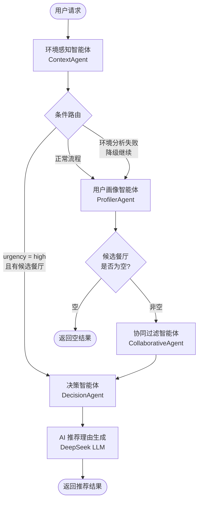

#### （2）Contextual Bandit 评分算法（决策智能体核心）

每个候选餐厅的最终推荐分数经过四层计算：

```
final_score = base_score + variable_score × multiplier + context_bonus + historical_score + cf_bonus
```

其中各层计算规则如下：

**第一层 — 基础分**：固定值 0.50（弱上下文）或 0.35（强上下文）

**第二层 — 变量分**（加权属性评分）：

| 因子 | 默认权重 | 预算型用户 | 高端型用户 | 强上下文 |
| :--- | :---: | :---: | :---: | :---: |
| 距离 | 0.25 | 0.25 | 0.25 | 0.02 |
| 评分 | 0.25 | 0.15 | 0.35 | 0.18 |
| 价格匹配 | 0.20 | 0.35 | 0.10 | 0.10 |
| 菜系匹配 | 0.20 | 0.15 | 0.20 | **0.55** |
| 配送时间 | 0.10 | 0.10 | 0.10 | 0.15 |

变量分乘数：弱上下文 ×0.50，强上下文 ×0.65

**第三层 — 上下文奖励**（动态加减分）：

| 上下文信号 | 奖励范围 | 触发条件 | 医学/运动学依据 |
| :--- | :--- | :--- | :--- |
| 高温（≥30°C） | ±0.45 ~ ±0.65 | 匹配冷/热食关键词 | — |
| 低温（≤10°C） | ±0.45 ~ ±0.65 | 匹配热/冷食关键词 | — |
| 交通拥堵 | +0.12 / -0.10 | 距离与拥堵指数交叉 | — |
| 运动后恢复 | +0.35 / -0.30 | 高蛋白 vs 油炸关键词 | ISSN 运动营养指南 |
| 高心率（>140bpm） | +0.25 / -0.20 | 清淡 vs 重口味 | AHA 心血管饮食建议 |
| 高压力（≥80） | +0.25 / -0.18 | 减压食物 vs 刺激食物 | 皮质醇管理研究 |
| 睡眠不足（<5h） | +0.25 / -0.18 | 恢复食物 vs 咖啡因 | WHO 睡眠恢复指南 |
| 低血氧（<90%） | +0.30 / -0.25 | 富铁食物 vs 难消化 | WHO 低氧血症临床标准 |
| 久坐（<2000步） | +0.15 / -0.12 | 低热量 vs 高热量 | WHO/ACSM 活动量指南 |
| 用户绝对意图 | **+0.40** | 查询词精确匹配餐厅名/菜系 | — |
| 暗光环境 | +0.15 / -0.08 | 夜宵 vs 冷食 | — |

**第四层 — 历史分 + 协同过滤分**：MAB 历史平均奖励 + NCF 协同过滤评分

#### （3）端云协同推荐硬过滤流程

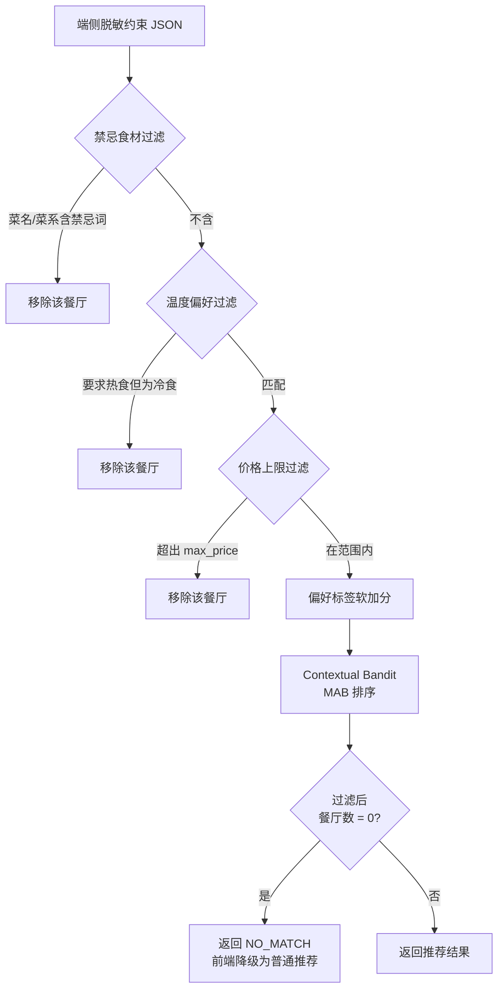

#### （4）MAB 在线学习反馈机制

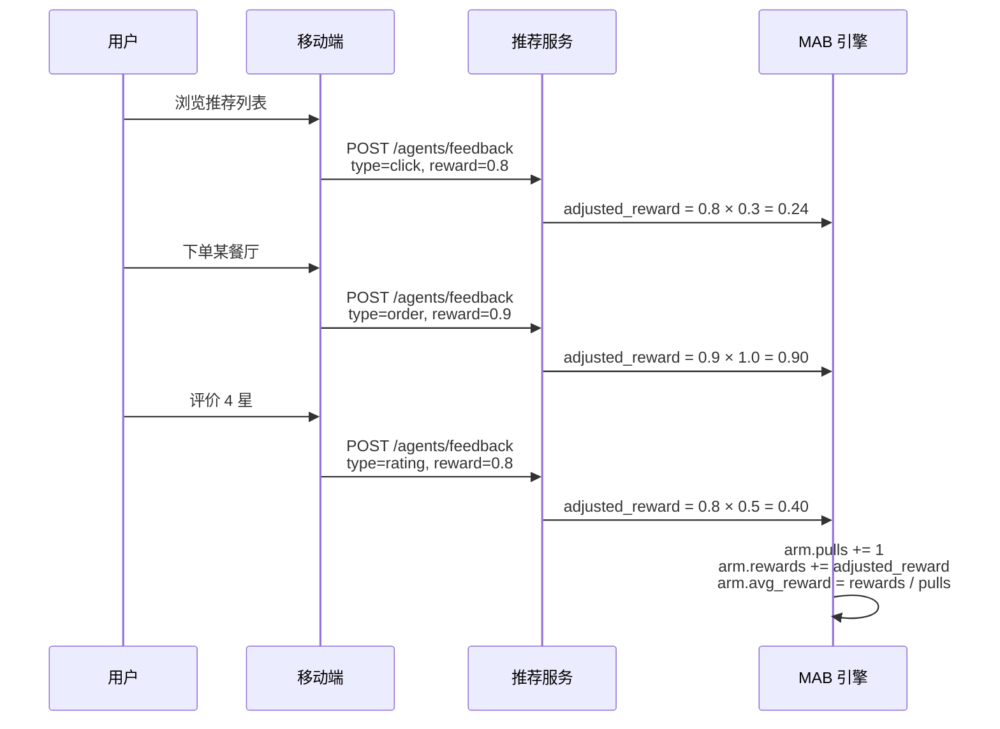

**反馈权重表**：

| 反馈类型 | 权重系数 | 说明 |
| :--- | :---: | :--- |
| click（点击浏览） | ×0.3 | 弱正反馈，仅表示兴趣 |
| order（下单购买） | ×1.0 | 最强正反馈，用户实际选择 |
| rating（用户评分） | ×0.5 | 中等反馈，反映满意度 |

### 8.1.6 限制条件

1. 位掩码枚举策略要求候选餐厅数量不超过约 50 个，否则组合爆炸；实际通过 POI 搜索半径控制候选数量。
2. 和风天气 API 和高德地图 API 依赖外部网络，不可用时降级为基于季节/时段的模拟数据，推荐精度会下降。
3. DeepSeek 文案生成依赖外部 API，不可用时降级为基于规则的 emoji 标签拼接理由。
4. 在线学习的 MAB 臂值保存在内存中，服务重启后重置（冷启动问题）。
5. 端云协同推荐的硬过滤基于关键词匹配，可能存在误过滤（如"麻辣烫"被"辣"关键词误过滤）。

---

## 8.2 AI 动态定价系统

### 8.2.1 功能描述

AI 动态定价系统遵循"数据驱动 + AI 决策 + 人机协同"的设计理念，实现了从销售数据采集、AI 分析到商家审批的完整自动化流水线。系统通过 RabbitMQ 实时监听订单支付事件自动积累销售数据，定期触发 AI 分析引擎（Gemini/DeepSeek 大语言模型）生成定价提案，商家可配置自动审批或人工审批模式。

### 8.2.2 性能描述

| 性能指标 | 目标值 | 说明 |
| :--- | :--- | :--- |
| 事件消费延迟 | < 100 ms | RabbitMQ order.paid 事件消费与写库 |
| 单菜品 AI 分析 | < 30 秒 | 单次 LLM API 调用超时上限 |
| 全量分析周期 | < 10 分钟 | 对所有活跃商家的全部菜品逐一分析 |
| 定价周期间隔 | 7 天 | 默认每周一次，支持手动触发 |
| 服务客户端超时 | 5 秒 | 调用商家服务和订单服务的超时 |

### 8.2.3 输入

**自动触发**：RabbitMQ `order.paid` 事件

| 字段 | 类型 | 说明 |
| :--- | :--- | :--- |
| `orderId` | Long | 订单 ID |
| `merchantId` | Long | 商家 ID |
| `items[].menuItemId` | Long | 菜品 ID |
| `items[].quantity` | Int | 购买数量 |
| `items[].price` | Float | 成交单价 |

**手动触发**：`POST /trigger-cycle`（无参数，立即启动一轮分析）

**AI 分析输入**（传入 LLM 的 prompt 数据）：

| 数据项 | 来源 | 说明 |
| :--- | :--- | :--- |
| 菜品名称 | 商家服务 | 待分析的菜品 |
| 当前定价 | 商家服务 | 当前售价（元） |
| 7 天总销量 | 订单服务 | 过去 7 天的累计销量（份） |
| 7 天总营收 | 订单服务 | 过去 7 天的累计营收（元） |

### 8.2.4 输出

**AI 分析输出**（LLM 返回的 JSON）：

| 字段 | 类型 | 说明 |
| :--- | :--- | :--- |
| `suggested_price` | Float | AI 建议价格 |
| `strategy_type` | String | 策略类型：MARKDOWN（降价）/ SURGE（涨价）/ MAINTAIN（维持） |
| `reasoning` | String | 中文分析理由（30 字以内） |

**事件输出**（发布到 RabbitMQ `pricing.events` exchange）：

| 字段 | 类型 | 说明 |
| :--- | :--- | :--- |
| `eventType` | String | "PRICE_PROPOSAL_CREATED" |
| `proposalId` | Long | 提案 ID |
| `merchantId` | Long | 商家 ID |
| `menuItemId` | Long | 菜品 ID |
| `currentPrice` | Float | 当前价格 |
| `newPrice` | Float | 建议价格 |
| `status` | String | "AUTO_APPROVED" 或 "PENDING" |
| Routing Key | — | `price.proposal.auto` 或 `price.proposal.pending` |

### 8.2.5 程序逻辑

#### （1）定价分析完整流水线

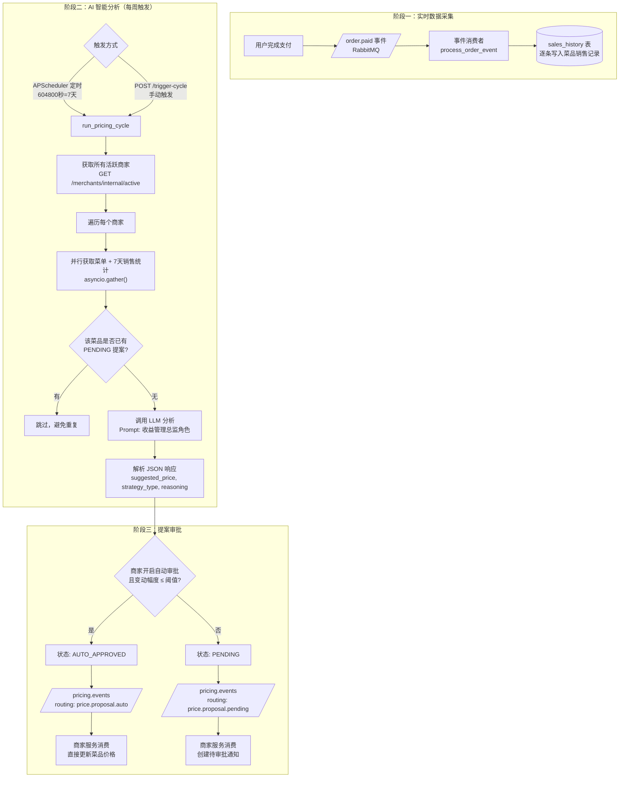

#### （2）自动审批判定逻辑（PDL 描述）

```
PROCEDURE auto_approval_check(merchant, suggested_price, current_price):
    
    IF abs(suggested_price - current_price) < 0.01 THEN
        RETURN "AUTO_APPROVED"    // 价格未变，直接通过
    END IF
    
    IF merchant.enableAutoApproval = FALSE THEN
        RETURN "PENDING"          // 商家未开启自动审批
    END IF
    
    diff_percent = abs(suggested_price - current_price) / current_price
    
    IF diff_percent <= merchant.autoApprovalThreshold THEN
        RETURN "AUTO_APPROVED"    // 变动在阈值内，自动通过
    ELSE
        RETURN "PENDING"          // 变动超出阈值，需人工审批
    END IF
    
END PROCEDURE
```

**判定表**：

| 价格变动 | 自动审批开关 | 变动幅度 vs 阈值 | 结果 |
| :--- | :---: | :--- | :--- |
| < 0.01 元（无变化） | 任意 | — | AUTO_APPROVED |
| ≥ 0.01 元 | 关闭 | — | PENDING |
| ≥ 0.01 元 | 开启 | ≤ 阈值（默认 5%） | AUTO_APPROVED |
| ≥ 0.01 元 | 开启 | > 阈值 | PENDING |

### 8.2.6 限制条件

1. AI 分析依赖外部 LLM API（DeepSeek/Gemini），API 不可用时降级为 MAINTAIN 策略（维持原价）。
2. 分析粒度为单菜品级别，暂不支持套餐组合定价优化。
3. 默认 7 天分析周期可能滞后于市场快速变化，建议对高频商家缩短周期。
4. 销售数据仅来源于平台内订单，无法感知商家在其他平台的销售情况。

---

## 8.3 NutriVision 多模态营养分析系统

### 8.3.1 功能描述

NutriVision 是一个基于多模态视觉大模型的菜单营养分析系统。用户拍摄菜单照片或单个菜品照片后，系统通过 Gemini 2.0 Flash 多模态 API 识别菜品并输出结构化的营养信息（名称、热量、食材、过敏原），同时根据用户的健康标签（如"花生过敏""低糖""素食"）推荐最适合的 Top-3 菜品。系统采用**端侧 CV + 云端 LLM 混合架构**——单个菜品先用端侧 EfficientNet-B0 模型快速分类，置信度 ≥ 60% 时仅需文本查询 LLM（更快更省），否则回退到全图像 LLM 分析。

### 8.3.2 性能描述

| 性能指标 | 目标值 | 说明 |
| :--- | :--- | :--- |
| 菜单图片分析 | < 120 秒 | 含图片上传 + Gemini 多模态推理 |
| 单菜品 CV 分类 | < 500 ms | EfficientNet-B0 端侧推理 |
| 单菜品文本 LLM | < 20 秒 | 高置信度时无需传图 |
| 最大并发 | 5 | 信号量控制，避免 API 过载 |
| 图片大小限制 | ≤ 5 MB | Base64 编码后 |
| 请求体限制 | ≤ 10 MB | GZip 压缩，最小 500 字节 |

### 8.3.3 输入

**菜单分析接口** `POST /api/v1/vision/analyze`：

| 输入字段 | 类型 | 必填 | 说明 |
| :--- | :--- | :---: | :--- |
| `image_base64` | String | 是 | 菜单图片的 Base64 编码 |
| `health_tags` | List[String] | 否 | 健康标签列表（如 ["花生过敏", "低糖"]） |

**单菜品分析接口** `POST /api/v1/vision/analyze-food`：

输入字段同上，但图片为单个菜品的照片。

### 8.3.4 输出

| 输出字段 | 类型 | 说明 |
| :--- | :--- | :--- |
| `status` | String | "success" / "error" |
| `items[]` | Array | 识别到的菜品列表 |
| `items[].name` | String | 菜品名称 |
| `items[].calories` | String | 估算热量（如"约 350 kcal"） |
| `items[].ingredients` | List[String] | 食材列表 |
| `items[].warnings` | String | 过敏原/健康警告 |
| `items[].is_recommended` | Bool | 是否推荐 |
| `top_recommendations` | List[String] | Top-3 推荐菜品名 |
| `health_summary` | String | 综合健康饮食建议 |

### 8.3.5 程序逻辑

#### （1）菜单图片分析流程

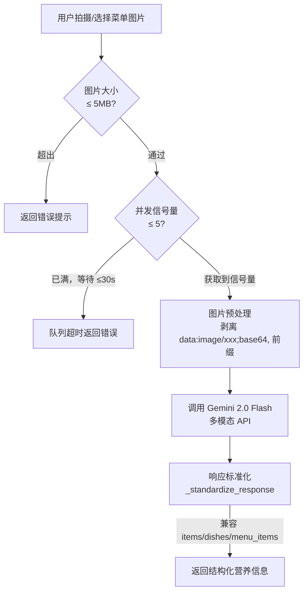

#### （2）单菜品混合分析流程（CV + LLM）

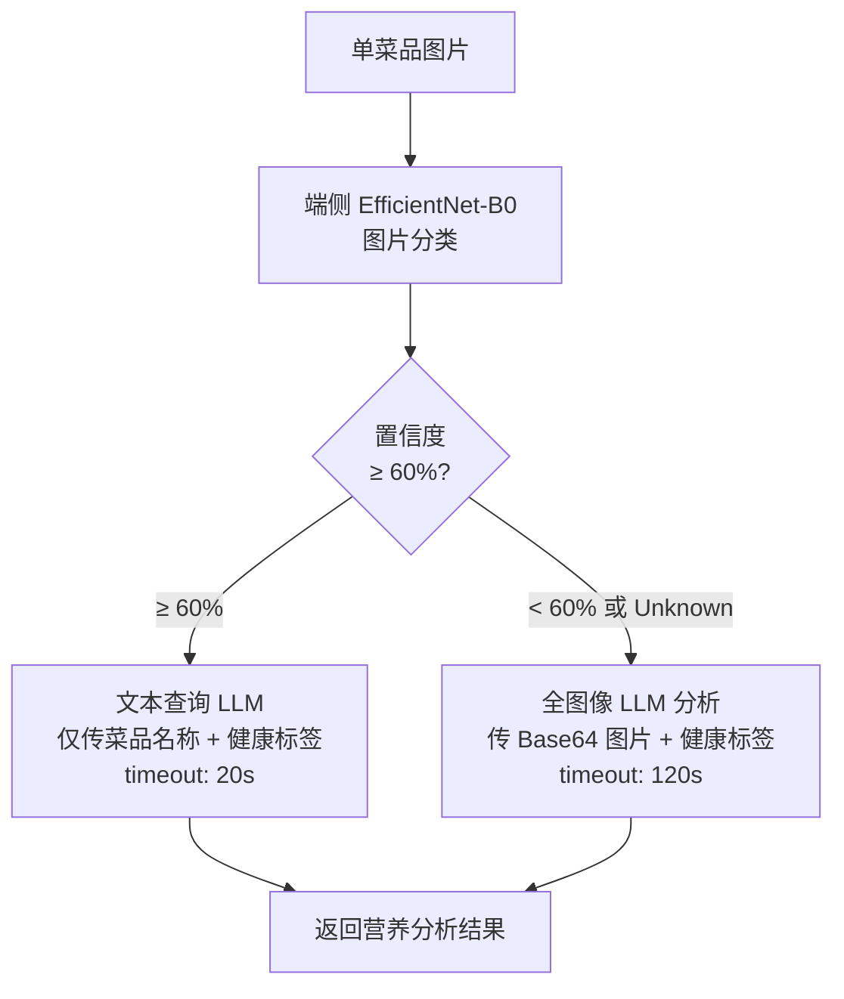

#### （3）响应标准化逻辑（PDL 描述）

```
PROCEDURE standardize_response(raw_response):
    
    // 步骤1：统一字段名
    IF raw_response 包含 "items" 字段 THEN
        items = raw_response["items"]
    ELSE IF raw_response 包含 "dishes" 字段 THEN
        items = raw_response["dishes"]
    ELSE IF raw_response 包含 "menu_items" 字段 THEN
        items = raw_response["menu_items"]
    ELSE IF raw_response 是 List 类型 THEN
        items = raw_response
    END IF
    
    // 步骤2：食材字段转换
    FOR EACH item IN items:
        IF item.ingredients 是 String 类型 THEN
            item.ingredients = item.ingredients.split("、")
        END IF
        
        // 确保必要字段存在
        IF item 缺少 name THEN item.name = "未知菜品"
        IF item 缺少 calories THEN item.calories = "未知"
        IF item 缺少 is_recommended THEN item.is_recommended = false
    END FOR
    
    // 步骤3：限制推荐数量
    top_recommendations = top_recommendations[:3]
    
    RETURN standardized_response
    
END PROCEDURE
```

### 8.3.6 限制条件

1. 菜单图片需清晰可读，模糊或光线不足的照片会导致识别精度下降。
2. Gemini Vision API 需外部网络访问，不可用时返回"分析暂不可用"错误。
3. 热量估算基于 AI 推断，非精确营养成分检测，仅供参考。
4. 并发限制为 5，超出排队等待最多 30 秒。
5. EfficientNet-B0 本地模型的食物分类范围受训练数据集限制。

---

## 8.4 智能营销系统

### 8.4.1 功能描述

智能营销系统包含两大核心子功能：**优惠券组合优化算法**和**智能发券引擎**。组合优化算法将用户持有的多张优惠券视为 0/1 背包问题的变种，通过位掩码枚举所有合法组合，找出总优惠金额最大的方案。智能发券引擎基于规则自动在用户注册、信用升级、订单里程碑等触发事件时发放优惠券。

**优惠券类型**：

| 类型 | 标识 | 计算方式 | 示例 |
| :--- | :--- | :--- | :--- |
| 折扣券 | DISCOUNT | `订单金额 × (1 - 折扣值/10)` | 折扣值=9 → 打九折 |
| 满减券 | THRESHOLD_REDUCTION | 满足门槛后减固定金额 | 满 50 减 10 |
| 无门槛券 | NO_THRESHOLD | 直接减面值 | 直减 5 元 |
| 免运费券 | FREE_SHIPPING | 减免运费（固定 5 元） | 免运费 |

### 8.4.2 性能描述

| 性能指标 | 目标值 | 说明 |
| :--- | :--- | :--- |
| 组合优化计算 | < 100 ms | n ≤ 15 张可叠加券时 |
| 单次发券 | < 50 ms | 含库存校验和写库 |
| 批量发券 | < 5 秒 | 100 个用户批量发放 |

### 8.4.3 输入

**最优组合计算** `POST /coupons/calculate-best`：

| 输入字段 | 类型 | 说明 |
| :--- | :--- | :--- |
| `userId` | Long | 用户 ID |
| `orderTotal` | BigDecimal | 订单总金额 |

**智能发券触发事件**（内部调用）：

| 触发类型 | 触发条件 |
| :--- | :--- |
| NEW_USER | 新用户注册成功 |
| CREDIT_UPGRADE | 用户信用等级上升 |
| ORDER_MILESTONE | 累计完成 N 笔订单 |
| VIP_USER | VIP 用户月度福利 |
| BIRTHDAY | 用户生日 |

### 8.4.4 输出

**最优组合计算结果**：

| 输出字段 | 类型 | 说明 |
| :--- | :--- | :--- |
| `selectedCouponIds` | List[Long] | 选中的用户优惠券 ID 列表 |
| `originalPrice` | BigDecimal | 原价 |
| `totalDiscount` | BigDecimal | 总优惠金额 |
| `finalPrice` | BigDecimal | 实付金额 |
| `description` | String | 组合方案描述文字 |

### 8.4.5 程序逻辑

#### （1）优惠券组合优化算法

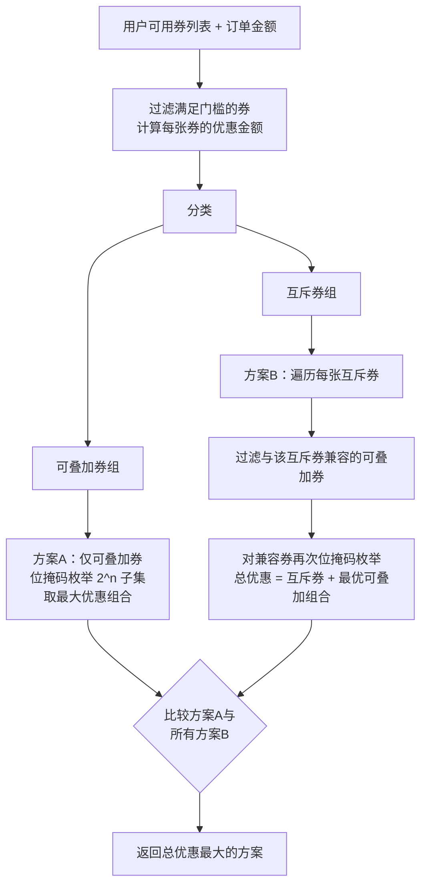

#### （2）位掩码枚举核心算法（PDL 描述）

```
PROCEDURE findBestStackableCombination(orderAmount, stackableCoupons):
    
    n = stackableCoupons.size()
    bestResult = {selectedIds: [], totalDiscount: 0}
    
    // 枚举所有 2^n 种子集
    FOR mask = 0 TO (2^n - 1):
        currentIds = []
        currentDiscount = 0
        valid = TRUE
        
        FOR i = 0 TO n-1:
            IF mask 的第 i 位为 1 THEN
                coupon = stackableCoupons[i]
                currentIds.add(coupon.id)
                currentDiscount += coupon.discount
                
                // 检查与已选中的券是否互斥
                FOR j = 0 TO i-1:
                    IF mask 的第 j 位为 1 THEN
                        prevCoupon = stackableCoupons[j]
                        IF coupon.exclusiveIds 包含 prevCoupon.id THEN
                            valid = FALSE
                            BREAK
                        END IF
                    END IF
                END FOR
                
                IF valid = FALSE THEN BREAK
            END IF
        END FOR
        
        IF valid AND currentDiscount > bestResult.totalDiscount THEN
            bestResult = {selectedIds: currentIds, totalDiscount: currentDiscount}
        END IF
    END FOR
    
    RETURN bestResult
    
END PROCEDURE
```

**时间复杂度**：O(n × 2^n)，其中 n 为可叠加券数量。

#### （3）优惠金额计算判定表

| 券类型 | 订单金额 | 满足门槛? | 优惠金额公式 | 封顶处理 |
| :--- | :--- | :---: | :--- | :--- |
| DISCOUNT | amount | — | amount × (1 - value/10) | min(计算值, maxDiscount) |
| THRESHOLD_REDUCTION | amount | amount ≥ minOrderAmount | discountValue | — |
| THRESHOLD_REDUCTION | amount | amount < minOrderAmount | 0（不可用） | — |
| NO_THRESHOLD | amount | — | discountValue | min(discountValue, maxDiscount) |
| FREE_SHIPPING | — | — | 5（固定） | — |

### 8.4.6 限制条件

1. 位掩码枚举的时间复杂度为 O(n × 2^n)，当可叠加券数量 n > 20 时可能产生性能问题。实际场景中用户同时持有的可叠加券通常不超过 10 张。
2. 互斥关系判断基于双向检查（A 排斥 B 且 B 排斥 A），需确保 `exclusiveIds` 字段的一致性。
3. 优惠金额不能超过订单原价（兜底逻辑在前端实现）。

---

## 8.5 平台运营与结算系统

### 8.5.1 功能描述

平台运营系统围绕"增值服务订阅 + 逐单佣金计算 + 自动结算"三个核心流程，实现了平台与商家之间的财务结算自动化。每笔订单支付完成后，系统自动遍历商家订阅的所有按单计费服务，逐一计算佣金并生成记录。结算模块支持按周和按月两种周期自动生成结算单，商家可在 3 天确认期内确认或提出异议，超时未操作自动确认。

### 8.5.2 性能描述

| 性能指标 | 目标值 | 说明 |
| :--- | :--- | :--- |
| 单笔订单佣金计算 | < 100 ms | 遍历活跃订阅并计算 |
| 结算单生成（100 商家） | < 30 秒 | 含数据聚合与写库 |
| 超时自动确认 | 每日 8:00 | 定时任务扫描过期结算单 |

### 8.5.3 输入

**佣金计算**（订单支付完成后内部触发）：

| 输入字段 | 类型 | 说明 |
| :--- | :--- | :--- |
| `orderId` | Long | 订单 ID |
| `merchantId` | Long | 商家 ID |
| `orderAmount` | BigDecimal | 订单金额 |

**结算单生成**（定时任务或手动触发）：

| 输入字段 | 类型 | 说明 |
| :--- | :--- | :--- |
| `settlementType` | Enum | WEEKLY / MONTHLY |
| `periodStart` | Date | 结算周期起始日期 |
| `periodEnd` | Date | 结算周期截止日期 |

### 8.5.4 输出

**佣金记录**：

| 输出字段 | 类型 | 说明 |
| :--- | :--- | :--- |
| `commissionAmount` | BigDecimal | 单笔佣金金额 |
| `serviceName` | String | 平台服务名称（冗余存储） |
| `feeType` | String | 计费方式（冗余存储） |
| `status` | String | PENDING / SETTLED / REFUNDED |

**结算单**：

| 输出字段 | 类型 | 说明 |
| :--- | :--- | :--- |
| `settlementNo` | String | 结算单号（如 ST202602W0010001） |
| `totalOrderAmount` | BigDecimal | GMV（订单总金额） |
| `totalCommission` | BigDecimal | 平台总分成 |
| `netIncome` | BigDecimal | 商家净收入 |
| `status` | String | PENDING_CONFIRM / CONFIRMED / DISPUTED / PAID |

### 8.5.5 程序逻辑

#### （1）佣金计算流程

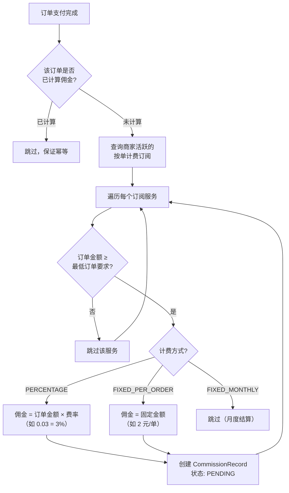

#### （2）结算单生成与状态流转

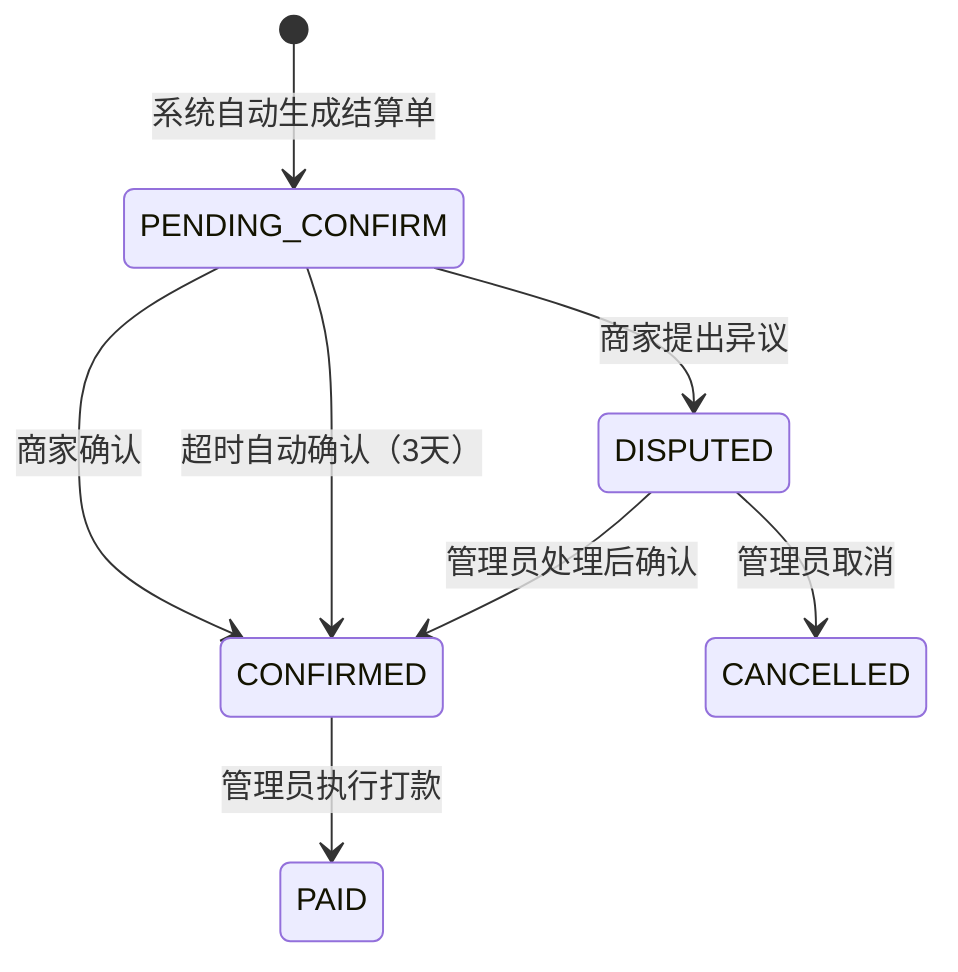

#### （3）结算单号生成规则

```
格式：ST{yyyyMM}{Type}{MerchantSuffix}{Sequence}

示例：ST202602W0010001
      ├── ST        固定前缀
      ├── 202602    年月
      ├── W         结算类型（W=周结/M=月结）
      ├── 001       商家ID末3位
      └── 0001      序号
```

### 8.5.6 限制条件

1. 佣金计算依赖订单服务的支付回调同步触发，如回调丢失则佣金缺失。
2. 月度固定费用（FIXED_MONTHLY）不在逐单佣金中体现，需独立的月度结算任务。
3. 超时自动确认默认 3 天，无法针对不同商家设置差异化确认期。

---

## 8.6 订单管理系统

### 8.6.1 功能描述

订单管理系统覆盖从创建、支付、接单、制作、配送到完成的全生命周期，同时支持取消申请和退款审批的双方协商机制。订单支付完成后通过 RabbitMQ 发布 `order.paid` 事件，驱动 AI 定价服务的数据采集和平台佣金计算。

### 8.6.2 性能描述

| 性能指标 | 目标值 | 说明 |
| :--- | :--- | :--- |
| 下单响应 | < 200 ms | 含库存校验和写库 |
| 支付确认 | < 500 ms | 含状态更新 + MQ 发布 + 佣金触发 |
| 状态更新 | < 100 ms | 单次状态流转 |

### 8.6.3 输入

| 输入字段 | 类型 | 说明 |
| :--- | :--- | :--- |
| `userId` | Long | 下单用户 |
| `merchantId` | Long/String | 商家 ID（支持数字和外部 ID） |
| `items[]` | Array | 菜品列表（menuItemId, quantity, price） |
| `paymentMethod` | Enum | WECHAT / ALIPAY / CARD / CASH |
| `paymentChannel` | Enum | APP / MINI_PROGRAM / H5 / WEB |

### 8.6.4 输出

| 输出字段 | 类型 | 说明 |
| :--- | :--- | :--- |
| `orderId` | Long | 订单 ID |
| `status` | String | 当前订单状态 |
| `totalAmount` | BigDecimal | 实付金额 |
| `discountAmount` | BigDecimal | 优惠金额 |
| `paymentTransactionId` | String | 第三方交易号 |

### 8.6.5 程序逻辑

#### 订单状态机

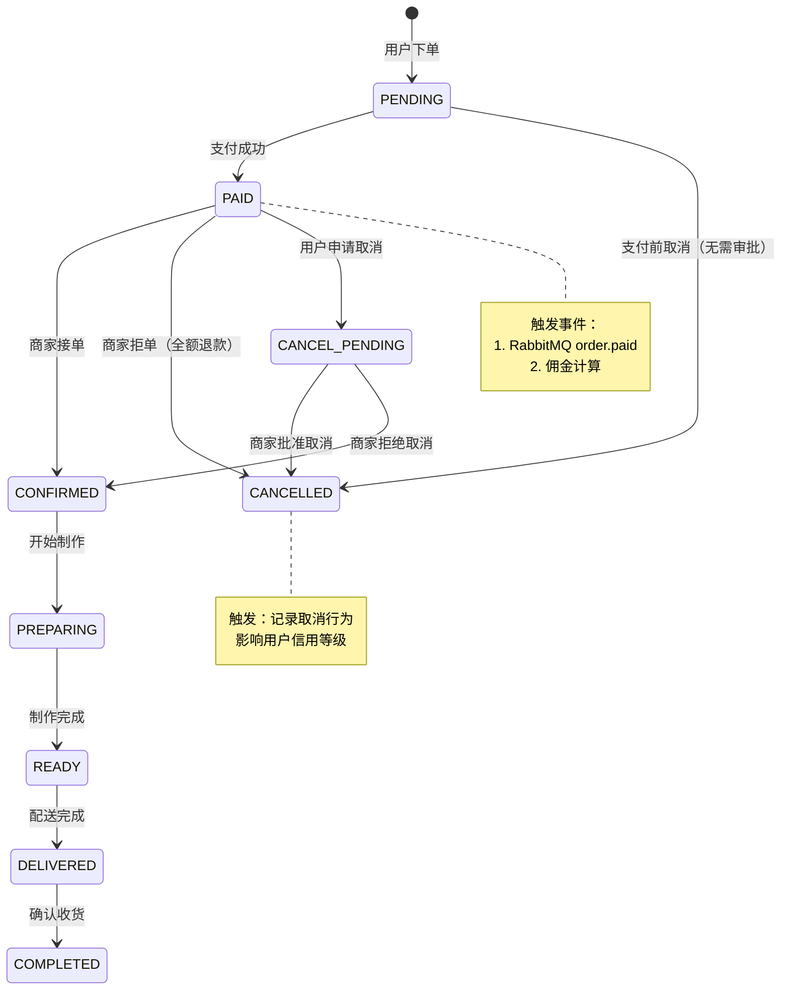

### 8.6.6 限制条件

1. 订单状态机仅允许正向流转（不可回退到已完成状态），商家拒绝取消时回退到 CONFIRMED。
2. 退款金额可由商家设置为部分退款或全额退款。
3. 死信队列（DLQ）用于捕获 MQ 发布失败的事件，需人工干预重放。

---

## 8.7 用户与信用等级系统

### 8.7.1 功能描述

用户系统提供注册、登录和 JWT 认证功能。信用等级系统维护 1-5 级的用户信用评级（5 为最高），根据取消行为自动降级、根据持续良好行为自动升级，与营销系统的智能发券引擎联动。

### 8.7.2 性能描述

| 性能指标 | 目标值 | 说明 |
| :--- | :--- | :--- |
| 登录响应 | < 200 ms | 含密码校验 + JWT 生成 |
| 信用等级计算 | < 50 ms | 含取消记录统计 |
| JWT 有效期 | 24 小时 | 86400000 ms |

### 8.7.3 输入

| 接口 | 输入 | 说明 |
| :--- | :--- | :--- |
| 注册 | username, email, password, role | 角色默认 customer |
| 登录 | username, password | 返回 JWT Token |
| 信用降级触发 | userId, orderId | 取消订单时自动触发 |

### 8.7.4 输出

| 接口 | 输出 | 说明 |
| :--- | :--- | :--- |
| 登录 | token, userId, username, role | JWT 包含 userId/role |
| 信用查询 | creditLevel, recentCancellations | 当前信用状态 |

### 8.7.5 程序逻辑

#### 信用等级升降级算法

```mermaid
flowchart TD
    EVENT{触发事件} --> |取消订单| DOWN_CHECK[查询近7天取消次数]
    EVENT --> |完成订单| UP_CHECK[查询升级条件]
    
    DOWN_CHECK --> DOWN_COND{近7天取消<br/>≥ 3次?}
    DOWN_COND -- "是" --> DOWN[creditLevel = max(level-1, 1)]
    DOWN_COND -- "否" --> NO_CHANGE1[等级不变]
    
    UP_CHECK --> UP_COND1{近7天<br/>0次取消?}
    UP_COND1 -- "否" --> NO_CHANGE2[等级不变]
    UP_COND1 -- "是" --> UP_COND2{近30天<br/>完成订单 ≥ 3?}
    UP_COND2 -- "否" --> NO_CHANGE3[等级不变]
    UP_COND2 -- "是" --> UP[creditLevel = min(level+1, 5)]
    
    UP --> COUPON[触发 CREDIT_UPGRADE<br/>智能发券事件]
```

**信用等级判定表**：

| 条件 | 近7天取消次数 | 近30天完成订单 | 操作 |
| :--- | :---: | :---: | :--- |
| 降级 | ≥ 3 | — | level - 1（最低 1） |
| 升级 | 0 | ≥ 3 | level + 1（最高 5） |
| 不变 | 1-2 | — | 保持当前等级 |
| 不变 | 0 | < 3 | 保持当前等级 |

### 8.7.6 限制条件

1. 信用等级仅基于取消行为评估，不考虑评价、投诉等其他维度。
2. JWT 使用对称密钥签名，所有微服务共享同一密钥，密钥泄露会影响全局安全。

---

## 8.8 商家管理与动态定价配置系统

### 8.8.1 功能描述

商家管理系统提供商家入驻、店铺信息管理、菜单 CRUD、以及 AI 动态定价配置的全套功能。商家服务同时作为 AI 定价流水线的终端消费者——通过 RabbitMQ 监听 `merchant.pricing.updates` 队列，接收 AI 定价提案并根据 routing key 判断执行自动更新或创建待审批通知。

### 8.8.2 性能描述

| 性能指标 | 目标值 | 说明 |
| :--- | :--- | :--- |
| 菜单 CRUD | < 100 ms | 标准数据库操作 |
| 提案消费处理 | < 200 ms | 含写库 + 通知创建 |
| 商家导入 | < 500 ms | 从外部 API 导入并生成默认菜单 |

### 8.8.3 输入

**定价提案消费**（RabbitMQ 消息）：

| 字段 | 类型 | 说明 |
| :--- | :--- | :--- |
| `merchantId` | Long | 商家 ID |
| `menuItemId` | Long | 菜品 ID |
| `proposalId` | Long | 提案 ID |
| `newPrice` | Float | 建议价格 |
| `reason` | String | AI 分析理由 |
| Routing Key | String | 含 "auto" → 自动执行；否则 → 待审批 |

### 8.8.4 输出

| 输出 | 说明 |
| :--- | :--- |
| 菜品价格更新 | 自动审批通过时直接更新 `menu_items.price` |
| 待审批提案 | 写入 `price_change_proposals` 表，状态 PENDING |
| 商家通知 | 写入 `merchant_notifications` 表 |

### 8.8.5 程序逻辑

#### 定价提案消费流程

```mermaid
flowchart TD
    MQ[/"RabbitMQ 消息<br/>merchant.pricing.updates"/] --> PARSE[解析消息体]
    PARSE --> KEY_CHECK{Routing Key<br/>包含 "auto"?}
    
    KEY_CHECK -- "是（自动审批）" --> UPDATE_PRICE[直接更新菜品价格<br/>MenuService.updatePrice]
    UPDATE_PRICE --> SAVE_AUTO[保存提案<br/>状态: AUTO_APPLIED]
    SAVE_AUTO --> NOTIFY_AUTO[创建通知<br/>"菜品 X 已自动调整为 Y 元"]
    
    KEY_CHECK -- "否（人工审批）" --> SAVE_PENDING[保存提案<br/>状态: PENDING]
    SAVE_PENDING --> NOTIFY_PENDING[创建通知<br/>"菜品 X 有新的定价建议待审批"]
    
    NOTIFY_AUTO & NOTIFY_PENDING --> DONE[完成]
```

### 8.8.6 限制条件

1. 商家导入时自动生成的默认菜单基于菜系模板，可能与商家实际菜单不符，需商家手动修正。
2. 自动执行的价格更新不可撤销，商家需手动改回原价。

---

## 8.9 用户画像服务

### 8.9.1 功能描述

用户画像服务基于 MongoDB 文档数据库存储用户的偏好、行为标签、浏览历史等非结构化数据，为推荐系统的 ProfilerAgent 提供用户上下文数据。支持惰性创建（首次访问时自动建档）和字段级部分更新。

### 8.9.2 性能描述

| 性能指标 | 目标值 | 说明 |
| :--- | :--- | :--- |
| 画像查询 | < 10 ms | MongoDB 单文档查询（username 唯一索引） |
| 上下文聚合 | < 200 ms | 合并画像 + 订单历史（Feign 调用） |
| 浏览记录写入 | < 20 ms | MongoDB 数组追加操作 |

### 8.9.3 输入

| 接口 | 输入 | 说明 |
| :--- | :--- | :--- |
| 查询/创建画像 | username | 惰性创建，不存在则新建空画像 |
| 更新画像 | username, preferences, tags, allergies | 字段级部分更新 |
| 记录浏览 | username, merchantId, merchantName | 写入 browseHistory 数组 |
| 获取聚合上下文 | userId, username | 合并画像 + 近期订单 |

### 8.9.4 输出

| 输出字段 | 类型 | 说明 |
| :--- | :--- | :--- |
| `preferences` | Map | 口味偏好（如 {"spicy": "high"}） |
| `tags` | List | AI 推断标签（如 ["健身达人"]） |
| `allergies` | List | 过敏原列表 |
| `browseHistory` | List | 浏览历史（merchantId, name, time） |
| `stats` | Object | 统计数据（消费水平、活跃时段、总订单数） |

### 8.9.5 程序逻辑

#### 用户上下文聚合流程

```mermaid
flowchart TD
    REQ[推荐服务请求<br/>GET /profile/{username}/context] --> MONGO[查询 MongoDB<br/>user_profiles 集合]
    MONGO --> EXISTS{文档存在?}
    EXISTS -- "不存在" --> CREATE[惰性创建空画像]
    EXISTS -- "存在" --> PROFILE[获取画像文档]
    CREATE --> PROFILE
    
    PROFILE --> FEIGN[Feign 调用订单服务<br/>获取近期订单历史]
    FEIGN --> MERGE{订单服务<br/>是否可用?}
    MERGE -- "可用" --> AGG[合并画像 + 订单数据<br/>生成 UserContextDto]
    MERGE -- "不可用" --> DEGRADE[降级：仅返回画像数据]
    
    AGG --> RETURN[返回聚合上下文]
    DEGRADE --> RETURN
```

### 8.9.6 限制条件

1. MongoDB 与 PostgreSQL 之间通过 `username` 字段在应用层关联，无数据库层面的外键约束。
2. 浏览历史为无限增长数组，极端情况下可能影响文档大小（MongoDB 单文档限制 16 MB）。
3. 订单服务不可用时，聚合上下文缺失订单维度数据，推荐精度可能下降。

---

## 8.10 跨服务通信设计

### 8.10.1 通信方式总览

FoodMate-AI 采用**同步 HTTP + 异步消息队列**混合通信模式。关键业务流程（如佣金计算）使用同步 HTTP 保证实时性，AI 数据采集使用异步 MQ 避免阻塞主流程。

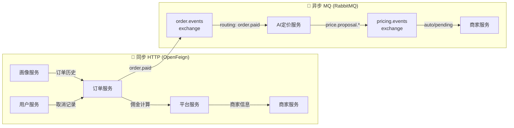

### 8.10.2 事件驱动数据流

| 事件名称 | Exchange | Routing Key | 发布者 | 消费者 | 用途 |
| :--- | :--- | :--- | :--- | :--- | :--- |
| order.paid | order.events | order.paid | 订单服务 | AI 定价服务 | 销售数据采集 |
| price.proposal.auto | pricing.events | price.proposal.auto | AI 定价服务 | 商家服务 | 自动执行价格更新 |
| price.proposal.pending | pricing.events | price.proposal.pending | AI 定价服务 | 商家服务 | 创建待审批提案 |

### 8.10.3 死信队列保障

```
正常流程：order.events → order.paid → consumer
消费失败：→ order.events.dlx (Dead Letter Exchange) → order.events.dlq (Dead Letter Queue)
人工干预：管理员查看 DLQ 消息 → 修复问题 → 重放消息
```

---

## 8.11 待补充图片清单

> **【待插入图片：图 8-1 多智能体推荐系统整体架构图】**
>
> **所在位置**：8.1.1 功能描述之后
>
> 使用 draw.io 绘制。内容：以三个智能体为核心的推荐系统全景架构图。左侧为数据输入源（天气 API、地图 API、MongoDB 画像、健康传感器），中间为三个智能体的流水线编排（ContextAgent → ProfilerAgent → DecisionAgent），右侧为输出（排序后的餐厅列表 + AI 推荐理由）。底部标注 LangGraph 状态图引擎和 MCP 协议层。每个智能体内标注关键算法（如 DecisionAgent 内标注 4 种 MAB 策略）。

> **【待插入图片：图 8-2 Contextual Bandit 评分层次结构图】**
>
> **所在位置**：8.1.5 节（2）Contextual Bandit 评分算法之前
>
> 使用 draw.io 绘制。内容：从下到上的四层叠加示意图——第一层（底层）为蓝色基础分条（0.50），第二层为绿色变量分条（距离/评分/价格/菜系/配送的加权条形图），第三层为橙色上下文奖励条（天气/温度/交通/健康/意图的正负奖励柱状图），第四层为灰色历史分条。顶部显示最终 final_score = 各层之和。右侧标注强/弱上下文的参数差异。

> **【待插入图片：图 8-3 NutriVision 分析结果界面截图】**
>
> **所在位置**：8.3.4 输出之后
>
> 手机截图。内容：NutriVisionResultScreen 页面的真实运行截图，展示菜品卡片列表（名称、热量、食材标签、过敏原红色警告）和 Top-3 推荐区域。
