# 第六章 数据库设计

## 6.1 数据库架构总览

FoodMate-AI 智能外卖平台采用**多数据库混合架构**，根据不同业务域的数据特点和访问模式选用最合适的数据库引擎，实现了业务数据与 AI 数据的物理隔离、结构化数据与非结构化数据的逻辑分治。整体数据架构包含三个独立数据库实例和一个全局缓存层，共计 **27 个数据实体**（24 张 PostgreSQL 主库表 + 2 张 AI 定价独立库表 + 1 个 MongoDB 文档集合）。

| 数据库 | 引擎 | 用途 | 所属服务 |
| :--- | :--- | :--- | :--- |
| `food_delivery_db` | PostgreSQL 15 | 核心业务数据：用户认证、商家管理、订单处理、营销优惠、定价分析、平台运营与结算 | 用户服务 / 商家服务 / 订单服务 / 营销服务 / 平台服务 |
| `ai_pricing_db` | PostgreSQL 15 | AI 定价分析专用数据：销售历史采集、定价提案管理 | AI 定价服务 |
| `user_profiles`（集合） | MongoDB 6.0 | 用户画像文档：口味偏好、行为标签、浏览历史、统计数据 | 用户画像服务 |
| Redis 缓存层 | Redis 7 | 全局热点数据缓存，提供毫秒级响应 | 全局共享 |

### 6.1.1 架构设计原则

1. **业务数据与 AI 数据物理隔离**：AI 定价服务使用独立的 `ai_pricing_db` 数据库，避免 AI 分析任务的大量读写操作影响主库 `food_delivery_db` 的核心业务性能。
2. **结构化数据用关系型数据库**：用户、订单、佣金等 Schema 固定、关系明确的业务数据统一使用 PostgreSQL，充分利用其事务一致性和丰富的索引能力。
3. **灵活 Schema 数据用文档数据库**：用户画像数据的维度高度灵活——不同用户可能拥有完全不同的偏好标签和行为记录，MongoDB 的文档模型天然适合此类动态 Schema 场景。
4. **冗余换性能**：佣金记录表中冗余存储了服务名称和费率值，避免结算查询时的跨表联查，提升高频查询性能。
5. **事件驱动数据同步**：AI 定价库通过 RabbitMQ 监听 `order.paid` 事件自动采集销售数据，实现跨库数据的异步同步，避免服务间的强耦合。

### 6.1.2 数据库架构拓扑图

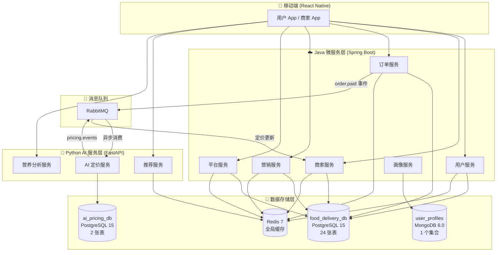

---

## 6.2 各模块表数量分布

系统按照微服务的业务域将 27 个数据实体划分为 8 个功能模块，每个模块内的表围绕核心实体展开，形成清晰的领域边界。

| 功能模块 | 表/集合数量 | 包含的数据实体 |
| :--- | :---: | :--- |
| 用户与认证模块 | 3 | users, addresses, cancellation_records |
| 商家与菜单模块 | 4 | merchants, menu_items, merchant_notifications, price_change_proposals |
| 定价分析模块 | 6 | pricing_strategies, menu_item_costs, pricing_history, price_elasticity, discount_recommendations, pricing_ab_tests |
| 订单管理模块 | 3 | orders, order_items, order_status_history |
| 营销优惠模块 | 4 | coupon_templates, user_coupons, auto_issuance_rules, auto_issuance_history |
| 平台运营与结算模块 | 4 | platform_services, merchant_service_subscriptions, merchant_settlements, commission_records |
| AI 定价数据库（独立库） | 2 | sales_history, pricing_proposals |
| 用户画像数据库（MongoDB） | 1 | user_profiles |

---

## 6.3 主业务数据库详细设计（food_delivery_db）

主库 `food_delivery_db` 基于 PostgreSQL 15 构建，共包含 **24 张业务表**，承载平台全部核心业务逻辑。以下按功能模块逐一说明每张表的结构、字段含义、约束条件和索引设计。

### 6.3.1 用户与认证模块

#### （1）users — 用户表

系统最核心的基础表，存储所有注册用户的认证信息和信用等级数据。用户角色支持消费者（customer）、商家（merchant）和管理员（admin）三种，信用等级从 1 到 5 级（5 为最高），与营销系统的智能发券引擎联动。

| 字段名 | 类型 | 约束 | 说明 |
| :--- | :--- | :--- | :--- |
| `id` | BIGSERIAL | PRIMARY KEY | 自增主键 |
| `username` | VARCHAR(50) | UNIQUE NOT NULL | 用户名，全局唯一 |
| `email` | VARCHAR(100) | UNIQUE NOT NULL | 邮箱地址，全局唯一 |
| `password_hash` | VARCHAR(255) | NOT NULL | 密码哈希值（BCrypt 加密存储） |
| `nickname` | VARCHAR(50) | — | 昵称（显示名称） |
| `avatar_url` | VARCHAR(255) | — | 用户头像 URL |
| `phone` | VARCHAR(20) | — | 手机号码 |
| `role` | VARCHAR(20) | NOT NULL DEFAULT 'customer' | 用户角色：customer / merchant / admin |
| `credit_level` | INT | DEFAULT 5 | 信用等级（1-5，5 为最高） |
| `recent_cancellations` | INT | DEFAULT 0 | 近期取消订单次数（7 天滑动窗口） |
| `last_level_change_at` | TIMESTAMP | — | 最后一次信用等级变动时间 |

**索引设计**：`username`（唯一索引）、`email`（唯一索引）

#### （2）addresses — 收货地址表

| 字段名 | 类型 | 约束 | 说明 |
| :--- | :--- | :--- | :--- |
| `id` | BIGSERIAL | PRIMARY KEY | 自增主键 |
| `user_id` | BIGINT | FK → users(id) ON DELETE CASCADE | 所属用户，级联删除 |
| `city` | VARCHAR(100) | NOT NULL | 城市 |
| `street` | VARCHAR(255) | NOT NULL | 街道 |
| `detail` | VARCHAR(255) | — | 详细地址（门牌号等） |
| `is_default` | BOOLEAN | DEFAULT FALSE | 是否为默认地址 |
| `created_at` | TIMESTAMP | DEFAULT CURRENT_TIMESTAMP | 创建时间 |

**索引设计**：`user_id`

#### （3）cancellation_records — 取消记录表

记录每一次订单取消行为，作为用户信用等级计算的数据源。系统通过统计用户近 7 天内的取消次数来判定信用等级的升降。

| 字段名 | 类型 | 约束 | 说明 |
| :--- | :--- | :--- | :--- |
| `id` | BIGSERIAL | PRIMARY KEY | 自增主键 |
| `user_id` | BIGINT | FK → users(id) | 取消操作的用户 |
| `order_id` | BIGINT | FK → orders(id) | 被取消的订单 |
| `cancelled_at` | TIMESTAMP | DEFAULT CURRENT_TIMESTAMP | 取消时间 |

**索引设计**：`idx_cancellation_records_user_id`、`idx_cancellation_records_created_at`

---

### 6.3.2 商家与菜单模块

#### （4）merchants — 商家表

商家信息核心表，同时存储 AI 动态定价相关的配置参数。`source` 字段标记数据来源，支持本地创建（LOCAL）和通过高德地图 API 自动导入（AMAP/AGENT）两种途径。

| 字段名 | 类型 | 约束 | 说明 |
| :--- | :--- | :--- | :--- |
| `id` | BIGSERIAL | PRIMARY KEY | 自增主键 |
| `owner_user_id` | BIGINT | FK → users(id) | 店主关联用户 ID |
| `name` | VARCHAR(100) | NOT NULL | 商家名称 |
| `address` | VARCHAR(255) | — | 商家地址 |
| `external_id` | VARCHAR(50) | UNIQUE | 外部 ID（来自地图 API，如 B0LDM1F2K5） |
| `latitude` | DOUBLE PRECISION | — | 纬度坐标 |
| `longitude` | DOUBLE PRECISION | — | 经度坐标 |
| `image_url` | VARCHAR(500) | — | 商家图片 URL |
| `rating` | DOUBLE PRECISION | — | 评分（0-5 星） |
| `cuisine_type` | VARCHAR(100) | — | 菜系类型（如"川菜""日料"） |
| `phone` | VARCHAR(50) | — | 联系电话 |
| `description` | TEXT | — | 商家描述 |
| `source` | VARCHAR(20) | DEFAULT 'LOCAL' | 数据来源：LOCAL / AGENT / AMAP |
| `enable_dynamic_pricing` | BOOLEAN | DEFAULT TRUE | 是否启用 AI 动态定价 |
| `pricing_strategy_id` | BIGINT | — | 当前使用的定价策略 ID（逻辑外键） |
| `ai_pricing_budget_percentage` | INT | DEFAULT 5 | AI 定价预算百分比 |
| `enable_auto_approval` | BOOLEAN | DEFAULT FALSE | 是否开启定价提案自动审批 |
| `auto_approval_threshold` | DOUBLE PRECISION | DEFAULT 0.05 | 自动审批阈值（价格变动比例，如 0.05 表示 5%） |
| `created_at` | TIMESTAMP | DEFAULT CURRENT_TIMESTAMP | 创建时间 |
| `updated_at` | TIMESTAMP | DEFAULT CURRENT_TIMESTAMP | 更新时间 |

**索引设计**：`idx_merchants_external_id`、`idx_merchants_source`

#### （5）menu_items — 菜单项表

菜品信息表，同时承载 AI 动态定价的价格数据。`base_price` 为商家设定的基础价格，`current_dynamic_price` 为 AI 计算后的动态价格，`price` 为当前实际售价。当 `is_dynamic` 为 true 时，系统使用动态价格替代基础价格。

| 字段名 | 类型 | 约束 | 说明 |
| :--- | :--- | :--- | :--- |
| `id` | BIGSERIAL | PRIMARY KEY | 自增主键 |
| `merchant_id` | BIGINT | FK → merchants(id) | 所属商家 |
| `name` | VARCHAR(100) | NOT NULL | 菜品名称 |
| `price` | DECIMAL(10,2) | NOT NULL | 当前售价 |
| `description` | TEXT | — | 菜品描述 |
| `image_url` | VARCHAR(255) | — | 菜品图片 URL |
| `category` | VARCHAR(50) | — | 菜品分类 |
| `is_available` | BOOLEAN | DEFAULT TRUE | 是否上架 |
| `base_price` | DECIMAL(10,2) | — | 基础价格（AI 定价基准） |
| `current_dynamic_price` | DECIMAL(10,2) | — | 当前 AI 动态价格 |
| `cost_type` | VARCHAR(50) | DEFAULT 'FIXED' | 成本类型 |
| `cost_amount` | DECIMAL(10,2) | — | 成本金额 |
| `pricing_strategy_id` | BIGINT | — | 关联的定价策略 ID |
| `last_price_update_at` | TIMESTAMP | DEFAULT CURRENT_TIMESTAMP | 最后价格更新时间 |
| `is_dynamic` | BOOLEAN | DEFAULT FALSE | 是否启用动态定价 |

**索引设计**：`idx_menu_items_pricing_strategy`、`idx_menu_items_is_dynamic`

#### （6）merchant_notifications — 商家通知表

| 字段名 | 类型 | 约束 | 说明 |
| :--- | :--- | :--- | :--- |
| `id` | BIGSERIAL | PRIMARY KEY | 自增主键 |
| `merchant_id` | BIGINT | — | 目标商家 ID |
| `title` | VARCHAR(255) | — | 通知标题 |
| `content` | VARCHAR(1000) | — | 通知内容 |
| `type` | VARCHAR(255) | — | 通知类型（如 PRICE_UPDATE） |
| `is_read` | BOOLEAN | DEFAULT FALSE | 是否已读 |
| `created_at` | TIMESTAMP | — | 创建时间 |

#### （7）price_change_proposals — 价格变更提案表

AI 定价服务生成的定价建议同步到主库后，以提案形式存储，供商家在移动端或 Web 端审批。支持 PENDING（待审批）、APPROVED（已批准）、REJECTED（已拒绝）和 AUTO_APPLIED（自动执行）四种状态。

| 字段名 | 类型 | 约束 | 说明 |
| :--- | :--- | :--- | :--- |
| `id` | BIGSERIAL | PRIMARY KEY | 自增主键 |
| `merchant_id` | BIGINT | — | 商家 ID |
| `menu_item_id` | BIGINT | — | 菜品 ID |
| `external_proposal_id` | BIGINT | — | 对应 ai_pricing_db 中的提案 ID |
| `current_price` | DECIMAL(10,2) | — | 变更前价格 |
| `suggested_price` | DECIMAL(10,2) | — | AI 建议价格 |
| `reason` | TEXT | — | AI 分析理由 |
| `status` | VARCHAR(50) | NOT NULL | 状态：PENDING / APPROVED / REJECTED / AUTO_APPLIED |
| `created_at` | TIMESTAMP | — | 创建时间 |
| `handled_at` | TIMESTAMP | — | 处理时间 |

---

### 6.3.3 定价分析模块

本模块共包含 6 张表，为 AI 动态定价系统提供策略配置、成本核算、价格弹性分析和 A/B 测试等数据支撑。

#### （8）pricing_strategies — 定价策略表

| 字段名 | 类型 | 约束 | 说明 |
| :--- | :--- | :--- | :--- |
| `id` | BIGSERIAL | PRIMARY KEY | 自增主键 |
| `merchant_id` | BIGINT | FK → merchants(id) | 所属商家 |
| `strategy_name` | VARCHAR(100) | NOT NULL | 策略名称 |
| `strategy_type` | VARCHAR(50) | NOT NULL | 策略类型 |
| `description` | TEXT | — | 策略描述 |
| `apply_time_range` | VARCHAR(50) | — | 适用时间段（如"11:00-13:00"） |
| `apply_day_of_week` | VARCHAR(50) | — | 适用星期（如"MON,TUE,WED"） |
| `price_adjustment_percentage` | INT | — | 价格调整百分比 |
| `min_price` | DECIMAL(10,2) | — | 最低价格限制 |
| `max_price` | DECIMAL(10,2) | — | 最高价格限制 |
| `ai_enabled` | BOOLEAN | DEFAULT TRUE | 是否启用 AI 参与 |
| `elasticity_factor` | DECIMAL(5,2) | — | 弹性系数 |
| `status` | VARCHAR(20) | DEFAULT 'ACTIVE' | 状态：ACTIVE / INACTIVE |
| `created_at` | TIMESTAMP | DEFAULT CURRENT_TIMESTAMP | 创建时间 |
| `updated_at` | TIMESTAMP | DEFAULT CURRENT_TIMESTAMP | 更新时间 |

#### （9）menu_item_costs — 菜品成本表

| 字段名 | 类型 | 约束 | 说明 |
| :--- | :--- | :--- | :--- |
| `id` | BIGSERIAL | PRIMARY KEY | 自增主键 |
| `menu_item_id` | BIGINT | FK → menu_items(id) | 关联菜品 |
| `cost_category` | VARCHAR(50) | — | 成本类别（如"原材料""人工"） |
| `cost_name` | VARCHAR(100) | — | 成本名称 |
| `cost_amount` | DECIMAL(10,2) | — | 成本金额 |
| `unit` | VARCHAR(20) | — | 计量单位 |
| `cost_date` | DATE | — | 成本记录日期 |
| `supplier` | VARCHAR(100) | — | 供应商名称 |
| `created_at` | TIMESTAMP | DEFAULT CURRENT_TIMESTAMP | 创建时间 |

#### （10）pricing_history — 定价历史表

记录每一次价格变更的完整审计轨迹，包括变更前后的价格、变更原因、关联的策略和操作者信息。

| 字段名 | 类型 | 约束 | 说明 |
| :--- | :--- | :--- | :--- |
| `id` | BIGSERIAL | PRIMARY KEY | 自增主键 |
| `menu_item_id` | BIGINT | FK → menu_items(id) | 菜品 ID |
| `merchant_id` | BIGINT | FK → merchants(id) | 商家 ID |
| `old_price` | DECIMAL(10,2) | — | 变更前价格 |
| `new_price` | DECIMAL(10,2) | — | 变更后价格 |
| `change_reason` | VARCHAR(100) | — | 变更原因 |
| `applied_strategy_id` | BIGINT | — | 应用的策略 ID |
| `changed_by` | VARCHAR(100) | — | 变更操作者 |
| `changed_at` | TIMESTAMP | DEFAULT CURRENT_TIMESTAMP | 变更时间 |

**索引设计**：`idx_pricing_history_menu_item`、`idx_pricing_history_changed_at`

#### （11）price_elasticity — 价格弹性表

存储 AI 分析计算的菜品价格弹性系数，用于指导动态定价决策。弹性系数越高，表示该菜品对价格变化越敏感。

| 字段名 | 类型 | 约束 | 说明 |
| :--- | :--- | :--- | :--- |
| `id` | BIGSERIAL | PRIMARY KEY | 自增主键 |
| `menu_item_id` | BIGINT | FK → menu_items(id) | 菜品 ID |
| `merchant_id` | BIGINT | FK → merchants(id) | 商家 ID |
| `elasticity_coefficient` | DECIMAL(5,3) | — | 弹性系数 |
| `confidence_score` | DECIMAL(5,3) | — | 置信度评分（0-1） |
| `optimal_price_min` | DECIMAL(10,2) | — | 最优价格下限 |
| `optimal_price_max` | DECIMAL(10,2) | — | 最优价格上限 |
| `data_period_start` | DATE | — | 数据采集起始日期 |
| `data_period_end` | DATE | — | 数据采集截止日期 |
| `sample_size` | INT | — | 样本量 |
| `last_calculated_at` | TIMESTAMP | — | 最后计算时间 |
| `created_at` | TIMESTAMP | DEFAULT CURRENT_TIMESTAMP | 创建时间 |

**索引设计**：`idx_price_elasticity_menu_item`

#### （12）discount_recommendations — 折扣推荐表

| 字段名 | 类型 | 约束 | 说明 |
| :--- | :--- | :--- | :--- |
| `id` | BIGSERIAL | PRIMARY KEY | 自增主键 |
| `merchant_id` | BIGINT | FK → merchants(id) | 商家 ID |
| `menu_item_id` | BIGINT | FK → menu_items(id) | 菜品 ID |
| `recommendation_type` | VARCHAR(50) | — | 推荐类型 |
| `recommended_discount` | DECIMAL(5,2) | — | 建议折扣率 |
| `recommended_price` | DECIMAL(10,2) | — | 建议价格 |
| `reason` | TEXT | — | AI 推荐理由 |
| `expected_sales_increase` | DECIMAL(5,2) | — | 预期销量增幅（%） |
| `status` | VARCHAR(20) | — | 状态 |
| `merchant_decision_reason` | VARCHAR(255) | — | 商家决策原因 |
| `decided_at` | TIMESTAMP | — | 决策时间 |
| `created_at` | TIMESTAMP | DEFAULT CURRENT_TIMESTAMP | 创建时间 |
| `expires_at` | TIMESTAMP | — | 过期时间 |

**索引设计**：`idx_discount_recommendations_merchant`

#### （13）pricing_ab_tests — 定价 A/B 测试表

支持对同一菜品设置两组不同价格，分别统计销量和营收，最终确定最优价格方案。

| 字段名 | 类型 | 约束 | 说明 |
| :--- | :--- | :--- | :--- |
| `id` | BIGSERIAL | PRIMARY KEY | 自增主键 |
| `merchant_id` | BIGINT | FK → merchants(id) | 商家 ID |
| `menu_item_id` | BIGINT | FK → menu_items(id) | 菜品 ID |
| `test_name` | VARCHAR(100) | — | 测试名称 |
| `test_group_a_price` | DECIMAL(10,2) | — | A 组价格 |
| `test_group_b_price` | DECIMAL(10,2) | — | B 组价格 |
| `test_start_date` | TIMESTAMP | — | 测试开始时间 |
| `test_end_date` | TIMESTAMP | — | 测试结束时间 |
| `group_a_sales` | INT | — | A 组销量 |
| `group_a_revenue` | DECIMAL(10,2) | — | A 组营收 |
| `group_b_sales` | INT | — | B 组销量 |
| `group_b_revenue` | DECIMAL(10,2) | — | B 组营收 |
| `winner` | VARCHAR(10) | — | 胜出组（A 或 B） |
| `winner_confirmed_at` | TIMESTAMP | — | 胜出确认时间 |
| `status` | VARCHAR(20) | — | 测试状态 |
| `created_at` | TIMESTAMP | DEFAULT CURRENT_TIMESTAMP | 创建时间 |

---

### 6.3.4 订单管理模块

#### （14）orders — 订单主表

订单全生命周期管理的核心表，支持完整的订单状态机流转和支付信息记录。`merchant_id` 兼容数字 ID 和外部字符串 ID，以适配从地图 API 导入的商家数据。

| 字段名 | 类型 | 约束 | 说明 |
| :--- | :--- | :--- | :--- |
| `id` | BIGSERIAL | PRIMARY KEY | 自增主键 |
| `user_id` | BIGINT | NOT NULL | 下单用户 ID |
| `merchant_id` | BIGINT | NOT NULL | 商家 ID |
| `total_amount` | DECIMAL(10,2) | NOT NULL | 订单实付金额 |
| `status` | VARCHAR(20) | NOT NULL | 订单状态（见下方状态机） |
| `created_at` | TIMESTAMP | DEFAULT CURRENT_TIMESTAMP | 下单时间 |
| `cancel_reason` | VARCHAR(255) | — | 取消原因 |
| `cancel_status` | VARCHAR(20) | — | 取消审核状态：PENDING_APPROVAL / APPROVED / REJECTED |
| `refund_amount` | DECIMAL(10,2) | — | 退款金额 |
| `refund_approved_at` | TIMESTAMP | — | 退款批准时间 |
| `discount_amount` | DECIMAL(10,2) | — | 优惠金额 |
| `original_amount` | DECIMAL(10,2) | — | 优惠前原始金额 |
| `original_item_price` | DECIMAL(10,2) | — | 原始菜品价格 |
| `applied_pricing_strategy_id` | BIGINT | — | 应用的 AI 定价策略 ID |
| `ai_discount_reason` | VARCHAR(255) | — | AI 折扣理由 |
| `paid_at` | TIMESTAMP | — | 支付完成时间 |
| `payment_method` | VARCHAR(50) | — | 支付方式：WECHAT / ALIPAY / CARD / CASH |
| `payment_transaction_id` | VARCHAR(100) | — | 第三方支付交易号 |
| `payment_channel` | VARCHAR(50) | — | 支付渠道：APP / MINI_PROGRAM / H5 / WEB |

**订单状态机**：

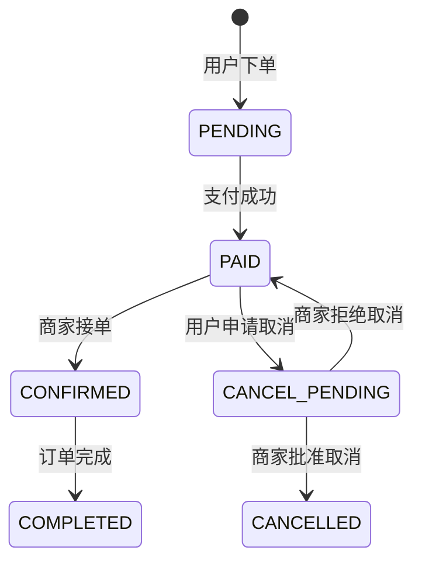

**索引设计**：`idx_orders_user_id`、`idx_orders_merchant_id`、`idx_orders_created_at`、`idx_orders_paid_at`、`idx_orders_payment_transaction_id`、`idx_orders_status_paid`

#### （15）order_items — 订单明细表

| 字段名 | 类型 | 约束 | 说明 |
| :--- | :--- | :--- | :--- |
| `id` | BIGSERIAL | PRIMARY KEY | 自增主键 |
| `order_id` | BIGINT | FK → orders(id) ON DELETE CASCADE | 关联订单，级联删除 |
| `menu_item_id` | BIGINT | NOT NULL | 菜品 ID（逻辑外键） |
| `price` | DECIMAL(10,2) | NOT NULL | 下单时的菜品单价（快照） |
| `quantity` | INT | NOT NULL | 购买数量 |

#### （16）order_status_history — 订单状态历史表

| 字段名 | 类型 | 约束 | 说明 |
| :--- | :--- | :--- | :--- |
| `id` | BIGSERIAL | PRIMARY KEY | 自增主键 |
| `order_id` | BIGINT | FK → orders(id) | 关联订单 |
| `old_status` | VARCHAR(20) | — | 变更前状态 |
| `new_status` | VARCHAR(20) | — | 变更后状态 |
| `status_changed_at` | TIMESTAMP | DEFAULT CURRENT_TIMESTAMP | 状态变更时间 |

---

### 6.3.5 营销优惠模块

#### （17）coupon_templates — 优惠券模板表

定义优惠券的类型、面额、使用条件和有效期等基本属性。支持四种优惠券类型和灵活的叠加/互斥关系配置。

| 字段名 | 类型 | 约束 | 说明 |
| :--- | :--- | :--- | :--- |
| `id` | BIGSERIAL | PRIMARY KEY | 自增主键 |
| `name` | VARCHAR(100) | NOT NULL | 优惠券名称 |
| `description` | VARCHAR(255) | — | 描述 |
| `type` | VARCHAR(20) | NOT NULL | 类型：DISCOUNT / THRESHOLD_REDUCTION / NO_THRESHOLD / FREE_SHIPPING |
| `min_order_amount` | DECIMAL(10,2) | — | 最低消费门槛 |
| `discount_value` | DECIMAL(10,2) | NOT NULL | 优惠值（折扣率或减免金额） |
| `max_discount` | DECIMAL(10,2) | — | 最大优惠上限 |
| `total_quantity` | INTEGER | DEFAULT 0 | 总发放数量 |
| `issued_quantity` | INTEGER | DEFAULT 0 | 已发放数量 |
| `valid_from` | TIMESTAMP | NOT NULL | 有效期起始 |
| `valid_until` | TIMESTAMP | NOT NULL | 有效期截止 |
| `enabled` | BOOLEAN | DEFAULT TRUE | 是否启用 |
| `stackable` | BOOLEAN | DEFAULT TRUE | 是否可叠加使用 |
| `exclusive_ids` | TEXT | — | 互斥券模板 ID 列表（JSON 格式） |
| `applicable_merchant_ids` | TEXT | — | 适用商家 ID 列表（JSON 格式） |
| `created_at` | TIMESTAMP | DEFAULT CURRENT_TIMESTAMP | 创建时间 |
| `updated_at` | TIMESTAMP | DEFAULT CURRENT_TIMESTAMP | 更新时间 |

**索引设计**：`idx_coupon_enabled`、`idx_coupon_type`

#### （18）user_coupons — 用户优惠券表

记录每个用户持有的优惠券及其使用状态，支持 AVAILABLE（可用）→ LOCKED（锁定，下单中）→ USED（已使用）的状态流转，以及超时自动 EXPIRED（过期）。

| 字段名 | 类型 | 约束 | 说明 |
| :--- | :--- | :--- | :--- |
| `id` | BIGSERIAL | PRIMARY KEY | 自增主键 |
| `user_id` | BIGINT | NOT NULL | 用户 ID |
| `coupon_template_id` | BIGINT | FK → coupon_templates(id) | 优惠券模板 |
| `status` | VARCHAR(20) | DEFAULT 'AVAILABLE' | 状态：AVAILABLE / LOCKED / USED / EXPIRED |
| `order_id` | BIGINT | — | 使用该券的订单 ID |
| `obtained_at` | TIMESTAMP | DEFAULT CURRENT_TIMESTAMP | 获得时间 |
| `used_at` | TIMESTAMP | — | 使用时间 |
| `expires_at` | TIMESTAMP | NOT NULL | 过期时间 |
| `created_at` | TIMESTAMP | DEFAULT CURRENT_TIMESTAMP | 创建时间 |
| `updated_at` | TIMESTAMP | DEFAULT CURRENT_TIMESTAMP | 更新时间 |

**索引设计**：`idx_user_id`、`idx_coupon_template_id`、`idx_user_status`（复合索引）

#### （19）auto_issuance_rules — 智能发券规则表

| 字段名 | 类型 | 约束 | 说明 |
| :--- | :--- | :--- | :--- |
| `id` | BIGSERIAL | PRIMARY KEY | 自增主键 |
| `rule_name` | VARCHAR(255) | NOT NULL | 规则名称 |
| `description` | TEXT | — | 规则描述 |
| `trigger_type` | VARCHAR(50) | NOT NULL | 触发类型：NEW_USER / CREDIT_UPGRADE / ORDER_MILESTONE / VIP_USER / BIRTHDAY |
| `coupon_template_id` | BIGINT | NOT NULL | 关联优惠券模板 ID |
| `enabled` | BOOLEAN | DEFAULT TRUE | 是否启用 |
| `condition_json` | TEXT | — | 触发条件（JSON 格式，如 `{"minCreditLevel": 5}`） |
| `frequency` | VARCHAR(20) | DEFAULT 'ONCE' | 触发频率：ONCE / DAILY / WEEKLY / MONTHLY |
| `priority` | INTEGER | DEFAULT 100 | 优先级（数值越小越高） |
| `created_at` | TIMESTAMP | DEFAULT CURRENT_TIMESTAMP | 创建时间 |
| `updated_at` | TIMESTAMP | DEFAULT CURRENT_TIMESTAMP | 更新时间 |
| `effective_from` | TIMESTAMP | — | 生效起始时间 |
| `effective_until` | TIMESTAMP | — | 生效截止时间 |
| `total_issue_limit` | INTEGER | — | 总发放上限 |
| `issued_count` | INTEGER | DEFAULT 0 | 已发放数量 |
| `created_by` | BIGINT | — | 创建人 ID |

**索引设计**：`idx_trigger_type`、`idx_enabled`、`idx_priority`、`idx_coupon_template`、`idx_effective_time`、`idx_created_at`

#### （20）auto_issuance_history — 智能发券历史表

| 字段名 | 类型 | 约束 | 说明 |
| :--- | :--- | :--- | :--- |
| `id` | BIGSERIAL | PRIMARY KEY | 自增主键 |
| `user_id` | BIGINT | NOT NULL | 目标用户 ID |
| `rule_id` | BIGINT | FK → auto_issuance_rules(id) ON DELETE CASCADE | 触发的规则 ID |
| `user_coupon_id` | BIGINT | — | 发放的用户优惠券 ID |
| `trigger_type` | VARCHAR(50) | NOT NULL | 触发类型 |
| `trigger_event_json` | TEXT | — | 触发事件详情（JSON 格式） |
| `successful` | BOOLEAN | NOT NULL | 是否发放成功 |
| `failure_reason` | VARCHAR(500) | — | 失败原因 |
| `issued_at` | TIMESTAMP | DEFAULT CURRENT_TIMESTAMP | 发放时间 |
| `processing_time_ms` | BIGINT | — | 处理耗时（毫秒） |

**索引设计**：`idx_user_id`、`idx_rule_id`、`idx_history_trigger_type`、`idx_successful`、`idx_issued_at`、`idx_user_rule`（复合索引）

---

### 6.3.6 平台运营与结算模块

#### （21）platform_services — 平台服务定义表

定义平台向商家提供的各类增值服务及其计费方式。服务分为四大类别：基础服务（BASIC）、流量推广（TRAFFIC）、配送服务（DELIVERY）和运营工具（OPERATION）。

| 字段名 | 类型 | 约束 | 说明 |
| :--- | :--- | :--- | :--- |
| `id` | BIGSERIAL | PRIMARY KEY | 自增主键 |
| `service_code` | VARCHAR(50) | UNIQUE NOT NULL | 服务编码（唯一标识，如 BASIC_TECH_FEE） |
| `service_name` | VARCHAR(100) | NOT NULL | 服务名称 |
| `category` | VARCHAR(30) | NOT NULL | 服务类别：BASIC / TRAFFIC / DELIVERY / OPERATION |
| `description` | TEXT | — | 服务描述 |
| `fee_type` | VARCHAR(30) | NOT NULL | 计费方式：PERCENTAGE / FIXED_PER_ORDER / FIXED_MONTHLY |
| `fee_value` | DECIMAL(10,4) | NOT NULL | 费率值（百分比用小数表示，如 0.05 = 5%） |
| `billing_cycle` | VARCHAR(20) | DEFAULT 'PER_ORDER' | 计费周期：PER_ORDER / MONTHLY / DAILY |
| `min_order_amount` | DECIMAL(10,2) | — | 最低订单金额要求 |
| `is_mandatory` | BOOLEAN | DEFAULT FALSE | 是否为强制订阅的基础服务 |
| `status` | VARCHAR(20) | DEFAULT 'ACTIVE' | 状态：ACTIVE / INACTIVE |
| `sort_order` | INT | DEFAULT 0 | 排序序号 |
| `created_at` | TIMESTAMP | DEFAULT CURRENT_TIMESTAMP | 创建时间 |
| `updated_at` | TIMESTAMP | DEFAULT CURRENT_TIMESTAMP | 更新时间 |

**索引设计**：`idx_platform_services_status`、`idx_platform_services_category`、`idx_platform_services_mandatory`

#### （22）merchant_service_subscriptions — 商家服务订阅表

| 字段名 | 类型 | 约束 | 说明 |
| :--- | :--- | :--- | :--- |
| `id` | BIGSERIAL | PRIMARY KEY | 自增主键 |
| `merchant_id` | BIGINT | FK → merchants(id) | 商家 ID |
| `service_id` | BIGINT | FK → platform_services(id) | 平台服务 ID |
| `status` | VARCHAR(20) | DEFAULT 'ACTIVE' | 状态：ACTIVE / CANCELLED / EXPIRED |
| `subscribed_at` | TIMESTAMP | DEFAULT CURRENT_TIMESTAMP | 订阅时间 |
| `expires_at` | TIMESTAMP | — | 过期时间（包月服务适用） |
| `cancelled_at` | TIMESTAMP | — | 取消时间 |
| `cancel_reason` | VARCHAR(200) | — | 取消原因 |
| `created_at` | TIMESTAMP | DEFAULT CURRENT_TIMESTAMP | 创建时间 |
| `updated_at` | TIMESTAMP | DEFAULT CURRENT_TIMESTAMP | 更新时间 |

**唯一约束**：`uk_merchant_service_active`（merchant_id, service_id, status），保证同一商家对同一服务只能有一个 ACTIVE 订阅。

**索引设计**：`idx_subscriptions_merchant`、`idx_subscriptions_service`、`idx_subscriptions_status`

#### （23）merchant_settlements — 商家结算单表

| 字段名 | 类型 | 约束 | 说明 |
| :--- | :--- | :--- | :--- |
| `id` | BIGSERIAL | PRIMARY KEY | 自增主键 |
| `settlement_no` | VARCHAR(32) | UNIQUE NOT NULL | 结算单号（格式：ST{年月}{W/M}{商家ID末3位}{序号}） |
| `merchant_id` | BIGINT | FK → merchants(id) | 商家 ID |
| `settlement_type` | VARCHAR(20) | NOT NULL | 结算类型：WEEKLY / MONTHLY |
| `period_start` | DATE | NOT NULL | 结算周期起始日期 |
| `period_end` | DATE | NOT NULL | 结算周期截止日期 |
| `period_label` | VARCHAR(20) | NOT NULL | 周期标签（如 2024-01、2024-W03） |
| `total_order_count` | INT | DEFAULT 0 | 订单总数 |
| `total_order_amount` | DECIMAL(12,2) | DEFAULT 0 | 订单总金额（GMV） |
| `total_commission` | DECIMAL(12,2) | DEFAULT 0 | 平台总分成 |
| `adjustment_amount` | DECIMAL(12,2) | DEFAULT 0 | 调整金额（可正可负） |
| `adjustment_reason` | VARCHAR(500) | — | 调整原因 |
| `net_income` | DECIMAL(12,2) | DEFAULT 0 | 商家净收入 |
| `status` | VARCHAR(20) | DEFAULT 'PENDING_CONFIRM' | 状态（见下方状态机） |
| `confirm_deadline` | TIMESTAMP | — | 确认截止时间（默认 3 天） |
| `confirmed_at` | TIMESTAMP | — | 确认时间 |
| `paid_at` | TIMESTAMP | — | 打款时间 |
| `dispute_reason` | VARCHAR(500) | — | 异议原因 |
| `dispute_at` | TIMESTAMP | — | 异议提出时间 |
| `created_at` | TIMESTAMP | DEFAULT CURRENT_TIMESTAMP | 创建时间 |
| `updated_at` | TIMESTAMP | DEFAULT CURRENT_TIMESTAMP | 更新时间 |

**结算单状态机**：

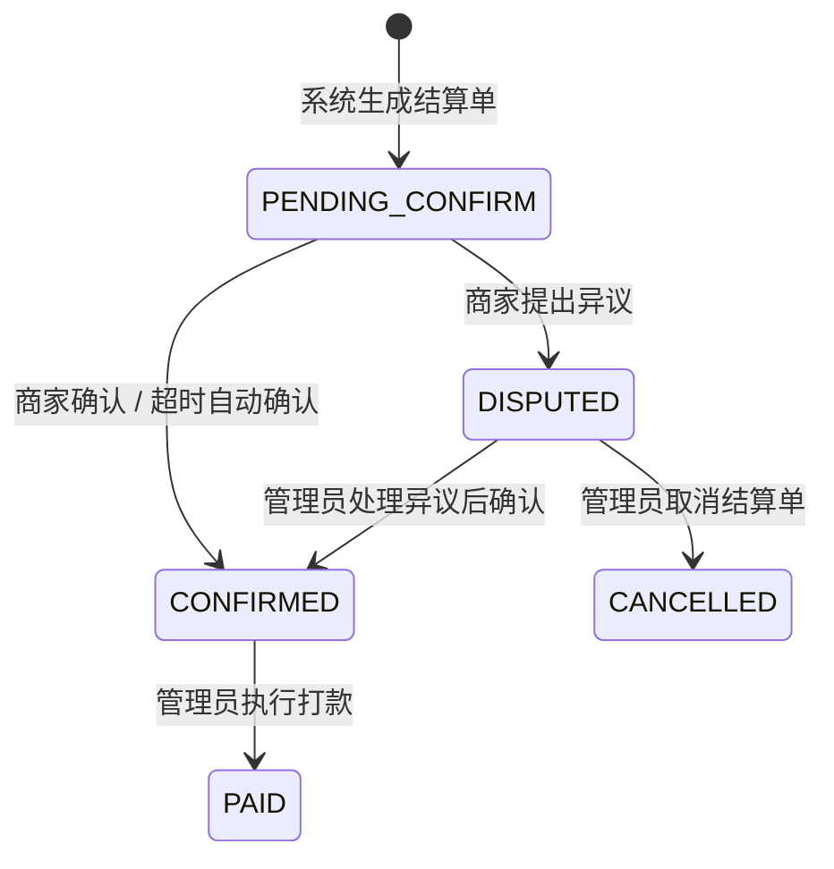

**唯一约束**：`uk_merchant_settlement_period`（merchant_id, settlement_type, period_label），保证同一商家同一类型同一周期只有一张结算单。

**索引设计**：`idx_settlement_merchant`、`idx_settlement_status`、`idx_settlement_type`、`idx_settlement_period`、`idx_settlement_confirm_deadline`

#### （24）commission_records — 订单佣金记录表

每笔订单支付后自动生成的佣金明细记录，关联到具体的订单、商家和平台服务。冗余存储服务名称和费率值，避免结算时的多表联查。

| 字段名 | 类型 | 约束 | 说明 |
| :--- | :--- | :--- | :--- |
| `id` | BIGSERIAL | PRIMARY KEY | 自增主键 |
| `order_id` | BIGINT | NOT NULL | 关联订单 ID（逻辑外键） |
| `merchant_id` | BIGINT | FK → merchants(id) | 商家 ID |
| `service_id` | BIGINT | FK → platform_services(id) | 平台服务 ID |
| `settlement_id` | BIGINT | FK → merchant_settlements(id) | 关联结算单（未结算时为 NULL） |
| `service_name` | VARCHAR(100) | NOT NULL | 服务名称（冗余存储） |
| `order_amount` | DECIMAL(10,2) | NOT NULL | 订单金额 |
| `fee_type` | VARCHAR(30) | NOT NULL | 计费方式（冗余存储） |
| `fee_value` | DECIMAL(10,4) | NOT NULL | 费率值（冗余存储） |
| `commission_amount` | DECIMAL(10,2) | NOT NULL | 佣金金额 |
| `status` | VARCHAR(20) | DEFAULT 'PENDING' | 状态：PENDING / SETTLED / REFUNDED |
| `created_at` | TIMESTAMP | DEFAULT CURRENT_TIMESTAMP | 创建时间 |
| `settled_at` | TIMESTAMP | — | 结算时间 |

**索引设计**：`idx_commission_order`、`idx_commission_merchant`、`idx_commission_settlement`、`idx_commission_status`、`idx_commission_created_at`、`idx_commission_merchant_created`（复合索引）、`idx_commission_unsettled`（部分索引：settlement_id IS NULL，加速结算查询）

---

## 6.4 AI 定价数据库详细设计（ai_pricing_db）

`ai_pricing_db` 是物理隔离于主业务库的独立 PostgreSQL 数据库，专供 AI 定价服务进行数据采集和分析。物理隔离的设计确保 AI 分析任务的大量读写操作不会影响主库的核心业务性能。

#### （25）sales_history — 销售历史表

通过 RabbitMQ 监听 `order.paid` 事件自动写入。每当用户完成订单支付，事件消费者会将订单中每个菜品的销售数据逐条写入此表，为 AI 定价分析积累历史数据。

| 字段名 | 类型 | 约束 | 说明 |
| :--- | :--- | :--- | :--- |
| `id` | SERIAL | PRIMARY KEY | 自增主键 |
| `order_id` | INTEGER | INDEX | 来源订单 ID |
| `menu_item_id` | INTEGER | INDEX | 菜品 ID |
| `merchant_id` | INTEGER | INDEX | 商家 ID |
| `quantity` | INTEGER | — | 销售数量 |
| `unit_price` | FLOAT | — | 单价 |
| `transaction_time` | TIMESTAMP | DEFAULT CURRENT_TIMESTAMP | 交易时间 |

**索引设计**：`idx_sales_item`（menu_item_id）、`idx_sales_time`（transaction_time）

#### （26）pricing_proposals — 定价提案表

AI 分析引擎（Gemini 大语言模型）生成的定价建议存储于此。根据商家配置，提案可自动审批（AUTO_APPROVED）或等待人工审批（PENDING）。

| 字段名 | 类型 | 约束 | 说明 |
| :--- | :--- | :--- | :--- |
| `id` | SERIAL | PRIMARY KEY | 自增主键 |
| `merchant_id` | INTEGER | INDEX | 商家 ID |
| `menu_item_id` | INTEGER | INDEX | 菜品 ID |
| `current_price` | FLOAT | — | 当前售价 |
| `suggested_price` | FLOAT | — | AI 建议价格 |
| `status` | VARCHAR(50) | DEFAULT 'PENDING' | 状态：PENDING / AUTO_APPROVED / MERCHANT_APPROVED / REJECTED / ROLLED_BACK |
| `reasoning` | TEXT | — | AI 分析理由 |
| `strategy_type` | VARCHAR(100) | — | 策略类型：MARKDOWN（降价促销） / SURGE（涨价） / MAINTAIN（维持） |
| `created_at` | TIMESTAMP | DEFAULT CURRENT_TIMESTAMP | 创建时间 |
| `applied_at` | TIMESTAMP | — | 执行时间 |

**索引设计**：`idx_proposal_merchant`、`idx_proposal_status`

---

## 6.5 用户画像数据库详细设计（MongoDB）

### user_profiles 集合

使用 MongoDB 文档数据库存储用户画像数据，Schema 灵活，不同用户可拥有不同维度的偏好标签和行为记录。与主库的 users 表通过 `username` 字段在应用层关联。

| 字段名 | 类型 | 说明 |
| :--- | :--- | :--- |
| `_id` | ObjectId | MongoDB 自动生成的文档 ID |
| `username` | String | 关联用户服务的用户名（唯一索引） |
| `preferences` | Map\<String, String\> | 口味偏好键值对（如 `{"spicy": "high", "sweet": "low"}`） |
| `tags` | List\<String\> | AI 推断的用户标签（如 `["健身达人", "川菜爱好者"]`） |
| `allergies` | List\<String\> | 过敏原/忌口列表（如 `["花生", "海鲜"]`） |
| `favoriteMerchantIds` | List\<Long\> | 收藏的商家 ID 列表 |
| `browseHistory` | List\<BrowseRecord\> | 浏览历史记录（内嵌文档数组） |
| `healthRecords` | List\<Object\> | 健康/饮食记录（动态结构） |
| `stats` | UserStats | 用户统计画像数据（内嵌文档） |

#### BrowseRecord 内嵌文档结构

| 字段名 | 类型 | 说明 |
| :--- | :--- | :--- |
| `merchantId` | Long | 浏览的商家 ID |
| `merchantName` | String | 商家名称（冗余存储，避免跨库查询） |
| `browsedAt` | DateTime | 浏览时间 |

#### UserStats 内嵌文档结构

| 字段名 | 类型 | 说明 |
| :--- | :--- | :--- |
| `totalOrders` | Integer | 历史总订单数 |
| `averageOrderAmount` | Double | 平均订单金额 |
| `spendingLevel` | String | 消费水平：High / Medium / Low |
| `activeHours` | String | 活跃时段：LateNight / Morning / Afternoon 等 |
| `frequentAddressCity` | String | 最常用地址所在城市 |
| `cuisineOrderFrequency` | Map\<String, Integer\> | 各菜系历史下单频率 |

**索引设计**：`username`（唯一索引）

---

## 6.6 枚举类型汇总

系统中使用的核心枚举类型如下表所示，各枚举值在数据库中以 VARCHAR 字符串形式存储，在 Java/Python 服务代码中以枚举类定义。

| 枚举名称 | 所属表 | 枚举值 | 说明 |
| :--- | :--- | :--- | :--- |
| OrderStatus | orders | PENDING / PAID / CONFIRMED / COMPLETED / CANCEL_PENDING / CANCELLED | 订单状态 |
| PaymentMethod | orders | WECHAT / ALIPAY / CARD / CASH | 支付方式 |
| PaymentChannel | orders | APP / MINI_PROGRAM / H5 / WEB | 支付渠道 |
| CouponType | coupon_templates | DISCOUNT / THRESHOLD_REDUCTION / NO_THRESHOLD / FREE_SHIPPING | 优惠券类型 |
| CouponStatus | user_coupons | AVAILABLE / LOCKED / USED / EXPIRED | 优惠券状态 |
| TriggerType | auto_issuance_rules | NEW_USER / CREDIT_UPGRADE / ORDER_MILESTONE / VIP_USER / BIRTHDAY | 发券触发类型 |
| Frequency | auto_issuance_rules | ONCE / DAILY / WEEKLY / MONTHLY | 触发频率 |
| ServiceCategory | platform_services | BASIC / TRAFFIC / DELIVERY / OPERATION | 平台服务类别 |
| FeeType | platform_services / commission_records | PERCENTAGE / FIXED_PER_ORDER / FIXED_MONTHLY | 计费方式 |
| BillingCycle | platform_services | PER_ORDER / DAILY / MONTHLY | 计费周期 |
| SettlementType | merchant_settlements | WEEKLY / MONTHLY | 结算类型 |
| SettlementStatus | merchant_settlements | PENDING_CONFIRM / CONFIRMED / DISPUTED / PAID / CANCELLED | 结算单状态 |
| SubscriptionStatus | merchant_service_subscriptions | ACTIVE / CANCELLED / EXPIRED | 订阅状态 |
| CommissionStatus | commission_records | PENDING / SETTLED / REFUNDED | 佣金状态 |
| ProposalStatus | pricing_proposals | PENDING / AUTO_APPROVED / MERCHANT_APPROVED / REJECTED / ROLLED_BACK | 定价提案状态 |
| StrategyType | pricing_proposals | MARKDOWN / SURGE / MAINTAIN | AI 定价策略类型 |
| MerchantSource | merchants | LOCAL / AGENT / AMAP | 商家数据来源 |

---

## 6.7 数据库 ER 图

### 6.7.1 全局实体关系总览图

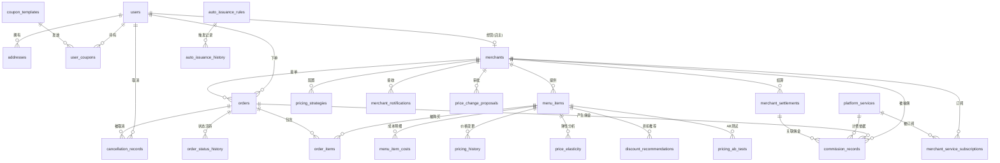

> **【待插入图片：图 6-1 FoodMate-AI 全局物理 ER 图】**
>
> 本图需使用 Navicat / draw.io / DBeaver 等专业数据库建模工具绘制，Mermaid 无法胜任。具体要求如下：
>
> - **内容**：将全部 27 个数据实体（24 张 PostgreSQL 主库表 + 2 张 AI 定价库表 + 1 个 MongoDB 集合）绘制在同一张高清物理 ER 图中
> - **布局**：按 6 个功能模块分区排列，建议使用不同底色区分模块：
>   - 蓝色区：用户与认证模块（users, addresses, cancellation_records）
>   - 橙色区：商家与菜单模块（merchants, menu_items, merchant_notifications, price_change_proposals）
>   - 黄色区：定价分析模块（pricing_strategies, menu_item_costs, pricing_history, price_elasticity, discount_recommendations, pricing_ab_tests）
>   - 绿色区：订单管理模块（orders, order_items, order_status_history）
>   - 紫色区：营销优惠模块（coupon_templates, user_coupons, auto_issuance_rules, auto_issuance_history）
>   - 红色区：平台运营与结算模块（platform_services, merchant_service_subscriptions, merchant_settlements, commission_records）
>   - 灰色区（独立）：AI 定价数据库（sales_history, pricing_proposals）
>   - 灰色区（独立）：MongoDB 用户画像（user_profiles）
> - **连线**：所有外键关系用 Crow's Foot（鸦脚）符号标注基数（1:1、1:N），逻辑外键用虚线表示
> - **字段**：每张表显示主键（PK）、外键（FK）和关键业务字段，不必列全部字段
> - **格式**：导出为高清 PNG（建议宽度 ≥ 2000px），确保打印后字段名清晰可读

### 6.7.2 用户与认证模块 ER 图

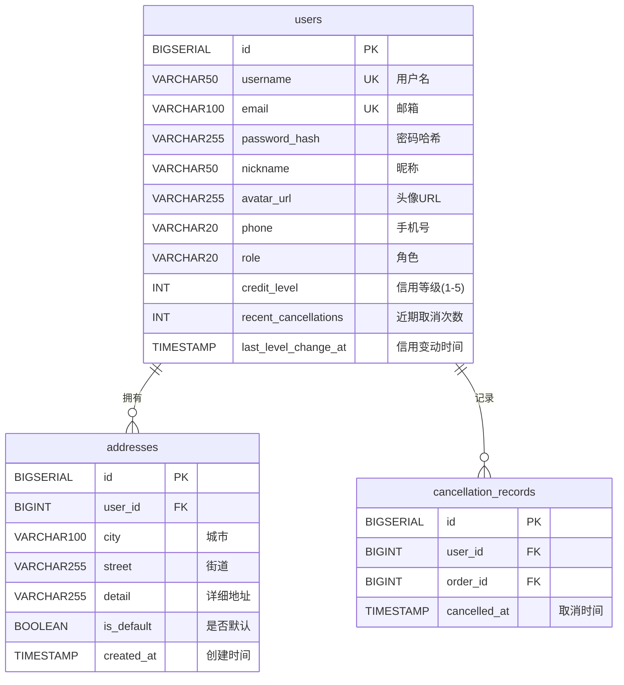

### 6.7.3 商家与菜单模块 ER 图

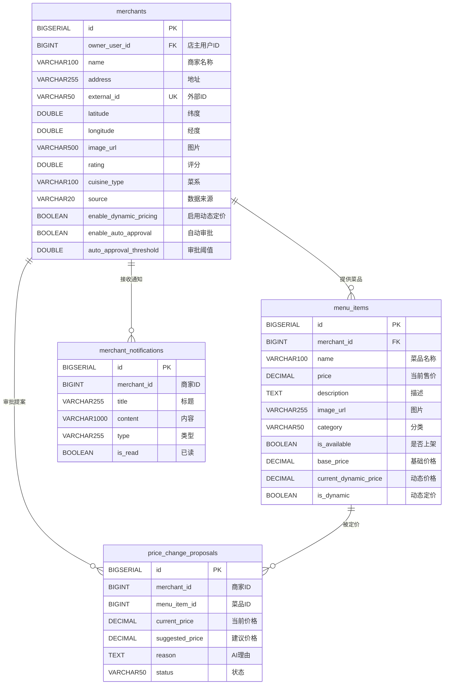

### 6.7.4 订单管理模块 ER 图

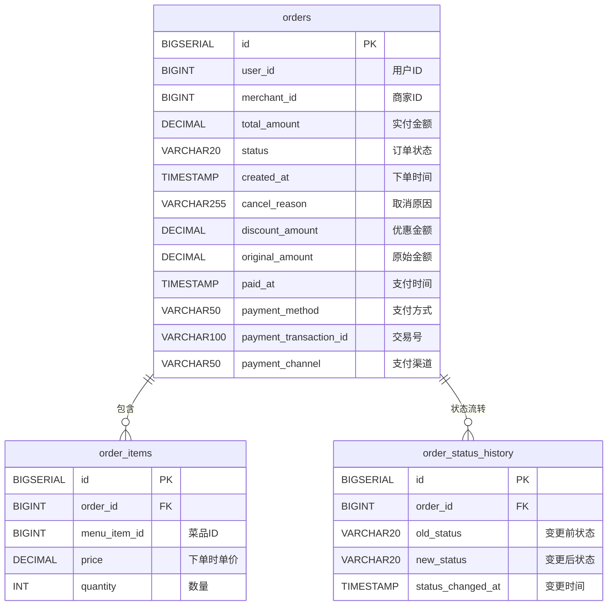

### 6.7.5 营销优惠模块 ER 图

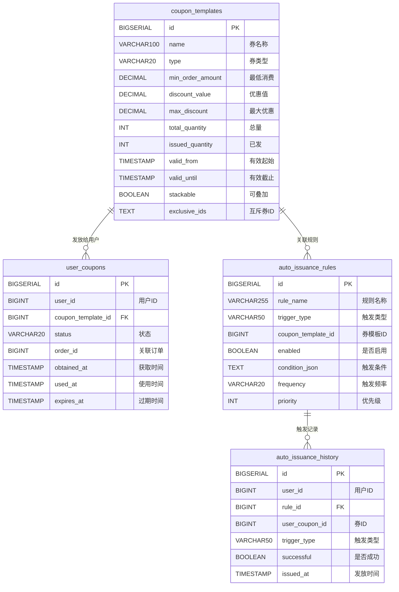

### 6.7.6 平台运营与结算模块 ER 图

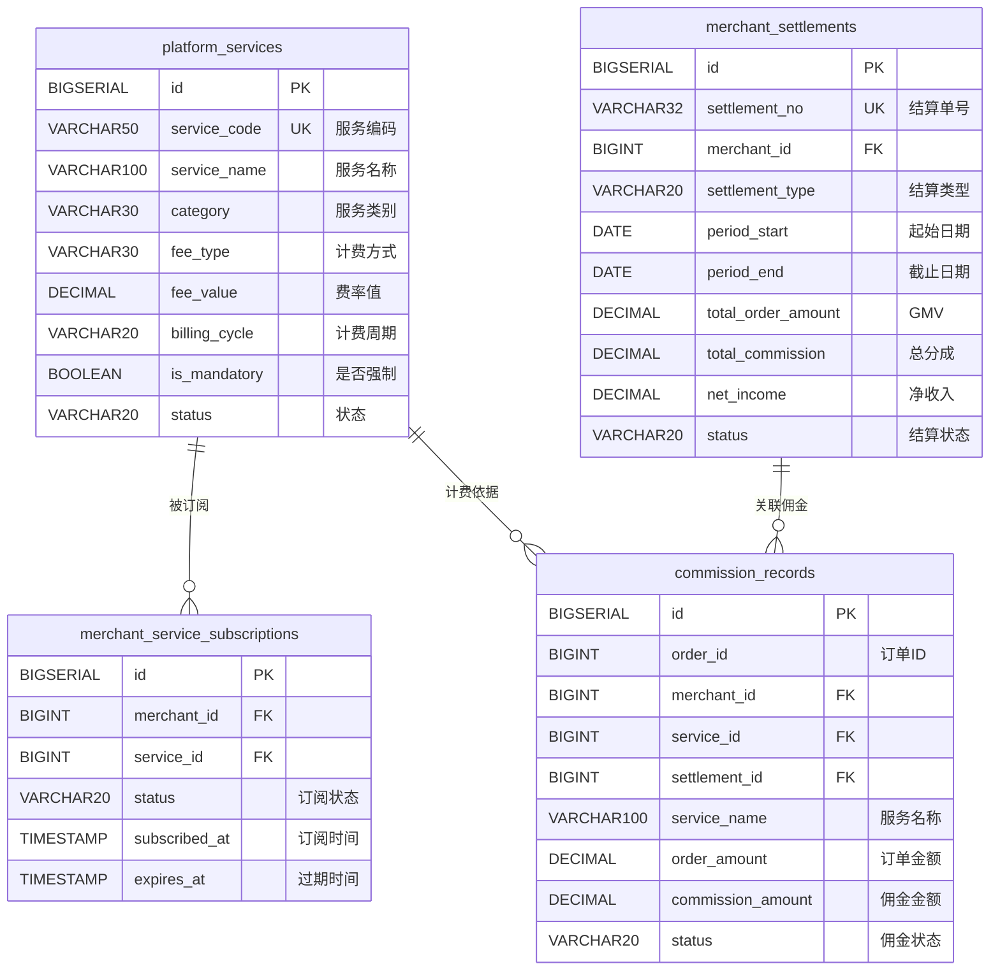

### 6.7.7 AI 定价数据库 ER 图

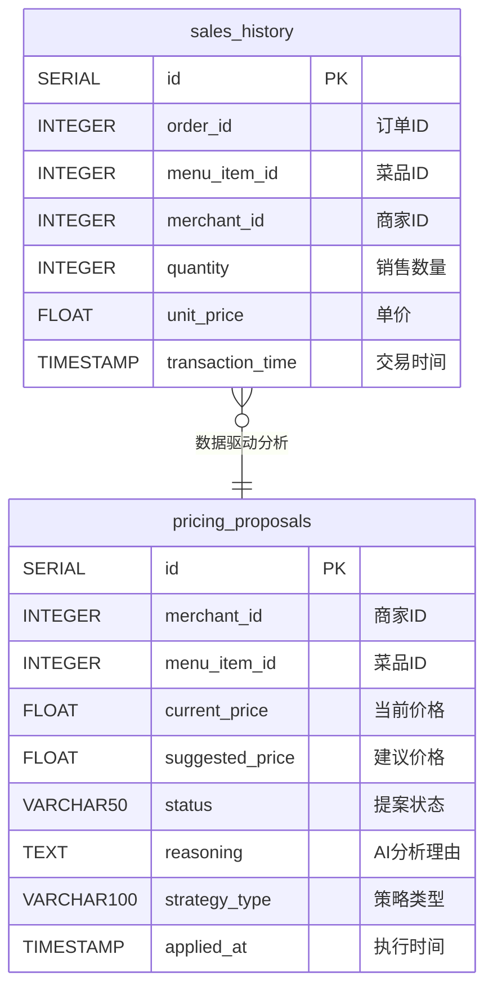

### 6.7.8 定价分析模块 ER 图

```mermaid
erDiagram
    pricing_strategies {
        BIGSERIAL id PK
        BIGINT merchant_id FK
        VARCHAR100 strategy_name "策略名称"
        VARCHAR50 strategy_type "策略类型"
        INT price_adjustment_percentage "调整百分比"
        DECIMAL min_price "最低价格"
        DECIMAL max_price "最高价格"
        BOOLEAN ai_enabled "AI参与"
        VARCHAR20 status "状态"
    }

    menu_item_costs {
        BIGSERIAL id PK
        BIGINT menu_item_id FK
        VARCHAR50 cost_category "成本类别"
        VARCHAR100 cost_name "成本名称"
        DECIMAL cost_amount "成本金额"
        VARCHAR20 unit "单位"
        DATE cost_date "成本日期"
        VARCHAR100 supplier "供应商"
    }

    pricing_history {
        BIGSERIAL id PK
        BIGINT menu_item_id FK
        BIGINT merchant_id FK
        DECIMAL old_price "变更前价格"
        DECIMAL new_price "变更后价格"
        VARCHAR100 change_reason "变更原因"
        TIMESTAMP changed_at "变更时间"
    }

    price_elasticity {
        BIGSERIAL id PK
        BIGINT menu_item_id FK
        BIGINT merchant_id FK
        DECIMAL elasticity_coefficient "弹性系数"
        DECIMAL confidence_score "置信度"
        DECIMAL optimal_price_min "最优价格下限"
        DECIMAL optimal_price_max "最优价格上限"
    }

    discount_recommendations {
        BIGSERIAL id PK
        BIGINT merchant_id FK
        BIGINT menu_item_id FK
        DECIMAL recommended_discount "建议折扣"
        DECIMAL recommended_price "建议价格"
        TEXT reason "推荐理由"
        VARCHAR20 status "状态"
    }

    pricing_ab_tests {
        BIGSERIAL id PK
        BIGINT merchant_id FK
        BIGINT menu_item_id FK
        VARCHAR100 test_name "测试名称"
        DECIMAL test_group_a_price "A组价格"
        DECIMAL test_group_b_price "B组价格"
        VARCHAR10 winner "胜出组"
        VARCHAR20 status "测试状态"
    }

    pricing_strategies }o--|| merchants : "所属商家"
    menu_item_costs }o--|| menu_items : "关联菜品"
    pricing_history }o--|| menu_items : "价格变更"
    price_elasticity }o--|| menu_items : "弹性分析"
    discount_recommendations }o--|| menu_items : "折扣推荐"
    pricing_ab_tests }o--|| menu_items : "AB测试"
```

---

## 6.8 数据库初始化脚本

全部 15 个 SQL 初始化脚本通过 PostgreSQL 的 `docker-entrypoint-initdb.d` 机制在 Docker 容器首次启动时自动按序号执行，实现了数据库的零人工干预自动化部署。

| 序号 | 脚本文件 | 用途 |
| :---: | :--- | :--- |
| 01 | `01_schema.sql` | 主库核心表结构创建（用户、商家、订单、定价分析等） |
| 02 | `02_seeds.sql` | 主库种子数据（测试用户、商家、菜单等） |
| 03 | `03_platform_service_schema.sql` | 平台服务模块表结构（4 张表） |
| 04 | `04_platform_service_seeds.sql` | 平台服务种子数据（基础服务定义等） |
| 05 | `05_add_payment_fields.sql` | 为 orders 表添加支付相关字段（增量迁移） |
| 06 | `06_add_external_id.sql` | 为 merchants 表添加外部 ID 等扩展字段（增量迁移） |
| 07 | `07_orders_merchant_id_to_string.sql` | 订单表 merchant_id 类型适配（兼容外部ID） |
| 08 | `08_generate_menu_items_for_imported_merchants.sql.skip` | 为导入商家生成菜单（默认跳过） |
| 10 | `10_create_ai_pricing_db.sql` | 创建 AI 定价独立数据库及 2 张表 |
| 11 | `11_init_ai_pricing_data.sql` | AI 定价模拟销售数据（30 天趋势） |
| 12 | `12_more_pricing_data.sql` | 补充定价模拟数据 |
| 13 | `13_add_merchant_auto_approval.sql` | 添加商家自动审批配置字段 |
| 14 | `14_more_pricing_data_v2.sql` | 定价数据 V2（更多场景覆盖） |
| 15 | `15_smart_issuance_tables.sql` | 智能发券规则与历史表 |

---

## 6.9 数据库统计汇总

| 数据库 | 表/集合数量 | 主要用途 |
| :--- | :---: | :--- |
| food_delivery_db（PostgreSQL） | 24 张表 | 用户认证、商家管理、订单处理、营销优惠、定价分析、平台结算 |
| ai_pricing_db（PostgreSQL） | 2 张表 | AI 销售数据采集、定价提案管理 |
| MongoDB | 1 个集合 | 用户画像与行为数据 |
| **合计** | **27 个数据实体** | 覆盖平台全部业务域 |

---

## 6.10 数据库设计特色与创新点

1. **多数据库异构架构**：根据数据特征选用最适合的存储引擎——PostgreSQL 处理结构化事务数据，MongoDB 处理灵活 Schema 的画像数据，Redis 提供毫秒级缓存——体现了"合适的工具做合适的事"的架构设计哲学。

2. **业务库与 AI 库物理隔离**：AI 定价分析可能涉及大量的历史数据扫描和聚合计算，物理隔离确保这些 I/O 密集型操作不会影响用户下单、支付等核心业务的响应速度。

3. **事件驱动的跨库数据同步**：通过 RabbitMQ 的 `order.paid` 事件实现主库订单数据向 AI 定价库的异步同步，避免了分布式事务的复杂性，同时保证了数据的最终一致性。

4. **冗余换性能的反范式设计**：佣金记录表中冗余存储服务名称和费率值，结算查询时无需联表，将 O(N) 的 JOIN 操作降为 O(1) 的直接读取。

5. **部分索引优化**：佣金记录表的 `idx_commission_unsettled` 使用 PostgreSQL 的部分索引（WHERE settlement_id IS NULL），仅对未结算记录建立索引，大幅缩小索引体积，提升结算查询效率。

6. **增量迁移脚本设计**：数据库结构演进通过有序编号的 SQL 脚本管理（01-15），支持容器化环境的自动执行，实现了数据库版本的可追溯和可复现。
