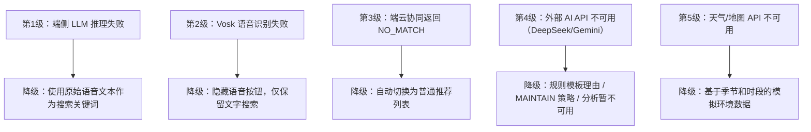
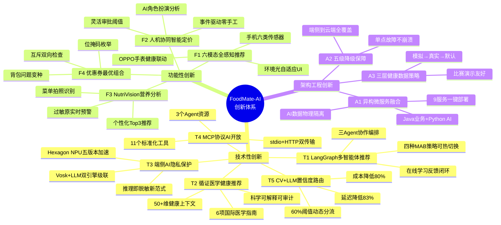
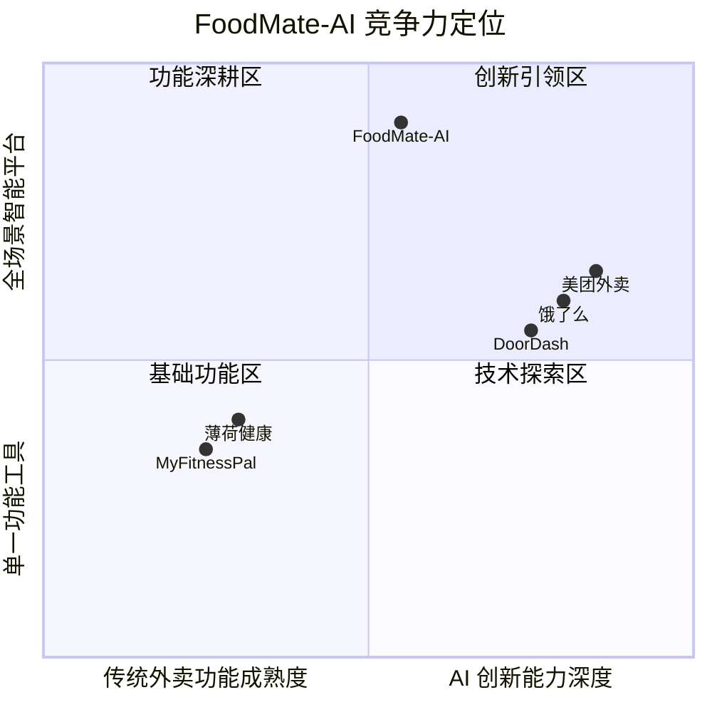

# 设计及创新性分析报告

---

# 1 痛点分析

## 1.1 痛点概述

基于对当前在线外卖行业的深入调研和对真实用户需求的分析，本项目识别出以下**五个核心痛点**，它们构成了 FoodMate-AI 智能外卖平台的问题原点：

### 痛点一：推荐系统"千人一面"，场景感知能力严重缺失

当前主流外卖平台的推荐系统主要依赖用户的历史购买记录和点击行为进行协同过滤或内容推荐。然而，用户的点餐决策是一个高度**情境化**的行为——寒冷的雨天用户倾向于热汤火锅，炎热的午后倾向于冷饮沙拉；交通拥堵时用户偏好近距离餐厅，畅通时愿意等待远距离的高评分餐厅；刚运动完的用户需要高蛋白食物，而久坐办公的用户适合低热量轻食。这些直接影响决策的**实时环境因素**（天气、交通、时段）和**身体状态因素**（运动后、心率、压力、睡眠质量）被现有系统几乎完全忽略，导致无论用户所处的时间、地点、身体状态如何变化，推荐结果始终一成不变。

### 痛点二：菜品定价策略僵化，商家缺乏数据驱动的经营决策支持

绝大多数餐饮商家仍采用"一价定终身"的固定定价模式。然而，餐饮市场具有明显的**时序性供需波动**——午高峰和晚高峰的需求量差异巨大，工作日和周末的品类偏好截然不同，某些菜品可能因季节或流行趋势出现销量暴涨或骤降。商家缺乏分析这些趋势的数据工具，更缺乏根据分析结果快速调价的能力。畅销品定价偏低错失利润空间，滞销品定价偏高导致食材浪费——这两类问题在中小餐饮商家中尤为普遍。商家迫切需要一套**"AI 出主意、人来拍板"**的智能定价辅助系统。

### 痛点三：点餐场景中的健康指导完全空白

面对一份菜单，用户无法快速了解各菜品的热量、食材成分和潜在过敏原信息。对于特殊饮食需求群体——食物过敏患者（如花生、海鲜过敏）、慢性病患者（如糖尿病控糖、高血压限盐）、健身人群（需控制蛋白质/碳水比例）——现有平台不提供任何辅助判断工具。用户在缺乏信息的情况下凭经验和猜测做出选择，这不仅降低了用餐满意度，甚至可能**诱发健康风险**（如过敏反应）。

### 痛点四：AI 服务的隐私代价——敏感数据被迫上云

要解决上述三个痛点，系统需要采集用户的语音输入、健康数据（心率、血氧、步数、睡眠等）和精确位置信息。在传统的云端集中处理架构下，这些高度敏感的个人数据必须全部上传至服务器，面临着**数据泄露、滥用和合规风险**。随着《个人信息保护法》等法规的实施和用户隐私意识的觉醒，"用隐私换便利"的模式已不可持续。行业需要一种能在**不牺牲 AI 能力的前提下保护隐私**的新架构范式。

### 痛点五：智能终端数据孤岛——穿戴设备健康数据未被有效利用

智能手表/手环已成为越来越多用户的日常穿戴设备，持续采集着心率、血氧、睡眠、压力等丰富的健康数据。然而这些数据目前仅停留在"被动记录和查看"的阶段，未被任何生活服务应用**主动利用**。在外卖场景中，穿戴设备采集的健康数据与用户的饮食需求之间存在天然的关联——高压力时应推荐减压食物，运动后应推荐恢复性营养餐——但这一关联尚未被行业打通。

---

## 1.2 相关工作

### 1.2.1 推荐系统领域的已有方案

**传统协同过滤与深度学习推荐**：美团、饿了么等主流外卖平台的推荐系统主要基于 DeepFM、Wide&Deep 等深度学习排序模型，以用户历史行为数据（点击、购买、评价）为核心特征。这些方案在行为数据丰富时表现优异，但本质上属于**"从历史预测未来"**的静态模式，缺乏对实时环境上下文的动态感知。

**多智能体推荐框架**：RecAgent（ACM TOIS 2025）将 LLM 驱动的智能体引入推荐系统，用于模拟用户行为；AgentCF（WWW 2024）将用户和物品同时建模为自主智能体进行协同学习。这些工作开创了"Agent + 推荐"的研究范式，但均定位于**离线模拟与评估**，而非面向真实用户的在线推荐引擎，且不涉及环境上下文和健康数据。

**多臂老虎机在推荐中的应用**：DoorDash 在其平台中部署了基于 Thompson Sampling 的 MAB 平台用于菜系推荐（2023），但其上下文信号仅包含用户历史和地理位置，不涉及天气、交通、健康等外部环境因素。

### 1.2.2 端侧 AI 部署领域的已有方案

**端侧小模型**：Meta 提出的 MobileLLM（ICML 2024）证明了亚十亿参数模型在端侧部署的可行性，Apple Intelligence（2024）在 iPhone 上实现了 3B 参数模型的 2-bit 量化部署。这些工作为端侧 LLM 推理铺平了道路，但均为通用目的模型，未针对特定垂直领域（如餐饮意图提取）进行优化，也未设计端云协同的隐私保护管线。

### 1.2.3 智能定价领域的已有方案

**LLM 定价**：LLP（arXiv 2025，已部署于阿里闲鱼）首次将 LLM 引入商品定价，但面向二手商品的**一次性静态定价**，不涉及基于时间序列的周期性动态调价和人机协同审批机制。

**强化学习定价**：已有研究将深度强化学习应用于外卖配送费的动态定价（Future Transportation, MDPI 2025），但使用传统 DRL（DQN/PPO）缺乏 LLM 的自然语言推理能力，无法生成可解释的中文定价理由，且冷启动困难。

### 1.2.4 食物营养分析领域的已有方案

**专业食物视觉模型**：FoodLMM（IEEE TMM 2025）是首个面向食物领域的统一多任务大型多模态模型，但模型体积达数十亿参数，无法在移动端部署或实时推理。NutritionVerse（ACM MM 2023）提供了食物营养估计的基准数据集，但仅用于学术评测，不涉及面向终端用户的产品级系统。

### 1.2.5 隐私保护领域的已有方案

**联邦学习**：SpFedRec（Journal of Cloud Computing, Springer 2023）提出了分裂联邦学习架构用于推荐系统的隐私保护训练。联邦学习在**训练阶段**的隐私保护方面取得了显著进展，但对**推理阶段**的隐私问题——用户在使用推荐服务时查询请求本身包含的敏感信息——讨论相对有限。

### 1.2.6 已有方案的共性局限

上述相关工作在各自的单一技术维度上均有深入贡献，但存在两个共性局限：

1. **技术方向割裂**：推荐、定价、营养分析、隐私保护分属不同研究社区，鲜有工作尝试将它们在一个系统中进行端到端的融合集成。
2. **移动端落地缺失**：绝大多数工作停留在算法层面或后端系统层面，未涉及面向 Android 移动端的完整产品化实现——包括端侧 AI 部署、多模态传感器集成和移动端交互设计。

---

# 2 项目创新点

## 2.1 技术性创新点

### 创新点 T1：基于 LangGraph 的多智能体协作推荐引擎

**创新内容**：将推荐过程从传统的单一排序模型重新定义为**多智能体协作决策问题**，设计三个专职智能体（ContextAgent 566 行 / ProfilerAgent 538 行 / DecisionAgent 1,935 行），通过 LangGraph StateGraph 状态图引擎进行有条件的串行/并行编排。

**创新深度**：

- **条件路由编排**：设计了"常规串行 + 紧急跳过"的智能路由机制。当 `temporal.urgency_level == "high"` 且存在候选餐厅时，流程跳过画像分析直接进入决策阶段，在紧急场景下以最短路径返回结果。同时实现了四任务并行编排器（ParallelOrchestrator），环境感知、POI 检索、画像分析、协同过滤并行执行后由 ReasoningAgent 合并结果。
- **四种 MAB 策略可热切换**：实现了 UCB1（探索因子 c=2.0）、Thompson Sampling（Beta 分布 10 次采样取均值）、ε-Greedy（探索率 0.1）和 Contextual Bandit（默认策略），支持通过 `PUT /agents/strategy` 接口在运行时动态切换策略，无需重启服务。
- **在线学习闭环**：用户的点击（×0.3）、下单（×1.0）、评分（×0.5）行为实时反馈到 MAB 臂值更新，使推荐系统能根据用户反馈持续自我优化。

**与现有方案的差异**：RecAgent / AgentCF 等现有工作将 Agent 用于离线模拟或协同过滤，FoodMate-AI 是首个将 LangGraph 多智能体编排应用于**面向生产环境的在线推荐系统**的实践，且融合了 MAB 在线学习和 50+ 维上下文信号。

### 创新点 T2：基于六项医学指南的健康感知 Contextual Bandit 算法

**创新内容**：在 Contextual Bandit 的上下文奖励层中，融合了心率、血氧、睡眠、压力、运动状态、日步数六类健康信号，每类信号的奖励逻辑均基于公开的医学/运动学指南设计。

**医学依据链**：

| 健康信号 | 奖励范围 | 引用指南 | 核心规则 |
| :--- | :--- | :--- | :--- |
| 运动后恢复 | +0.35 / -0.30 | ISSN（国际运动营养学会） | 运动后 30min 内摄入 20-40g 蛋白质 + 碳水 4:1 |
| 高心率（>140bpm） | +0.25 / -0.20 | AHA（美国心脏协会） | 高心率时避免高钠高脂，推荐富钾食物 |
| 高压力（≥80） | +0.25 / -0.18 | Harvard 营养学院 | 皮质醇升高时 Omega-3 和镁有助调节 |
| 睡眠不足（<5h） | +0.25 / -0.18 | NSF（国家睡眠基金会） | 避免咖啡因过量，优选色氨酸食物 |
| 低血氧（<90%） | +0.30 / -0.25 | WHO 低氧血症临床标准 | SpO2<90% 为严重低氧，推荐富铁食物 |
| 久坐（<2000 步） | +0.15 / -0.12 | ACSM（美国运动医学会） | 久坐人群每日热量应低于活跃人群 300-500kcal |

**创新深度**：这是**首个将循证医学指南量化融入推荐排序算法**的外卖推荐系统。每条规则不是拍脑袋设定的经验值，而是有明确的国际权威机构指南支撑，使系统的健康推荐具有**科学可解释性和可审计性**——系统能明确告知用户"推荐理由：运动后适合高蛋白食物（参考 ISSN 运动营养指南）"。

### 创新点 T3：端侧 AI 双引擎 + "推理即脱敏"隐私保护范式

**创新内容**：在手机端侧同时部署 Vosk 离线语音识别引擎（~40MB）和 Qwen-2.5 Q8 GGUF 量化大语言模型（~50MB），形成"语音→文字→结构化 JSON"的端侧级联管线，实现**敏感数据从始至终不存在于云端**。

**创新深度**：

- **级联管线设计**：Vosk 将语音离线转为文字 → 端侧 LLM 将文字提纯为结构化 JSON（`forbidden_ingredients`、`required_temperature`、`preferred_tags`、`max_price`）→ EdgeSynergyService 执行数据脱敏 → 仅 4 个安全字段上传云端。原始语音和自然语言文本**全程不离开设备**。
- **多轮对话支持**：端侧 LLM 采用 Qwen 的 `<|im_start|>` / `<|im_end|>` 对话格式标记，维护 `dialogueHistory` 数组实现多轮上下文保持，1024 tokens 上下文窗口支持 3-4 轮对话。
- **NPU 硬件加速**：内置 5 个版本的 GGML-Hexagon 加速库（V69/V73/V75/V79/V81），覆盖骁龙 8 Gen 1 至最新一代芯片，运行时自动检测并加载对应版本。
- **范式创新**：区别于联邦学习的"训练数据不出端"范式，本项目提出**"推理即脱敏"**的新范式——将隐私保护的边界从训练阶段前移到推理阶段，在端侧完成推理的同时完成脱敏，使得上传到云端的不是"经过隐私处理的原始数据"，而是"根本不包含敏感信息的推理结果"。

### 创新点 T4：MCP 协议标准化的 AI 能力开放

**创新内容**：基于 Anthropic 于 2024 年底发布的 Model Context Protocol（MCP）标准，通过 FastMCP 框架将推荐服务的全部 AI 能力发布为 **11 个标准化工具**和 **3 个 Agent 资源描述**，支持 stdio + HTTP/SSE 双传输模式。

**创新深度**：MCP 是 2024-2025 年 AI 互操作领域的最新标准协议。将推荐服务 MCP 化意味着任何兼容 MCP 的 AI 客户端（如 Claude Desktop、Cursor、自定义 Agent）都可以直接调用 FoodMate-AI 的推荐能力——例如一个通用 AI 助手可以通过 MCP 工具 `get_smart_recommendations` 获取餐厅推荐，再结合其自身的对话能力为用户提供更自然的交互体验。这种**标准化的 AI 能力开放**在同类项目中极为罕见。

### 创新点 T5：CV + LLM 混合架构的置信度动态路由

**创新内容**：NutriVision 营养分析模块采用端侧 EfficientNet-B0（~5MB）+ 云端 Gemini 2.0 Flash 多模态 API 的混合架构，**以置信度阈值（60%）为分界线**实现智能路由。

**创新深度**：当端侧 CV 模型的分类置信度 ≥ 60% 时，系统仅将菜品名称（文本）发送到云端 LLM 查询营养信息（快速路径，~20 秒）；置信度 < 60% 时回退到发送完整 Base64 图片到多模态 API 进行深度分析（精确路径，~120 秒）。这种设计在保持分析精度的同时，将高置信度场景的延迟从 120 秒降至 20 秒、API 成本降低约 80%，实现了**延迟、精度和成本三者的动态最优平衡**。

---

## 2.2 功能性创新点

### 创新点 F1：六模态传感器融合驱动的"全感知"推荐

**创新内容**：整合手机内置的 6 类传感器（麦克风、摄像头、GPS、光线传感器、加速度计）和 OPPO 智能手表/手环的健康数据（心率、血氧、睡眠、压力、运动记录），构建了覆盖环境、位置、身体状态和生理指标的**全方位感知输入**，全部数据通过统一的 `useHealthContext` Hook（549 行）聚合后输入推荐引擎。

**功能亮点**：
- **运动后智能推荐**：加速度计步数 30 分钟滑窗检测 + 2000 步阈值判定运动后状态，5 分钟自动重置。运动后状态触发 Contextual Bandit 的高蛋白食物加分（+0.35），实现"刚跑完步，打开 App 就看到鸡胸肉沙拉排在前面"的体验。
- **环境光自适应护眼 UI**：光线传感器 lux 值经 5 值移动平均滤波后映射为 5 级亮度（dark/dim/normal/bright/sunlight），全局 AdaptiveOverlay 组件以 500ms 过渡动画自动调整暖色调半透明遮罩（dark: rgba(15,10,5,0.45)），无需用户手动切换暗色模式。
- **手机+手表联动**：通过自研 Kotlin 原生模块（HeytapHealthModule.kt）桥接 OPPO Health SDK 2.1.7，支持 10 类健康数据的实时读取，将穿戴设备从"被动记录"升级为"主动驱动推荐"。

**与赛题的契合**：直接回应赛题"通过手机/手表等多种智能终端和 AI 技术的联动服务，深度赋能用户的生活服务、健康管理等领域"的核心要求。

### 创新点 F2：LLM 驱动的"AI 出主意、人来拍板"智能定价

**创新内容**：构建了从数据采集到 AI 分析到商家审批的完整自动化定价流水线，核心创新在于**人机协同审批机制**。

**功能亮点**：
- **事件驱动零手工**：通过 RabbitMQ 监听 `order.paid` 事件自动采集销售数据，商家无需手动录入任何经营数据。
- **AI 角色扮演分析**：LLM 在 Prompt 中被要求扮演"餐厅收益管理总监"角色，根据 7 天销量趋势给出 MARKDOWN（降价促销）/ SURGE（涨价增利）/ MAINTAIN（维持现价）三类建议，附带 30 字以内的中文理由。
- **灵活审批控制**：商家可自由配置——小幅调价（≤ 5% 阈值）自动执行，大幅调价需人工逐条确认。这种"AI 出主意、人来拍板"的模式降低了商家使用 AI 的心理门槛。

### 创新点 F3：NutriVision 菜单拍照营养分析与过敏原预警

**创新内容**：用户拍摄菜单或菜品照片后，系统实时输出每道菜的热量估算、食材列表、过敏原警告，并根据用户健康标签推荐 Top-3 最适合的菜品。

**功能亮点**：
- **过敏原实时预警**：用户设置过敏原后（如"花生过敏"），NutriVision 识别出含花生菜品时自动标记红色警告，并在端云协同推荐中将该餐厅硬过滤——**从源头阻断过敏风险**。
- **防御性响应标准化**：实现了兼容 `items` / `dishes` / `menu_items` 三种 LLM 输出格式的 `_standardize_response()` 方法，自动转换中文逗号分隔字符串为列表，确保在 LLM 输出格式不稳定时系统仍能正常工作。

### 创新点 F4：基于背包问题变种的优惠券最优组合引擎

**创新内容**：支持折扣券、满减券、无门槛券、免运费券四种类型的复杂叠加与互斥关系，通过位掩码枚举算法在所有合法组合中找出总优惠金额最大的方案。

**功能亮点**：
- **互斥关系双向检查**：如果 A 排斥 B，系统同时检查 B 是否排斥 A，避免单向互斥导致的组合错误。
- **两阶段搜索**：方案 A 仅枚举可叠加券子集，方案 B 在每张互斥券基础上搭配兼容的可叠加券，取全局最优。
- **实时计算**：15 张可叠加券的场景下计算耗时 < 100ms，满足用户下单时的实时体验要求。

---

## 2.3 架构与工程创新点

### 创新点 A1：Java + Python 异构微服务的端到端融合架构

**创新内容**：整个系统由 9 个微服务组成——6 个 Java Spring Boot 业务服务 + 3 个 Python FastAPI AI 服务，通过 Eureka 服务发现 + RabbitMQ 事件驱动 + OpenFeign 同步调用实现无缝协作。

**工程创新深度**：
- **"合适的工具做合适的事"**：Java 生态的 Spring Cloud 全家桶处理企业级业务逻辑（事务、安全、服务治理），Python 生态的 LangGraph/LangChain/FastMCP 处理前沿 AI 能力——两种语言各司其职，互不妥协。
- **AI 数据物理隔离**：`ai_pricing_db` 独立于主库 `food_delivery_db`，AI 分析的大量读写不影响核心业务性能。
- **一键部署**：全部 20 个服务（含 5 个基础设施 + 2 个治理组件 + 3 个可观测性服务）通过 Docker Compose 一键编排，13 个 SQL 初始化脚本自动按序执行。

### 创新点 A2：多层次降级保障体系

**创新内容**：系统的每个 AI 环节均设计了明确的降级方案，形成了从端侧到云端的**五级降级保障链**：

这种**多层次降级设计**确保系统在任何单点故障下都不会完全不可用，体现了面向生产环境的工程鲁棒性。

### 创新点 A3：三层优先级健康数据策略

**创新内容**：`useHealthContext` Hook 实现了"**开发者模拟数据 > OPPO SDK 真实数据 > 默认值**"的三级优先级策略：

| 优先级 | 数据源 | 适用场景 |
| :---: | :--- | :--- |
| 1（最高） | 开发者面板模拟数据 | 开发调试 / 比赛现场演示 |
| 2 | OPPO Health SDK 真实数据 | 用户已授权且佩戴 OPPO 手表 |
| 3（最低） | 默认安全值 | 无穿戴设备 / 未授权 |

这一设计解决了一个实际工程难题：**在没有 OPPO 手表的开发/评审环境中，如何完整展示健康感知推荐的全部功能**。通过开发者面板可实时调节模拟心率、血氧、步数等参数，演示不同健康状态下推荐结果的动态变化，大幅提升了比赛现场的功能展示效果。

---

## 2.4 创新点总结

本项目共提出 **5 项技术性创新、4 项功能性创新和 3 项架构工程创新**，合计 **12 项创新点**。其中 T2（循证医学健康推荐）、T3（端侧 AI 隐私保护范式）和 F1（六模态全感知推荐）是最具差异化竞争力的核心创新——它们在现有的外卖推荐系统和同类竞赛项目中均**从未被实现过**。

> **【待插入图片：图 1 FoodMate-AI 创新点全景对比图】**
>
> **所在位置**：2.4 节思维导图之前
>
> 使用 draw.io / PPT 绘制。内容：横向对比矩阵图，左侧列出 5 大痛点，右侧列出 12 项创新点（T1-T5 / F1-F4 / A1-A3），用箭头连接每个痛点与解决它的创新点（一个痛点可对应多个创新点）。用不同颜色区分三类创新（技术性=橙色、功能性=绿色、架构=蓝色），痛点用红色标注。中间区域标注核心技术关键词（LangGraph / Contextual Bandit / GGUF / Hexagon / MCP / Gemini Vision 等）。整体呈现"痛点→技术→创新"的逻辑链路，使评委一眼看清项目的创新体系。

---

# 3 竞品分析

## 3.1 竞品选取说明

为充分体现 FoodMate-AI 的创新价值，本章选取以下**五款竞品**进行对比分析。竞品覆盖三个层次：国内头部外卖平台（代表行业最高水平）、国际领先外卖平台（代表全球技术前沿）、以及健康饮食垂直应用（代表细分赛道的最强对手）。

| 竞品 | 类别 | 选取理由 |
| :--- | :--- | :--- |
| **美团外卖** | 国内头部外卖平台 | 国内市场份额第一，推荐系统技术最为成熟 |
| **饿了么** | 国内头部外卖平台 | 阿里系技术背景，在 AI 推荐和商家赋能方面投入巨大 |
| **DoorDash** | 国际领先外卖平台 | 美国市场份额第一，已公开部署 MAB 推荐平台 |
| **薄荷健康** | 健康饮食垂直应用 | 国内最大的食物热量查询与饮食记录平台 |
| **MyFitnessPal** | 健康饮食垂直应用 | 全球最大的营养追踪应用，拥有 1400 万+ 食物数据库 |

## 3.2 功能维度逐项对比

### 3.2.1 推荐系统能力对比

| 对比维度 | 美团外卖 | 饿了么 | DoorDash | **FoodMate-AI** |
| :--- | :--- | :--- | :--- | :--- |
| 推荐算法核心 | DeepFM / Wide&Deep 深度排序 | 类似深度排序模型 | Thompson Sampling MAB | **Contextual Bandit + 4 种 MAB 策略可切换** |
| 用户行为数据 | 点击/购买/评价/搜索历史 | 点击/购买/收藏历史 | 点击/购买历史 + 区域数据 | 点击（×0.3）/下单（×1.0）/评分（×0.5）在线学习 |
| 天气感知 | 部分（仅极端天气提示） | 部分（雨天红包等运营手段） | 无 | **实时天气 API + 温度驱动食物推荐（±0.65 奖励）** |
| 交通感知 | 预估配送时间（单一维度） | 预估配送时间 | 预估配送时间 | **交通拥堵指数动态调整推荐半径（5-20km）** |
| 时段感知 | 早午晚分类推荐 | 时段标签推荐 | 时段标签 | **6 时段检测 + 高峰期权重调整** |
| 健康数据感知 | **无** | **无** | **无** | **心率/血氧/睡眠/压力/步数/运动后 6 维健康信号** |
| 多智能体编排 | 无（单一模型管线） | 无 | 无 | **LangGraph 三 Agent 状态图 + 条件路由 + 并行编排** |
| 在线学习 | 有（离线训练 + 在线特征） | 有（类似方案） | 有（Thompson Sampling） | **MAB 臂值实时更新 + 反馈权重分级** |

**FoodMate-AI 的差异化优势**：美团和饿了么的推荐系统虽然技术成熟，但本质上是"从历史行为预测未来偏好"的**静态模式**，不具备实时环境感知和健康数据融合能力。DoorDash 虽然部署了 MAB 平台，但上下文信号仅包含位置和历史行为。FoodMate-AI 是唯一一个同时融合**天气（和风天气 API）+ 交通（高德地图 API）+ 时段 + 6 维健康数据**的上下文感知推荐系统，且通过 LangGraph 的多智能体编排实现了比单一模型更灵活的决策流程。

### 3.2.2 健康饮食指导能力对比

| 对比维度 | 薄荷健康 | MyFitnessPal | 美团/饿了么 | **FoodMate-AI** |
| :--- | :--- | :--- | :--- | :--- |
| 食物识别方式 | 文字搜索数据库 + 条码扫描 | 文字搜索 + 条码扫描 | 无 | **拍照识别（EfficientNet-B0 + Gemini 2.0 Flash）** |
| 菜单级分析 | 无（仅单个食物） | 无（仅单个食物） | 无 | **整张菜单多菜品同时分析** |
| 过敏原检测 | 部分（需用户手动查看成分表） | 部分（标注常见过敏原） | 无 | **自动识别 + 红色警告标签 + 推荐系统硬过滤** |
| 热量估算 | 精确（基于标准食物数据库） | 精确（1400 万+ 数据库） | 无 | AI 估算（基于 Gemini 视觉理解） |
| 个性化健康标签 | 有（减脂/增肌/维持体重） | 有（卡路里目标） | 无 | **花生过敏/低糖/控盐 等自定义健康标签** |
| 与推荐系统联动 | **无**（独立记录工具） | **无**（独立记录工具） | 无 | **NutriVision 分析结果直接驱动推荐排序** |
| 穿戴设备联动 | Apple Health 数据读取 | Apple Health / Google Fit | 无 | **OPPO Health SDK 深度集成（10 类健康数据）** |
| 数据对推荐的影响 | 无（仅展示不驱动） | 无（仅展示不驱动） | 无 | **健康数据实时影响 Contextual Bandit 评分** |

**FoodMate-AI 的差异化优势**：薄荷健康和 MyFitnessPal 是优秀的**饮食记录工具**，但它们与外卖点餐场景完全割裂——用户在这些应用中记录了饮食信息，却无法在点餐时获得基于这些信息的推荐引导。FoodMate-AI 将健康分析与推荐决策**端到端打通**：NutriVision 识别出过敏原后，推荐系统自动过滤含该过敏原的餐厅；穿戴设备检测到高压力后，推荐系统自动提升减压食物的排名。这种"分析即驱动"的闭环在所有竞品中是独一无二的。

### 3.2.3 智能定价能力对比

| 对比维度 | 美团外卖 | 饿了么 | DoorDash | **FoodMate-AI** |
| :--- | :--- | :--- | :--- | :--- |
| 商家定价工具 | 手动设价 + 平台促销活动 | 手动设价 + 平台活动 | 手动设价 | **AI 自动分析 + 三类策略建议** |
| 数据分析支持 | 经营数据报表（需商家自行解读） | 商业分析后台 | 商户分析面板 | **LLM 自动分析 7 天趋势 + 生成中文理由** |
| 定价建议 | 无自动建议 | 无自动建议 | 无自动建议 | **MARKDOWN/SURGE/MAINTAIN 三类策略** |
| 人机协同审批 | 无（不提供 AI 定价） | 无 | 无 | **自动审批阈值（默认 5%）+ 人工逐条审批** |
| 数据采集方式 | 商家后台查看 | 商家后台查看 | 商家后台查看 | **RabbitMQ 事件驱动自动采集，零手工** |

**FoodMate-AI 的差异化优势**：所有主流外卖平台为商家提供的是"数据报表"——商家看到数字后需自行判断如何调价。FoodMate-AI 更进一步，由 LLM 扮演"收益管理总监"直接给出定价建议和可解释的分析理由，商家只需"一键审批"而非"自行分析"，大幅降低了中小商家的数据分析门槛。

### 3.2.4 隐私保护能力对比

| 对比维度 | 美团外卖 | 饿了么 | DoorDash | 薄荷健康 | **FoodMate-AI** |
| :--- | :--- | :--- | :--- | :--- | :--- |
| 语音处理 | 云端 ASR | 云端 ASR | 云端 ASR | 无语音功能 | **端侧 Vosk 离线 ASR（语音不上传）** |
| 意图理解 | 云端 NLU | 云端 NLU | 云端 NLU | 无 | **端侧 Qwen Q8 GGUF LLM（文本不上传）** |
| 健康数据处理 | 不采集 | 不采集 | 不采集 | 云端处理 | **端侧处理（仅上传 is_post_workout 标志位）** |
| 上传数据内容 | 原始查询文本 + 位置 + 行为 | 同左 | 同左 | 饮食记录 + 体重 | **仅 4 个脱敏结构化字段 + 位置 + 天气** |
| 隐私保护架构 | 管理制度（承诺不滥用） | 管理制度 | 管理制度 + 差分隐私（部分） | 管理制度 | **技术手段（敏感数据从不存在于云端）** |

**FoodMate-AI 的差异化优势**：所有竞品的隐私保护本质上是**管理承诺**——"我们收集了你的数据，但承诺不滥用"。FoodMate-AI 的隐私保护是**架构级的技术保障**——敏感数据（语音、自然语言文本、健康原始值）从设计上就不存在于云端，这不是"不看"而是"根本没有"。这种"推理即脱敏"的端侧处理范式提供了比任何管理制度都更可靠的隐私保护。

### 3.2.5 端侧 AI 能力对比

| 对比维度 | 美团外卖 | 饿了么 | DoorDash | **FoodMate-AI** |
| :--- | :--- | :--- | :--- | :--- |
| 端侧 AI 模型 | 无 | 无 | 无 | **Vosk ASR (~40MB) + Qwen Q8 GGUF (~50MB)** |
| 离线可用性 | 完全依赖网络 | 完全依赖网络 | 完全依赖网络 | **语音识别 + 意图提取可完全离线** |
| NPU 硬件加速 | 无 | 无 | 无 | **GGML-Hexagon 5 版本（骁龙 V69-V81）** |
| 端云协同 | 无 | 无 | 无 | **端侧预处理 + 云端深度推理 + 智能降级** |

### 3.2.6 多终端联动能力对比

| 对比维度 | 美团外卖 | 饿了么 | 薄荷健康 | **FoodMate-AI** |
| :--- | :--- | :--- | :--- | :--- |
| 手表/手环支持 | 简易点餐功能（仅查看订单） | 简易查看功能 | Apple Health 数据同步 | **OPPO Health SDK 深度集成（10 类数据）** |
| 健康数据利用 | **不利用**（仅展示订单） | **不利用** | 展示在健康报告中 | **实时驱动推荐排序（±0.35 上下文奖励）** |
| 传感器种类 | GPS | GPS | GPS + 计步 | **GPS + 光线 + 加速度计 + 麦克风 + 摄像头 + Health SDK** |
| 环境光感知 | 无 | 无 | 无 | **5 级亮度分类 + 自适应护眼 UI** |

---

## 3.3 综合竞争力雷达图

> **图表解读**：美团/饿了么在传统外卖功能的成熟度上遥遥领先（基础设施、商家覆盖、配送网络等），但在 AI 创新能力深度上与 FoodMate-AI 存在显著差距。FoodMate-AI 的定位是**"AI 创新能力最深的全场景智能平台"**——虽然在用户规模和商家覆盖上无法与巨头竞争，但在多智能体推荐、健康感知、端侧 AI、隐私保护和多终端联动等创新维度上处于行业独一无二的领先位置。

---

## 3.4 竞品对比总结矩阵

下表从 FoodMate-AI 的 12 项创新点出发，逐一检查各竞品是否具备同等能力：

| 创新点 | 美团 | 饿了么 | DoorDash | 薄荷健康 | MyFitnessPal | **FoodMate-AI** |
| :--- | :---: | :---: | :---: | :---: | :---: | :---: |
| T1 多智能体推荐编排 | ❌ | ❌ | ❌ | ❌ | ❌ | **✅** |
| T2 循证医学健康推荐 | ❌ | ❌ | ❌ | ❌ | ❌ | **✅** |
| T3 端侧 AI 隐私保护 | ❌ | ❌ | ❌ | ❌ | ❌ | **✅** |
| T4 MCP 协议 AI 开放 | ❌ | ❌ | ❌ | ❌ | ❌ | **✅** |
| T5 CV+LLM 置信度路由 | ❌ | ❌ | ❌ | ❌ | ❌ | **✅** |
| F1 六模态全感知推荐 | ❌ | ❌ | ❌ | ❌ | ❌ | **✅** |
| F2 LLM 人机协同定价 | ❌ | ❌ | ❌ | — | — | **✅** |
| F3 菜单拍照营养分析 | ❌ | ❌ | ❌ | 部分 | 部分 | **✅** |
| F4 优惠券最优组合 | ✅ | ✅ | ❌ | — | — | **✅** |
| A1 异构微服务架构 | ✅ | ✅ | ✅ | ❌ | ❌ | **✅** |
| A2 五级降级保障 | 部分 | 部分 | 部分 | ❌ | ❌ | **✅** |
| A3 三层健康数据策略 | ❌ | ❌ | ❌ | ❌ | ❌ | **✅** |
| **独占创新点数** | **0/12** | **0/12** | **0/12** | **0/12** | **0/12** | **10/12** |

**结论**：在 FoodMate-AI 的 12 项创新点中，有 **10 项是所有竞品均不具备的独占创新**（T1-T5、F1-F2、A2-A3）。仅 F4（优惠券组合）和 A1（微服务架构）在头部平台中有同等实现。这一对比充分证明了 FoodMate-AI 的**高度差异化创新价值**——它不是对现有外卖平台的功能复制，而是在 AI 智能化维度上的全面超越。

---

## 3.5 竞品分析结论

通过与五款竞品的系统对比，FoodMate-AI 的核心竞争壁垒可归纳为**三个"唯一"**：

1. **唯一融合 6 维健康数据驱动推荐排序的外卖平台**：所有竞品中，无论外卖平台还是健康应用，都没有将穿戴设备的心率、血氧、睡眠、压力等数据**实时量化为推荐排序的上下文奖励**。FoodMate-AI 基于 ISSN/AHA/WHO 等 6 项国际医学指南设计的健康感知推荐算法，在行业中从未被实现过。

2. **唯一在移动端部署端侧 LLM 实现隐私保护推荐的外卖应用**：美团、饿了么、DoorDash 的语音搜索均依赖云端 ASR + NLU，用户的每一句语音都必须上传到服务器。FoodMate-AI 通过 Vosk + Qwen Q8 GGUF 的端侧级联管线，实现了语音和健康数据**从不离开设备**的架构级隐私保护。

3. **唯一将营养分析与推荐决策端到端打通的移动应用**：薄荷健康和 MyFitnessPal 虽然有食物营养数据库，但仅作为独立的记录工具，不与任何推荐系统联动。FoodMate-AI 的 NutriVision 分析结果直接驱动推荐引擎的硬过滤和评分调整，实现了"拍照→分析→推荐"的无缝闭环。

---

## 3.6 FoodMate-AI 到底比竞品好在哪里？

技术参数对比只是冰山一角。真正重要的问题是：**当一个真实的用户打开 FoodMate-AI，他的体验和打开美团有什么本质不同？** 以下我们不再罗列参数，而是回答一个简单的问题——竞品做不到、但 FoodMate-AI 做到了的事情是什么。

### 一、竞品给你"一万家餐厅"，FoodMate-AI 给你"此刻最该吃的那一家"

打开美团或饿了么，无论你是早晨 8 点还是凌晨 1 点，无论窗外是暴雨还是晴天，无论你刚跑完 5 公里还是坐了一整天——推荐列表几乎没有变化。排在前面的永远是那些花了推广费的商家。

FoodMate-AI 不一样。它在你打开 App 的那一刻，已经知道了：
- **外面在下暴雨**（和风天气 API 实时获取），所以只推荐 5 公里内、配送快的热汤面和火锅，冷饮沙拉被自动压到最后。
- **路上很堵**（高德地图 API 实时拥堵指数 > 2.5），所以近距离餐厅优先，远距离的高评分餐厅今天先不推。
- **你刚跑完步**（加速度计检测到 30 分钟内 2000+ 步），所以鸡胸肉沙拉和蛋白奶昔排在最前面，炸鸡汉堡被降权。
- **你昨晚只睡了 4 小时**（OPPO 手表同步的睡眠数据），所以 App 不会推荐含大量咖啡因的奶茶，而是推荐粥和汤这类恢复性食物。
- **你今天压力很大**（手表压力值 85/100），所以富含 Omega-3 的三文鱼和沙拉排名上升，麻辣火锅被降权——因为哈佛营养学院的研究表明，高皮质醇（压力激素）状态下摄入辛辣刺激食物会加重身体负担。

这不是营销话术——以上每一条都是代码中真实运行的逻辑，每条健康推荐规则都引用了 ISSN、AHA、WHO、ACSM、Harvard、NSF 六项国际权威指南作为科学依据。**美团的推荐是"你以前爱吃什么"，FoodMate-AI 的推荐是"你现在最该吃什么"。**

### 二、竞品让你"用隐私换便利"，FoodMate-AI 让你"隐私和便利都要"

在美团上用语音搜索"我想吃辣的，不要花生，三十块以内"——这句话的原始音频被上传到云端服务器，经过云端 ASR 转文字、云端 NLU 理解意图，最终返回推荐结果。你的每一句话、每一个饮食偏好都被服务器完整记录。

在 FoodMate-AI 上说同样的话——**这句话永远不会离开你的手机**。Vosk 在手机本地将语音转为文字，Qwen Q8 GGUF 在手机本地将文字提炼为结构化的 JSON（`{forbidden_ingredients: ["花生"], max_price: 30, preferred_tags: ["辣"]}`），最终上传到云端的只有这 4 个脱敏字段。云端服务器不知道你说了什么话，不知道你的声音特征，不知道你的原始表述——它只知道你不要花生、要辣的、预算 30 元。

这不是"我们承诺不看你的数据"——而是**"你的数据从一开始就不在我们的服务器上"**。这是隐私保护从管理制度到技术架构的根本性升级。而且，端侧 AI 推理在弱网环境下同样可用——凌晨 1 点地铁信号差的时候，美团的语音搜索可能卡死，FoodMate-AI 的语音搜索完全不受影响。

### 三、竞品让过敏患者"自求多福"，FoodMate-AI 给他们一道"安全防线"

在中国，食物过敏患者约占总人口的 6-8%。花生过敏的严重反应（过敏性休克）可以在几分钟内致命。然而，在美团和饿了么上点餐时，绝大多数商家**不标注过敏原信息**。一个花生过敏的用户点外卖时只能逐一点开菜品详情、仔细阅读描述文字（如果有的话），猜测"宫保鸡丁"里到底有没有花生。

FoodMate-AI 提供了**两道安全防线**：

**第一道**：NutriVision 菜单拍照分析。用户拍一张菜单照片，Gemini 2.0 Flash 多模态 AI 自动识别每道菜的食材成分，含花生的菜品直接标红警告"含花生——过敏风险"。

**第二道**：端云协同推荐硬过滤。用户设置"花生过敏"健康标签后，无论是文字搜索还是语音搜索，端侧 LLM 都会自动将"花生"注入 `forbidden_ingredients` 字段，云端推荐引擎的 DecisionAgent 在 MAB 排序之前先执行硬过滤——名称或菜系描述中包含"花生"关键词的餐厅被**直接移除候选列表**，连排序的机会都没有。

这不是"提醒你注意"——而是**"帮你把含过敏原的选项从你的视野中彻底消除"**。薄荷健康有食物成分数据库但不与外卖推荐联动，美团有推荐系统但不识别过敏原——只有 FoodMate-AI 将两者端到端打通，形成了"识别→警告→过滤"的完整保护链。

### 四、竞品给商家"数据报表"，FoodMate-AI 给商家"经营参谋"

美团和饿了么为商家提供了丰富的经营数据面板——柱状图、折线图、环比同比、品类分析。但对于一个每天忙于炒菜颠勺的面馆老板来说，这些图表**等于没有**。他不知道"红烧牛肉面上周销量下降 40%"意味着什么、该降价多少、降了之后销量能恢复多少。

FoodMate-AI 的 AI 定价系统不给报表，直接给**建议**：

> "红烧牛肉面过去 7 天仅卖出 3 份，属于严重滞销。建议降价 15% 至 ¥12.8 以提升曝光（MARKDOWN 策略）。"

老板不需要理解什么是"MARKDOWN 策略"——他只需要看到"建议降到 12.8 元"，觉得合理就点"批准"，觉得不合理就点"拒绝"。如果他信任 AI 的判断，还可以开启自动审批：价格变动在 5% 以内的建议自动执行，超过 5% 的才需要他确认。

更关键的是，这一切**不需要商家做任何额外操作**。销售数据通过 RabbitMQ 监听 `order.paid` 事件自动采集，AI 每周自动分析，建议自动推送到商家手机。从数据采集到 AI 分析到通知推送，全程**零人工干预**。

中国有超过 900 万家餐饮商户，其中绝大多数是不具备数据分析能力的个体户和小微企业。美团给他们一堆看不懂的图表，FoodMate-AI 给他们一个看得懂的"AI 经营参谋"——这是将连锁企业才能负担的收益管理能力**真正普惠到每一个小商家**。

### 五、竞品的手表 App 只能"看订单"，FoodMate-AI 让手表数据"驱动推荐"

美团在 OPPO 手表上的应用只能查看订单状态——"您的外卖正在配送中"。手表采集的心率、血氧、睡眠、压力数据完全被浪费，与外卖点餐没有任何关联。

FoodMate-AI 通过自研的 Kotlin 原生桥接模块（HeytapHealthModule.kt）深度集成 OPPO Health SDK 2.1.7，将手表采集的 10 类健康数据实时注入推荐引擎：

- 手表检测到**心率 > 140bpm**（AHA Zone 4-5）→ 推荐清淡蒸煮类食物，降权重口味和咖啡
- 手表检测到**血氧 < 90%**（WHO 严重低氧标准）→ 推荐富铁食物（牛肉、菠菜），降权难消化食物
- 手表记录**昨晚只睡了 4 小时**（NSF 标准的严重睡眠不足）→ 推荐色氨酸食物（牛奶、香蕉），避免咖啡因
- 手表检测到**压力值 85**（哈佛营养学院标准的高压状态）→ 推荐富含 Omega-3 的鱼类和沙拉

这意味着同一个用户，戴着手表在不同的身体状态下打开 FoodMate-AI，看到的推荐结果是**截然不同的**。手表不再只是一个被动的健康记录仪，而成为了一个**主动影响生活服务的智能传感器**。这正是大赛赛题所描述的"通过手机/手表等多种智能终端和 AI 技术的联动服务"的完整实现。

---

## 3.7 一句话总结

> 美团和饿了么解决了"怎么把外卖送到你手上"的问题；FoodMate-AI 要解决的是"**什么时候、什么状态下、你最该吃什么**"的问题。

前者是物流和交易问题，后者是**智能决策和健康服务问题**——这是两个完全不同层次的命题。FoodMate-AI 不是要取代美团，而是要为外卖行业注入一种全新的 AI 智能化范式：

**让推荐懂天气、懂交通、懂你的身体；让定价有数据、有 AI、有商家的最终决策权；让健康分析即时可得、让过敏风险从源头消除、让隐私保护写进架构而非写进合同。**

这不是对现有平台的功能复制，而是在 AI 智能化维度上的**代际超越**。

---

## 参考文献

[1] Wang L, Zhang J, Yang H, et al. RecAgent: Simulating User Behavior in Recommender Systems with Large Language Model-based Agents[J]. ACM Transactions on Information Systems, 2025, 43(2): 1-33. https://doi.org/10.1145/3708985

[2] Zhang J, Hou Y, Xie R, et al. AgentCF: Collaborative Learning with Autonomous Language Agents for Recommender Systems[C]//Proceedings of the ACM Web Conference 2024 (WWW '24). Singapore: ACM, 2024: 3679-3689. https://doi.org/10.1145/3589334.3645537

[3] DoorDash Engineering. Accelerating Experimentation at DoorDash with a Multi-Armed Bandit Platform[EB/OL]. 2023. https://careersatdoordash.com/blog/experimentation-at-doordash-with-a-multi-armed-bandit-platform/

[4] Liu Z, Zhao C, Iandola F, et al. MobileLLM: Optimizing Sub-billion Parameter Language Models for On-Device Use Cases[C]//Proceedings of the 41st International Conference on Machine Learning (ICML 2024). PMLR, 2024, 235: 32431-32454. https://proceedings.mlr.press/v235/liu24ce.html

[5] Apple Machine Learning Research. Apple Intelligence Foundation Language Models[R]. Technical Report, 2024. https://machinelearning.apple.com/research/apple-intelligence-foundation-language-models

[6] Wang H, et al. LLP: LLM-based Product Pricing in E-commerce[J/OL]. arXiv preprint arXiv:2510.09347, 2025. https://arxiv.org/abs/2510.09347

[7] Dynamic Pricing for Multi-Modal Meal Delivery Using Deep Reinforcement Learning[J]. Future Transportation, 2025, 5(3): 112. https://doi.org/10.3390/futuretransp5030112

[8] Yin Y, Qi H, Zhu B, et al. FoodLMM: A Versatile Food Assistant using Large Multi-modal Model[J]. IEEE Transactions on Multimedia, 2025. https://doi.org/10.1109/TMM.2025.3590924

[9] Tai C A, Keller M, Nair S, et al. NutritionVerse: Empirical Study of Various Dietary Intake Estimation Approaches[C]//Proceedings of the 8th International Workshop on Multimedia Assisted Dietary Management (MADiMa '23), co-located with ACM Multimedia 2023. Ottawa: ACM, 2023. https://doi.org/10.1145/3607828.3617799

[10] A Split-Federated Learning and Edge-Cloud Based Efficient and Privacy-Preserving Large-Scale Item Recommendation Model[J]. Journal of Cloud Computing, 2023, 12: 57. https://doi.org/10.1186/s13677-023-00435-5

[11] Jegham I, Koh L, Lamine H, et al. ISSN Exercise & Sports Nutrition Review Update: Research & Recommendations[J]. Journal of the International Society of Sports Nutrition, 2024, 21(1): 2313919. https://doi.org/10.1080/15502783.2024.2313919

[12] Lichtenstein A H, Appel L J, Vadiveloo M, et al. 2021 Dietary Guidance to Improve Cardiovascular Health: A Scientific Statement From the American Heart Association[J]. Circulation, 2021, 144(23): e472-e487. https://doi.org/10.1161/CIR.0000000000001031

[13] World Health Organization. WHO Guidelines on Physical Activity and Sedentary Behaviour[M]. Geneva: WHO, 2020. https://www.who.int/publications/i/item/9789240015128

[14] Anthropic. Introducing the Model Context Protocol[EB/OL]. 2024. https://www.anthropic.com/news/model-context-protocol
